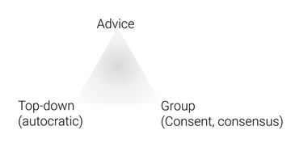
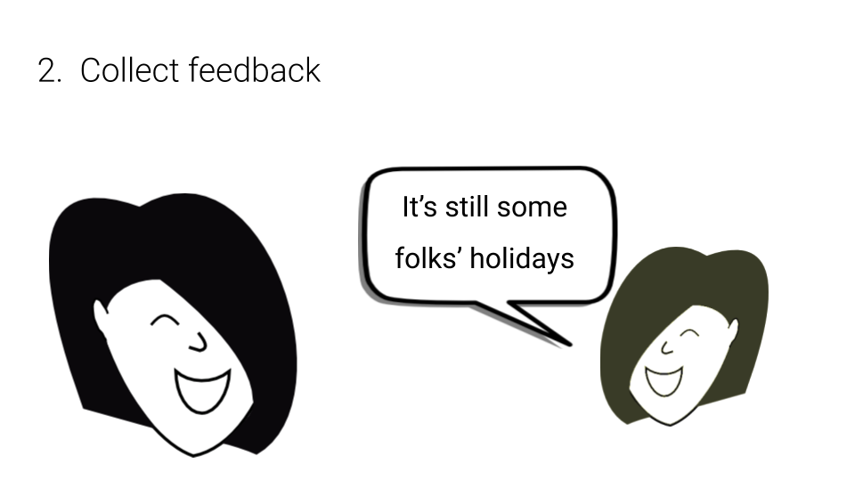

Today I want to show you how to make decisions that receive  more engagement (and, thus, better performance), build team confidence and alignment, and – when done well – increase interpersonal trust and motivation, all while maintaining **efficiency**. Trusting those closest to the problem to own the decision and be responsible for their own work – while simultaneously taking advantage of input and expertise within the organization – is possible, and can be done without sacrificing the ability to respond and adapt quickly.

This way of decision making improves accountability, will lead to more motivation and better work from everyone in your group and – ultimately – produce the clear outcomes your group needs. While a lot of processes also address some of these obstacles (for example, Consent) many teams prefer to use a technique like _“advice process”_ often modeled after the one popularized by _Reinventing Organizations._

## **How it works** anywhere
In one sentence, using Advice Process means

For example, Sam needs to decide if the new product website can be publicised.

Here’s how the Advice Process went for Sam:

Sam asks for feedback from the marketing director and the product lead.

The marketing director reminds her it’s still the holidays across the pond.

Sam is quick on her feet.

Confident that she got sufficient feedback and resolved the marketing head’s feedback, she’s published the website and scheduled it to be promoted the following week, alerting the marketing team of their responsibility.

Sam documents the decision…

…putting it somewhere her peers can see it.

Here’s the steps that Sam took:

1. She **stated an intention**
2. She **collected feedback**
 - She **responded to objections** (and tensions)
3. She **made the decision** (and **adequately communicated and recorded it**)

You’ll notice that Sam has made a decision that calls for others to execute the work. The big benefits of advice process only come if decisions made by advice process are considered the decision of the team or organization. You don’t have to make advice process available for any decision, but – for those you do – best be committed.

_It’s less critical, but_ you’ll also notice that Sam explained what’s going to happen next, including responsibilities. If her text box was bigger, she might have also explained why she made the choice, for the record and for team learning.

Before you move on: It’s not depicted just above, but there’s one other key element; **decision makers are accountable for their decisions.** If you can align power (and resources) with accountability (and support), you’ll get better results.

## **How it works** online
<iframe src="//www.slideshare.net/slideshow/embed_code/key/gtyG8KTL1Jme3s?startSlide=2" width="595" height="485" frameborder="0" marginwidth="0" marginheight="0" scrolling="no" style="border:1px solid #CCC; border-width:1px; margin-bottom:5px; max-width: 100%;" allowfullscreen> </iframe>

## Tips & Challenges
### Common challenges
**Feedback is hard.** I can think of plenty of times when I just wanted to keep moving forward on a project when I knew it would be better to invite a colleague into conversation. _What if addressing their comments slows down my progress? What if I need to start over? Do their comments mean my work isn’t valuable?_ All of these hypothetical worries tend to keep us from reaching out for feedback about something, especially something that didn’t go well. Even now, after working with advice process for a number of years, I still find myself hesitating. Recalling times I have taken the time to give (or ask for) feedback, it’s often easier than I thought it would be, and greatly benefitted my next actions or work. It gets even easier when I make use of the great frameworks that are available (eg, **ASK:** feedback is best when it’s_ **A**ctionable, **S**pecific, and **K**ind).

**Giving feedback is a responsibility:** If someone from your organization asks you for feedback and you don’t provide input, you are still accountable for the decision. So, if you have something valuable to add, there's an expectation that you say it.

**Receiving feedback can be hard,** especially if it’s not a team habit. Self-awareness and the capacity to regulate one’s emotions and ego are some of the work that can remedy pain points here. In my own journey I have been challenged to notice when I get too attached to my opinion and react as if suggestions or concerns are attacks on me. A big part of overcoming this was turning away from perfectionism (good enough and safe to fail) and towards confidence in myself and that my team has my back. Suspending judgement is a useful way to talk about how to best get out of my own way. The better I actively listen (and not just prepare responses), the more value the feedback is likely to bring. Another framework that can help here is **SBI**: **S**ituation, **B**ehavior, **I**mpact.³

**Accountability can get left out.** Decision makers may not become aware of any poor outcomes, losing the opportunity to learn or to fix significant issues; _the buck has to stop somewhere._ This makes feedback even more critical.

Efficiency and effectiveness are directly related to the capacity for open, honest, and direct communication.

**Communication is hard,** but advice process can actually be a step towards improving communications for your team. If your group is considering adopting advice process, that means you’re somewhere on your journey towards being a more collaborative organization. It can be of great value to pick up advice process early on and to practice it with specific kinds of decisions. Your organization may decide to try it out in one team, or just for picking meeting dates, to get started.
### Your first experiment (checklist)
For your first advice process experiment, you might want to check that the people who need to be involved or aware of it can answer the following:

- How will we use advice process, and when? Limitations?
- What good could come from adopting this technique?
- How does this affect my work?

**Transparency** is important; think about whether those who can make the decisions will be able to have the information they need. Transparency also supports another critical element, trust.

**Trust** will elevate your advice process, and _all_ your decision making, to the next level. The benefits compound when that trust is built on:

Open and honest communication (again!) and the skills that support it (EQ!)

One key you can easily test <a href=”https://loomio.coop/conflict_resolution.html” target=”_blank”>and work towards</a> is a culture that is comfortable with healthy conflict.²

A space of [psychological safety](https://rework.withgoogle.com/blog/five-keys-to-a-successful-google-team/), a.k.a. “brave space” or “safe(r) space”
A [shared purpose](https://help.loomio.org/en/guides/four-patterns-of-success/?utm_campaign=advice-process-medium&utm_term=medium) everyone can name.

### Tips and tricks
**Name your biases,** ⁴ everyone has them. Lack of awareness around biases can lead you and your team to miss important information. Naming your biases increases your awareness and helps your advisors give you better advice.

- **Solution bias** is a useful example. If you are biased towards a particular solution to the problem/opportunity you’re trying to solve, let your advisors know. For example, if you are doing an advice process about different software vendors and you think one vendor is the best fit, say it and explain why. This will help advisors ask better questions and give better advice.

**Who to invite feedback from** is not always clear, and there may be a limit to how many people you have time to engage. One simple tool you can consider is Peggy Holman’s acronym, “Invite those who **ARE IN**”. Invite those who have **A**uthority, **R**esponsibility, and **E**xpertise, those who are **I**mpacted and/or generally **N**eed the consultation or outcome.

Let us know if you want any specifics on overcoming challenges and succeeding with Advice process online, with or without Loomio.

## Not just a tool
Advice process, as a tool, makes **good business sense**, and it can deliver even more than that. How would it feel if you knew you had full support of your team the next time you needed to make an important decision? Advice process – and, moreover, a _culture of advice process_ – may be used to transform an organization’s philosophy or overall governance and operations. Some teams have significantly grown their capacity by adopting it more deeply. If you want to explore stepping beyond, we can connect you with one of our consultant partners.

You can quickly make better decisions by using advice process. All it takes is a proposal, asking for feedback, making an informed decision, and sharing the outcome. You’re already on your way to a more engaged team achieving faster, higher quality decisions.

Sound good? Share this video! Chat with your group about it… try it out and let us know how it goes!

[Try it on Loomio, for free, today.](https://loomio.org/?frontpage/?utm_campaign=advice-process-guide&utm_term=guide)

Cheers! Happy world-changing to you and your groups!

---
### Credits

¹ Modified from GrantTree https://granttree.co.uk

² “A culture that is comfortable with healthy conflicts”  –James Bloementhal (Fitzii / Ian Martin Group)

³ mindtools.com/blog/corporate/wp-content/uploads/sites/2/2014/05/SBI-Feedback-Tool.pdf

⁴ Thanks again to James Bloementhal (Fitzii / Ian Martin Group)

