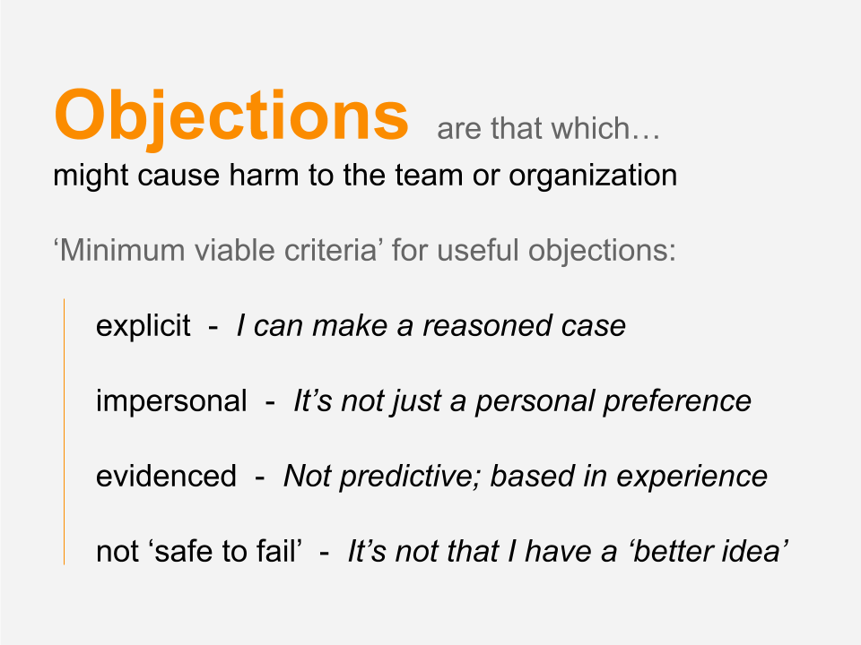

Our world grows more complex, with higher stakes and increasing feelings of scarcity, by the day.  Time is of the essence, the relevance of our actions more vital, and our ability to work together to transform Goliath challenges more pressing than ever.

Yet our ability to collectively make effective and efficient decisions, and then collaboratively and consistently enact them, remains elusive... sometimes there and sometimes not. If we can better our practice of collaboration, not only can we improve participation and engagement, but we can gain momentum in bringing about a more beautiful world.

Part of effective collaboration is around decision making, both individual and collective, including who makes which decisions, by which methods, and when. In this article, we begin a tutorial series on collaboration processes by sharing a simple step-by-step for better collective decision making in any group, and especially with groups working across space.

Given that we are currently emerging out of a long history of top down leadership as the dominant way of leading, collective decision making faces some common challenges:

- Lack of clear process can leave people confused and unable to meaningfully participate, e.g., _‘what are we deciding?’_ or _‘how will this go?’_  and _'how does my voice matter?'_

- Without an explicit process, you'll still use one – just an unintentional one, often falling back to norms like top down or majority rules.

- Frustration can occur if it’s unclear whether we’re done deciding.

- Groups can try to make decisions around EVERYTHING instead of what really needs collective time and energy.

- Conversely, fluid ad-hoc styles of communication can fail to include the people impacted by the decision in the process of making the decision, leading to harmful or ineffective actions:

 - including poor implementation and disengagement

 - _studies show this leads to weaker performance_

- Decisions can fail to be made or take way too long.

- Loud, dominating personalities or people with more time than others can overpower some voices.

- No record of the decisions means we are creating the potential for conflict which we will then have to resolve… again.

One of the best ways we’ve found to overcome these obstacles is to make decisions using _consent-based decision making_, or just _consent_. There are, of course, many different kinds of collective decision-making processes, including different versions of consent, but we’ve found _Integrative Consent_ – a model developed by Round Sky Solutions – to be a simple and effective starting place for a team wanting to learn a consent process. We hope you’ll use this as a template, iterate variations on it that fit your unique team, and pass what you learn back to us!

The steps you’ll learn in Integrative Consent are useful whether in person or online. And we believe all teams have something to gain by moving some decisions online. In particular, online, asynchronous decision making can:

- Alleviate the time pressure in meetings, leaving more time in meetings for important conversations.

- Encourage more thoughtful and considerate decisions as participants have time to ‘sleep on it.’

- Enable teams to have a clear and easily accessible record.

- Make the process easier to learn by making the process visible and accessible to varied learning styles.

Integrative Consent is an evolution upon Sociocracy’s (and Holacracy’s) decision making processes which evolved out of consensus. All of these bring great value to the world, but each have some limitations which Integrative Consent transcends. The intent with Integrative Consent is to match a clear process with what seems to be working well when humans are engaged in collective decision making so that we can reliably replicate efficient and effective collaborative decision making anywhere and anytime we choose.

## Integrative Consent, step by step

<b>1.</b> The first step of Integrative Consent is ‘propose’. This is done through two different possible options:

- **A proposal surfacing process**, via *open discussion*[ ¹](#glossary) by the team, until the person who brought the item forward (the *proposer*[ ²](#glossary)) has heard enough to craft a proposal out of the team input.

- **The proposer has an idea** that they put in writing to start the process.

Either way, the proposer gets something in writing as the initial proposal for step one.

> As facilitators of this process it’s really important to remember that it is not your choice as facilitator which option to take in step one, that choice belongs to the proposer. As facilitator it’s your job to help them do that efficiently, by thinking with them and checking back with them to see if they have enough information to craft that proposal. Once we have a proposal in writing, however rough, we can move to step two.

<b>2.</b> Step two is a round for questions and comments. This can include clarifying questions, sharing points of information, making any desired responses, including better ideas for the proposal on the table. If there are questions, it is the proposer who gets to answer them or delegate them to whoever they would like to answer that question. During this step it’s very important for the proposer to be listening carefully and paying close attention to what’s being shared for anything that they would like to change about their proposal, which is the third step. If you are facilitating this process synchronously, it’s important to keep this as a *round*[ ³](#glossary) and not open discussion.

<b>3.</b> Step three, *amend*, is where the proposer makes changes at their discretion to their proposal based on the input they received in step two. The proposer doesn’t have to amend anything or respond to everything shared in step two. Their job is to change what they feel would be best **on behalf of the whole team**, not just their, or anyone else’s, personal preferences. Once we have an amended proposal, then we move into step four, integrate.

<b>4.</b> _Integration_ is where things get interesting. During this phase, all team members are invited to present any objections they have, with objections being defined as what “**might cause harm to the team or organization**”. Now, how do we know if it might cause harm? This question can sometimes open a can of worms if there is not a clear agreement about what is a valid objection. At the very least, we recommend that an objection needs to have a reasoned case that can be made explicit. If the ‘why’ of the objection is unclear, it may be impossible to integrate and waste a lot of time. Beyond that, there are a number of other basic questions your group could ask of each objection to ensure that they will not just cause the team to go round and round in circles. We call these validation criteria. Your group will likely want to agree on the criteria that work best for you, but we think you might find these basic ones useful to get started:

So, a few examples of why we wouldn’t want to consider every reasoned objection valid. Maybe my objection is a personal reason why I don’t like the particular proposal. Perhaps we’re deciding on our brand colors and maybe I personally don’t like red, but market research shows that our customers actually love red. My objection that I don’t like red doesn’t constitute harm to the whole, it’s a reflection of my personal wishes.

Another example might be that I’ve just had a better idea. Better ideas in general are great, and we definitely want to encourage them during questions and comments, but not during integrate. Why? Because we’ll be starting a better idea war and could spend the rest of the year competing against each other for the best idea, and depending on how desperate our egos are we could easily spend the team’s valuable resources doing just that. At this stage in the process, it’s time to get to ‘good enough for now’, what’s ‘safe to try’, then garner data from real life and evolve the agreements later.

And the third way in which objections are not valid is that they are based on predictive concerns for which we have no current data. Are we afraid our customers hate red or do we have actual market research? Predictive concerns can frankly just be wrong, and we can end up spending lots of team resources trying to integrate predictive concerns, especially if we have no relevant experience that supports our concerns.

### Completing Step 4: Integrating objections

Once all objections have been surfaced then we can complete integration. This includes understanding the concerns and checking that each objection meets the validation criteria. Your facilitator should pick one objection at a time and integrate it via open discussion to create an amended version of the proposal. It’s important that the proposal in its changed form still resolves the proposer’s tension. In other words, it would be pointless to change the proposal so that it no longer addresses the need that put it on the table in the first place, though how that need gets met may be different than the way the proposer initially conceived. This process is repeated for all valid objections, remembering that new objections may be raised as we change the proposal. When there are no further objections, the proposal has passed.

As we mentioned, there’s a number of benefits from doing some of your consent processes online.

## Integrative Consent online

<iframe src="//www.slideshare.net/slideshow/embed_code/key/wOxlElLfkChauk?startSlide=3" width="595" height="485" frameborder="0" marginwidth="0" marginheight="0" scrolling="no" style="border:1px solid #CCC; border-width:1px; margin-bottom:5px; max-width: 100%;" allowfullscreen> </iframe> 

### There are a few key pitfalls to avoid as you learn to use this process.

Pitfall 1: Getting sidetracked because the team or facilitator is lost in the process, for example, not knowing who is in charge of the proposal at which step in the process.  

<i>Example:</i>  A meeting where you’ve gone in circles for far too long, because people have a million questions and comments and no one feels bold enough to end that particular step of the process.

Pitfall 2: Trying to get the best, most perfect idea that everyone loves… great goal, but it is not often attainable (or real) and is not necessary for effective collaboration!  

<i>Example:</i> The proposer has heard many different possible changes to their initial proposal and wants to please everyone, so has taken a lot of group time to wordsmith their proposal during amend to try to get it perfect. Then in objections someone raises a concern regarding a specific term which isn’t actually something that causes harm, just a personal preference, but the facilitator then tries to integrate it and finds someone else raises an objection about the new term, and so on until the team has run out of time to act.

Pitfall 3: Getting stuck with validating and integrating objections.

<i>Example:</i> Someone strongly and emotionally objects to a proposal but can’t say much more than they really don’t like the proposal and won’t stand behind it.

To learn what to do to resolve these common pitfalls, check out [Round Sky’s website](https://roundskysolutions.com).

The most important thing to remember is that in using Integrative Consent, we’re aiming for decisions that are _safe to try_. You don’t have to get either the process or the decision that comes out of it perfectly right for it to work and make a big difference for you and your team. You can muddle about a bit and see what happens, what questions emerge, and what’s next for your team’s collaboration needs. So get started today by sharing this article with your group and giving it a try on Loomio.

For more information on Integrative Consent including a demo video of a team using it to make a decision, go here.  And, for more support in facilitating decisions, check out our guides in our robust [help resource and user manual](http://help.loomio.org/en/user_manual/getting_started/?utm_campaign=200making-desicions-medium&utm_term=medium). And if you have an example of a team decision that you’d like to see us workshop using Integrative Consent as an anonymous example in an upcoming post, please contact us here. In addition, Round Sky has created a Cooperative Decision-Making Toolkit with more tips and tricks to support you and your team’s meaningful and efficient collaboration ([request it here](https://www.roundskysolutions.com/contact/))

Cheers! Happy world-changing to you and your groups!

---

### Glossary:

¹ Open Discussion: a discussion style where all members of the team contribute as they have something to offer in a popcorn style.

² Proposer: the individual who raises an item for consideration which requires a decision

³ Round: a discussion style where one person shares at a time as requested by the facilitator
