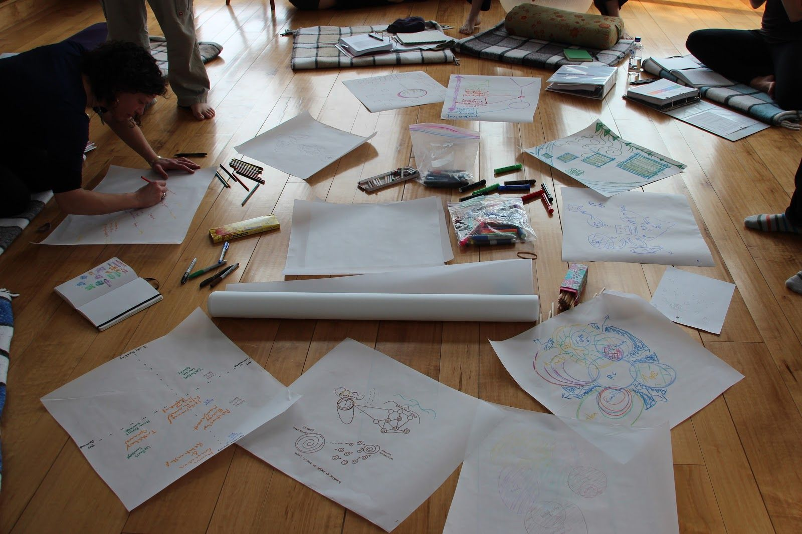
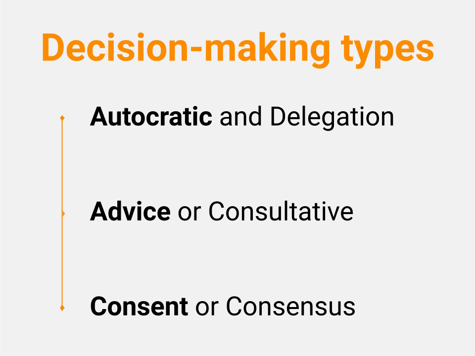
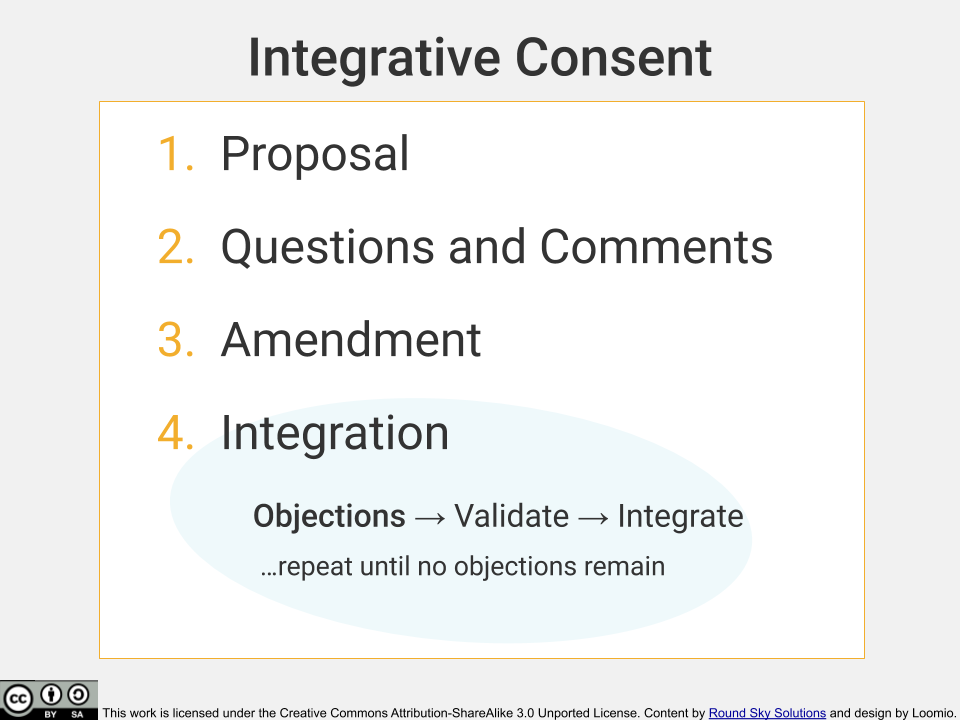

_By Loomio and Round Sky Solutions—creators of the Integrative Consent process._

Our world grows more complex, with higher stakes and feelings of scarcity increasing by the day. Time is of the essence, the relevance of our actions more vital, and our ability to work together to transform Goliath challenges more pressing than ever.

Yet our ability to collectively make effective and efficient decisions – and then collaboratively and consistently enact them – remains elusive, sometimes there and sometimes not. If we can better collaborate, we can improve participation and engagement _and_ gain momentum in bringing about a more beautiful world.

Decision making is a key part of effective collaboration, both individual and collective, including who makes which decisions, by which methods, and when. In this article, we begin a series of simple step-by-step guides for better collaboration and collective decision making in any group, and especially with groups working across space and time.

Given that we are currently emerging out of a long history of top down leadership as the dominant way of leading, collective decision making faces some challenges:

- Lack of clear process can leave people confused and unable to meaningfully participate, e.g., _‘what are we deciding?’_ or _‘how will this go?’_  and _'how does my voice matter?'_

- Without an explicit process, you'll still use one – just an unintentional one, often falling back to norms like top down or majority rules.

- Frustration can occur if it’s unclear whether we’re done deciding.

- Groups can try to make decisions around EVERYTHING instead of what really needs collective time and energy.

- On the other hand, lack of process can lead to harmful or ineffective actions by neglecting to include/involve those impacted by the decision, which can ultimately lead to _poor implementation_ and _disengagement_

- Decisions can fail to be made or take way too long.

- Loud, dominating personalities or people with more time than others can overpower some voices.

- No record of the decisions means we are creating the potential for conflict which we will then have to resolve… again.

## Rewriting the rules

One of the best ways we’ve found to overcome these obstacles is to make decisions using **consent-based decision making**, or just **consent**. There are, of course, many different kinds of collective decision-making processes, including different versions of consent, but we’ve found **Integrative Consent** – a model developed by Round Sky Solutions – to be a simple and effective starting place for a team wanting to learn a consent process. We hope you’ll use this as a template, iterate variations on it that fit your unique team, and pass what you learn back to us!

## Face to face or Online?

The steps you’ll learn in Integrative Consent are useful whether in person or online. And we believe all teams have something to gain by moving some decisions online. In particular, online, asynchronous decision making can:

- Alleviate the time pressure in meetings, leaving more time in meetings for important conversations.

- Encourage more thoughtful and considerate decisions as participants have time to ‘sleep on it.’

- Enable teams to have a clear and easily accessible record.

- Make the process easier to learn by making the process visible and accessible to varied learning styles.

## Consent-based decision making

Integrative Consent is an evolution upon Sociocracy’s (and Holacracy’s) decision making processes which evolved out of consensus. All of these bring great value to the world, but each have some limitations which Integrative Consent transcends. The intent with Integrative Consent is to match a clear process with what seems to be working well when humans are engaged in collective decision making so that we can reliably replicate efficient and effective collaborative decision making anywhere and anytime we choose.

# Integrative Consent

## STEP 1: Proposal

First is the **proposal**. This step is best done in writing so that there is no ambiguity and it’s easier to keep the details of the proposed idea in mind. There are two ways this happens:

**1.**  A proposal surfacing within an **open discussion**[ ¹](#glossary)

It's often best if the person who raised it with the group continues as the **proposer**[ ²](#glossary), crafting a proposal out of everyone's input.

**2.**  The proposer has an idea – and puts it in writing to start the process.

It’s also a good idea to set someone up as a **facilitator** who can help the proposer do their job efficiently, checking in with them to see if they have enough information to craft and refine their proposal. Either way, the proposer gets something in writing as the initial proposal for step one.

<i><b>Facilitators:</b> it is important to remember that it is not your choice which option to take in step one; that choice belongs to the proposer.</i>

## STEP 2: Questions and Comments

This round can include clarifying questions, sharing points of information, making any desired responses, including better ideas for the proposal on the table. If there are questions, it is the proposer who gets to answer them or delegate them to whoever they would like to answer that question. During this step it’s very important for the proposer to be listening carefully and paying close attention to what’s being shared for anything that they would like to change about their proposal, which is the third step. If you are facilitating this process synchronously, it’s important to keep this as a *round*[ ³](#glossary) and not open discussion.

## STEP 3: Amendment

Step three, *amend*, is where the proposer makes changes at their discretion to their proposal based on the input they received in step two. The proposer doesn’t have to amend anything or respond to everything shared in step two. Their job is to change what they feel would be best **on behalf of the whole team**, not just their, or anyone else’s, personal preferences. Once we have an amended proposal, then we move into step four, integrate.

## STEP 4: Integration (objections)

**Integration** is where things get interesting. During this phase, all team members are invited to present any objections they have, with objections being defined as what “**might cause harm to the team or organization**”. Now, how do we know if it might cause harm? This question can sometimes open a can of worms if there is not a clear agreement about what is a valid objection. At the very least, we recommend that an objection needs to have a reasoned case that can be made explicit. If the ‘why’ of the objection is unclear, it may be impossible to integrate and waste a lot of time. Beyond that, there are a number of other basic questions your group could ask of each objection to ensure that they will not just cause the team to go round and round in circles. We call these validation criteria. Your group will likely want to agree on the criteria that work best for you, but we think you might find these basic ones useful to get started:

So, a few examples of why we wouldn’t want to consider every reasoned objection valid. Maybe my objection is a personal reason why I don’t like the particular proposal. Perhaps we’re deciding on our brand colors and maybe I personally don’t like red, but market research shows that our customers actually love red. My objection that I don’t like red doesn’t constitute harm to the whole, it’s a reflection of my personal wishes.

Another example might be that I’ve just had a better idea. Better ideas in general are great, and we definitely want to encourage them during questions and comments, but not during integrate. Why? Because we’ll be starting a better idea war and could spend the rest of the year competing against each other for the best idea, and depending on how desperate our egos are we could easily spend the team’s valuable resources doing just that. At this stage in the process, it’s time to get to ‘good enough for now’, what’s ‘safe to try’, then garner data from real life and evolve the agreements later.

And the third way in which objections are not valid is that they are based on predictive concerns for which we have no current data. Are we afraid our customers hate red or do we have actual market research? Predictive concerns can frankly just be wrong, and we can end up spending lots of team resources trying to integrate predictive concerns, especially if we have no relevant experience that supports our concerns.

### Integration (objections to completion)

Once all objections have been surfaced then we can complete integration. This includes understanding the concerns and checking that each objection meets the validation criteria. Your facilitator should pick one objection at a time and integrate it via open discussion to create an amended version of the proposal. It’s important that the proposal in its changed form still resolves the proposer’s tension. In other words, it would be pointless to change the proposal so that it no longer addresses the need that put it on the table in the first place, though how that need gets met may be different than the way the proposer initially conceived. This process is repeated for all valid objections, remembering that new objections may be raised as we change the proposal. When there are no further objections, the proposal has passed.

# Integrative Consent online

As we mentioned, there’s a number of benefits from doing some of your consent processes online. Here's how (on Loomio):

<iframe width="100%" height="380px" src="https://www.youtube-nocookie.com/embed/1sc425MNZ9I" frameborder="0" allowfullscreen></iframe>

## Key Pitfalls

There are a few key pitfalls to avoid as you learn to use this process.

PITFALL 1: Getting sidetracked because the team or facilitator is lost in the process, for example, not knowing who is in charge of the proposal at which step in the process.  

<i><b>Example:</b> A meeting where you’ve gone in circles for far too long, because people have a million questions and comments and no one feels bold enough to end that particular step of the process.</i>

PITFALL 2: Trying to get the best, most perfect idea that everyone loves… great goal, but it is not often attainable (or real) and is not necessary for effective collaboration!  

<i><b>Example:</b> The proposer has heard many different possible changes to their initial proposal and wants to please everyone, so has taken a lot of group time to wordsmith their proposal during amend to try to get it perfect. Then in objections someone raises a concern regarding a specific term which isn’t actually something that causes harm, just a personal preference, but the facilitator then tries to integrate it and finds someone else raises an objection about the new term, and so on until the team has run out of time to act.</i>

PITFALL 3: Getting stuck with validating and integrating objections.

<i><b>Example:</b> Someone strongly and emotionally objects to a proposal but can’t say much more than they really don’t like the proposal and won’t stand behind it.</i>

To learn what to do to resolve these common pitfalls, check out Round Sky’s Decision Making Toolkit below.

## Video quick-guide

<iframe width="100%" height="380px" src="https://www.youtube-nocookie.com/embed/4jSrVBhwPZM" frameborder="0" allowfullscreen></iframe>

## Safe to try

The most important thing to remember when you are using Integrative Consent is that you should be aiming for decisions that are _safe to try_. It is unlikely that your team will make the perfect decision every time but by opening the door for your entire team to weigh in you will maximize your brainpower and arrive at a workable solution faster than you could have alone.

If you think this could help, share it with your team and [try it for free on Loomio](https://loomio.org/?frontpage/?utm_campaign=consent-process-guide-help&utm_term=help). We hope to play a part in your team’s next step towards better collaborative decision making.

Want more on Integrative Consent or a demo video of the process in action? Head on over to Round Sky Solutions for more info and a free, comprehensive [Cooperative Decision-Making Toolkit](https://www.roundskysolutions.com/decisionmakingtoolkit/?utm_source=Loomio&utm_medium=partners&utm_campaign=DecisionMakingToolkit2019).

Cheers! Happy world-changing to you and your groups!

---

## Glossary

**Open Discussion:** a discussion style where all members of the team contribute as they have something to offer in a popcorn style.

**Proposer:** the individual who raises an item for consideration which requires a decision

**Round:** a discussion style where one person shares at a time as requested by the facilitator

**Facilitator:** someone who can help the proposer do their job efficiently. For example, in step 1, they might check in with them to see if they have enough information to craft and refine their proposal.

**Objection:** what might cause harm to the team or organization
