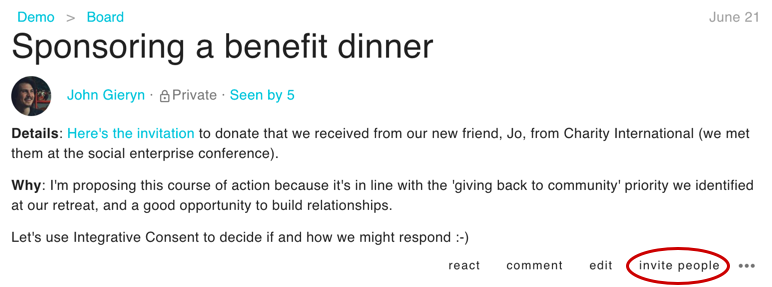

Use Loomio's **threads** to have discussion that result in clear outcomes.

<iframe width="100%" height="380px" src="https://www.youtube-nocookie.com/embed/1qxGl8MBA88" frameborder="0" allowfullscreen></iframe>

**Facilitation** means “to make easier, to help forward." Discussions on Loomio always work best when there is a clearly identified **facilitator**, someone whose role is to help the discussion move forward to a clear outcome. You don't have to be a pro to help your group have productive discussions. In fact, anyone in a group can make little acts of facilitation. There are many ways to improve your online conversation or deliberations.

## What makes up a thread

At the top of the thread you can always find the **title** and **context**. The context is where you share all the information, links, and prompts that will support group members to interact productively with it. Sometimes it's useful to think of the context like an agenda that you would write up on the wall, or the handout that makes a certain conversation possible.

Below these elements, you will find the comments, where most of the action will happen as people share their thoughts and feelings, alert one another, and use the facilitation tools such as the poll and proposal.

You can always navigate back to your group or subgroup by clicking their names, the links above the thread's title.

## Keep the topic concise

Making the thread title and context clear and engaging is the best way to ensure a productive discussion. Take a little time to consider what contribution you would like from the group. For example:

- Will a decision be made within the thread?
- Over what time frame will the discussion take place?
- Are you calling for personal experiences or asking for thoughts about some information?

Make an invitation of thread/group participants, letting them know the quickest way to engage and where it goes next.

## Getting attention

Effective use of Loomio means knowing how and when to get attention from the group.

If you ask for attention when it's really important, and avoid it when it's not, people will keep paying attention.

### Start a discussion

When you start a discussion, you can choose to select all members of a group, or a select number of them. When you select the whole group, you can assume it will get everyone's attention.

### Mentioning

A direct way of asking for someone's attention. Use the `@` symbol and select the person's name. It's generally expected that you will respond when someone mentions you.

### Replying

If you choose **reply**, and proceed as you would to post a comment, you will notify the user you replied to; this means you don't have to `@`mention them.

### Reacting

On any comment or contexts (threads) you can click **react** to quickly respond with an apt emoji. You might use a reaction when you want to share how you feel, a brief opinion, or indicate that you have seen the comment. Reactions are helpful because they are less disruptive than mentions, replies, or comments.

### Invite people

When you start a thread, your whole group can access it immediately. If you want more people's participation, or want their participation sooner, you can additionally send them an alert via the box that immediately appears when you start the thread. You can also alert people in this way later on; to do so, click **invite people** at the bottom of the thread context.

#### Invite guest (or expert)

You can also use **invite people** to invite people outside of your group; see "Invite non-members to a discussion", below, for details.

### Start a decision

The most powerful way to get attention from your group. Ensure that you have a clear decision description so people know how to participate. Loomio will notify everyone you choose (the whole group, everyone in the thread, or selected individuals) about new decisions, _although you can choose not to notify people and let them find it on their own time._ Loomio will also remind participants, and those you invite to the decision, 24 hours before the closing deadline.

#### Disagreeing and Blocking

Disagreement is an indicator that someone wants to be listened to, and typically gives valuable information that can lead to new thinking. It's useful to give them an opportunity to explain themselves, whether you reach out in the thread or more privately. Remember, everyone can change their mind while a decision is still open.

## Maintain a safe environment

> A [study of more than 180 teams within Google](https://rework.withgoogle.com/blog/five-keys-to-a-successful-google-team/) tells us that the number one factor in team performance is **psychological safety**.

Respectful disagreement is essential to finding the best solution for the group, but it can be challenging work. For real discussion to happen, you must hold space for differing opinions. Help people express themselves, in a way that allows others to express themselves too.

**Raise the bandwidth:** If someone is distressed, being too disruptive, or is in a minority opinion they feel strongly about, it’s a good indication that a phone conversation – or, even better, a face-to-face – might help.

For more guidance, see the section of our handbook on [conflict](https://loomio.coop/conflict_resolution.html/?utm_campaign=having-discussions-help-pg&utm_term=help).

## Who's not present?

If someone's missing, invite them!

Bring group members into a specific discussion by getting their attention (as mentioned above; _eg, mention them by typing "@" before their name_). Try to notice people who have not participated and invite their input.

High quality decisions come from gathering the right inputs. Are there other people the decision affects, who have not shared an opinion? Are there experts in the field that you could bring into the room?

**Invite non-members to a discussion**

You can invite people from outside of your group to a specific thread by using **invite people**, at the bottom of the thread's context, as depicted above. They will have access to this thread alone and to no other part of your group. This can be useful if you have contracted an expert (e.g., a lawyer) and you would like to make the conversation accessible to your group. It helps you keep tidy records, saving you time and effort copying and pasting communications that have occurred outside of Loomio.

**Inviting diverse participation**

Remember to look out for those people who tend to be quiet. Don't just call them out, but consider how best to bring their perspective in, and why they might be participating or vocalizing less than others.

## Keep the title and context relevant

Loomio threads are designed to evolve with a discussion, which is why the title and context box are editable. The thread context always remains at the top of the thread in order to frame and guide the conversation or decision. Make it easy for people have a clear, shared understanding of where things are at, or to catch up, by updating the thread context and title with the latest info. This also helps you later if you want to refer back to a previous discussion and quickly remind yourself what happened.

Double-clicking on the context is the quickest way to edit a thread context and title.

<iframe width="100%" height="380px" src="https://www.youtube-nocookie.com/embed/eD4NyVJEjB0" frameborder="0" allowfullscreen></iframe>

Here’s an example in which the facilitator has made a note so that 1.) those coming late to this thread know that the agenda is basically finalized, and 2.) those who contributed understand what has happened as a result of their agenda suggestions.

## Break down complex issues

**Working Groups or Committees**

Sometimes an issue is helped by delegating a small group to do background research, frame up options, or summarise data. They can work together and then come back to the larger group when they're ready to present a decision. Or you can decide to mandate them to move forward autonomously. *Loomio's [subgroups](../../groups/subgroups) are a big help here.*

**Mutiple threads or sequential proposals**

If a complex discussion is raised, think about breaking it down into multiple threads, one for each different aspect. Or, you might want to raise a series of proposals in the same thread to address different smaller decisions in the same topic. That way, all the context stays in one place.

**Subgroups**

If you have an area of collaboration requiring many threads and ongoing collaboration, but it only affects certain people, you can create a [subgroup](../../groups/subgroups). For example, offices in different geographical locations, teams working on different projects, or groups with a specific mandate like a governance board.

## Going in-depth on Facilitation

See the [Facilitators Guide to Loomio](../../../guides/facilitators_guide/) for more information on this topic and more.

## Next up

The best tool for making decisions is good discussion; it's the best way to frame the topic, seek input, and gather ideas. Often you'll find that you can make progress with comments and replies. Other times, in order to bring the discussion to a clear outcome, you will want the clear calls to engagement and facilitation support of…  [→ Proposals and polls](../decision_tools)
