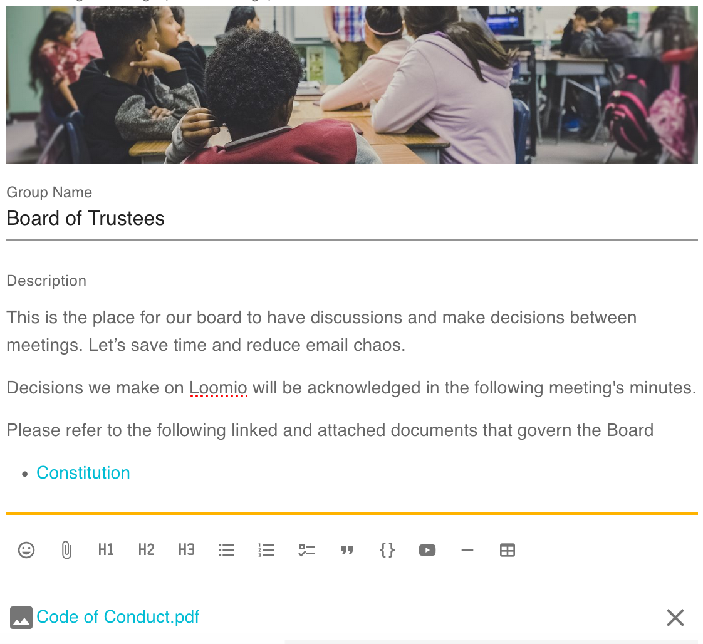
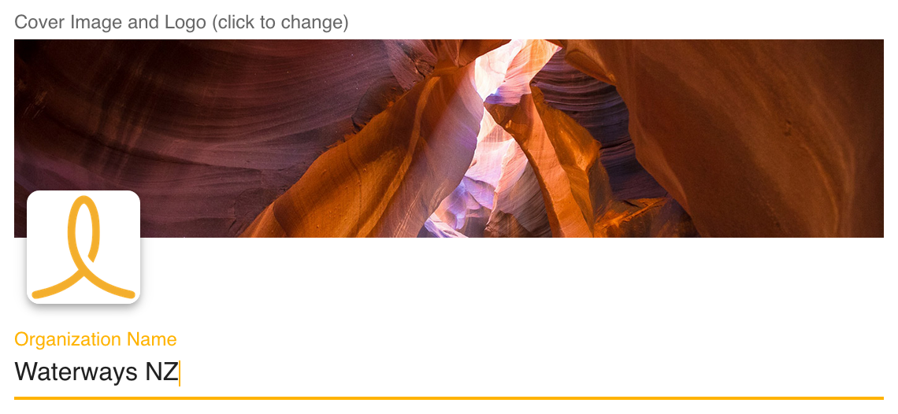

Getting started on Loomio means getting everyone signed up, familiar with the tool, and comfortable communicating or coordinating with one another. When done well, the group will come to life as people take the initiative to participate and engage.

Most Loomio groups need a champion to help them get going, and then they build their own momentum. If you're reading this, that champion is probably you!

## Get a running start

Some groups find great value in **expert guidance** as they get started, so they lean on us and our experience developed working with hundreds of groups.

[Ask about our personalised onboarding service.](https://loomio.org/contact)

## Introduce Loomio

Have a discussion with your group about using Loomio.

- **What problem** are you trying to solve with a new tool? _Eg, reducing meetings_
- **What is Loomio for?** How will you use it, _eg, forum, decisions, or just input?_
- **Who's involved?** Who will facilitate or support conversations to be productive?
- What kind of **behaviour** is welcome, and what's not ok?
- How will Loomio complement your **existing processes**?

Some people will be apprehensive about adopting a new piece of software for online decision making. Talk to people in your group to work through any concerns.

- Starting simple can help, especially with pre-existing **routines**
- Agree on the **scope** and trial it; offer a date when it will be reviewed.

# Starting a new group

When you first start, you'll create a new **organization**. At this stage, organization is basically another way of saying "your group." The first thing to do is enter a name and a description for your group.

## Group details

You can always return to change these by visiting **Edit group settings** on the **Settings** tab of your group page.

### Group name

It's best to keep your group name short and concise.

### Group handle

By default, Loomio will make this `your-group-name` but you can choose any unused, alphanumeric handle (hyphens optional). Navigating to the URL loomio.org/[your-group-handle] will take you directly to your group page.

### Group description

It's important to add a description to help people settle in and get engaged.

The description should give members a clear understanding of the purpose or scope of the group. Some examples:

"_A public group for us to approve requests for use of the gallery space_"

"_The space for our board members to consider budget proposals_"

**Add a Group description** by navigating to the **Settings** tab on your group page. Click **Edit Group Settings** and use the form that appears (click save when done). If you're having trouble finding it from Edit Group Settings, double-check that you haven't switched tabs ("Profile" should be highlighted in yellow).

<iframe width="100%" height="380px" src="https://www.youtube-nocookie.com/embed/7z60BLLBLFU?rel=0" frameborder="0" allowfullscreen></iframe>

With a clear purpose, people can make judgment calls about what's best for the group. Understanding group context helps people get oriented.

### Group description is also a Resource hub

Your Loomio **group page** is a place to store all of the information, links, and files that everyone in your group needs. Update the Group description field and attach files from your computer or from the cloud.

**Tip:** Group descriptions are a great place to include reasons why you're using Loomio. Sharing why you're implementing Loomio can help motivate people to adopt it.

## Privacy

Your privacy settings determine who can find your group, who can see the threads in your group, and how people join.

The recommended privacy setting for new groups is **Closed**. This means it is possible for people to find your group and ask to join, but the content of your discussions and decisions is private. _The Group Description and Name are public for Closed groups._

If you want the content of your discussions and decisions to be public, change your group privacy to **Open**. The members list will only be visible to other members.

If you want to hide your group, set your group privacy to **Secret**. Secret groups are similar to Closed groups, but only invited members will be able to see the group name and description.

**NOTE:** If you have a **Closed** or **Secret** group and change it to **Open**, all threads will become public. Changing an **Open** group to **Closed** or **Secret** will make all threads private.

## Upload a profile photo

Seeing someone's face next to the text they've written can make it feel more human. It's especially important if you're the one welcoming everyone in.

Upload your [profile photo](/en/guides/getting_started/notifications_settings) before sending invitations to join the group, so that your friendly image is included.

## Upload a group photo

Uploading a photo that has some meaning to your group significantly improves the sense of belonging. You can customize both the small square photo (eg, with a logo), and the big cover image (eg, with a group photo) by clicking on the placeholder images. _You can always change it again by going to Group Settings._

## Invite people

You're ready to invite people into the group! Loomio is a group collaboration tool, so this is an important step.

First, visit your group page and click the **Members** tab to access member management

Second, click one of two options

1. **Invite**: If you have their email addresses, you can send invitations to each member of your group.
2. **Share**: Or you can share the **Reusable invitation link** via email or however your team communicates.

<iframe width="100%" height="380px" src="https://www.youtube-nocookie.com/embed/RGv0Yq6sv8g?rel=0" frameborder="0" allowfullscreen></iframe>

If your group's privacy is **closed** then you can additionally invite people by sharing your `loomio.org/handle`. When people arrive at your group page, they will see the title, the description, and a button **Join group** to request membership. They become a group member when their request is approved.

> Reminder: Closed groups are basically private, but – unlike Secret groups – disclose their Group Name and Group Description publicly.

Follow up on people who don't make it into the group and give them a nudge. You don't want to leave people out of key conversations or decisions. (*You can get a sense of who is participating by looking at your thread's [Seen by](/en/user_manual/threads/thread_admin/#seen-by), and many elements of Loomio have [Notification history](/en/user_manual/threads/thread_admin/#notification-history)*.)

If people join but don't begin to participate right away, you might like to welcome them to the group with an @mention, for example:

> “Welcome to the group @Jane :) It's great to have you here! Would you saying a little bit about your work in this space?”

## Champion the use of Loomio

If you model behavior for others  to emulate, your group will be more inclusive and engaging. You can help deliberation/communications progress constructively.

For example:

> - “@Jane that could be a good idea, why don’t you raise a proposal so we can see if the rest of the group agrees?”
- “We haven’t heard from @Bill and @Ngaire … what are your thoughts?”
- “We might be getting off topic here. I've started another Loomio discussion about that [here](http://www.loomio.org). Let's bring this back to the original focus.”

## Developing a productive Loomio habit

**If discussions happen via email,** remind the group you've agreed to use Loomio and request people move the discussion over there. Sometimes it can be helpful to copy and paste what's been said so far and directly give everyone the Loomio link.

**If decisions are being made in-person,** invite the group to move the discussion online before concluding the decision with an outcome.

It's good to name one or more reasons _why_ you're moving back to Loomio. A couple common reasons:

- to include people who aren't in the room
- to create documentation for future reference.

**Raising the stakes** is another strategy for accelerating the adoption of Loomio. An example illustrates it best: _"Want to participate in the decision? You'll have to voice your position on Loomio"_. When taking this approach it is, of course, good to accompany this candor with _care_. Kindness – _and, again, a reminder of the reason you're using Loomio_ – can help at most steps of your journey.

## Next up

Now that you're on Loomio, how to get those clear outcomes… [→ Having discussions](../having_discussions)
