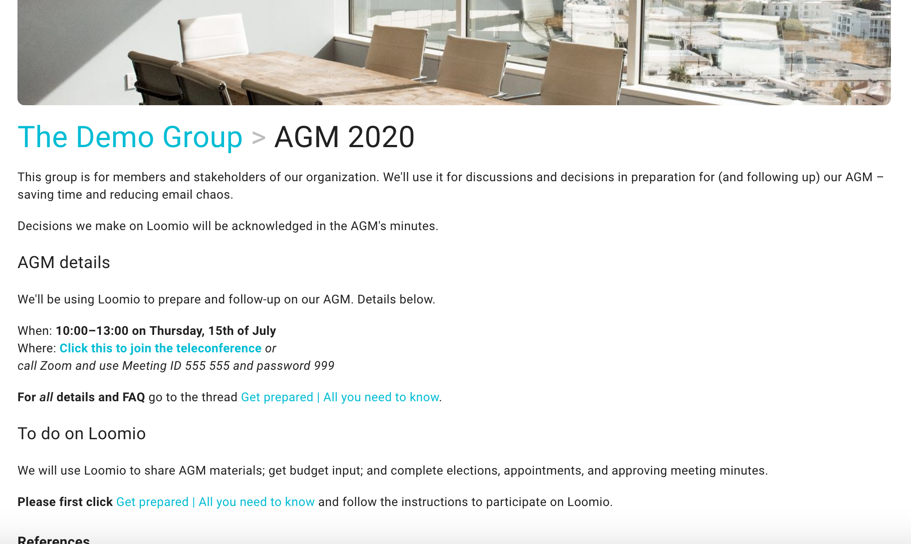
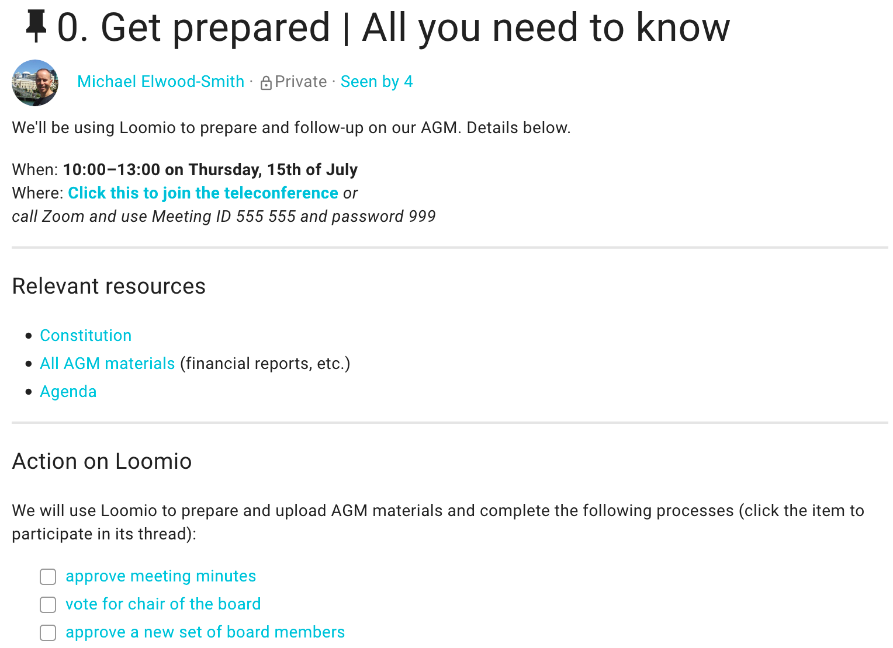
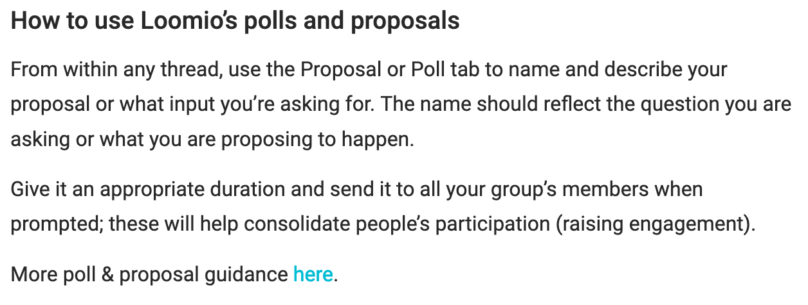
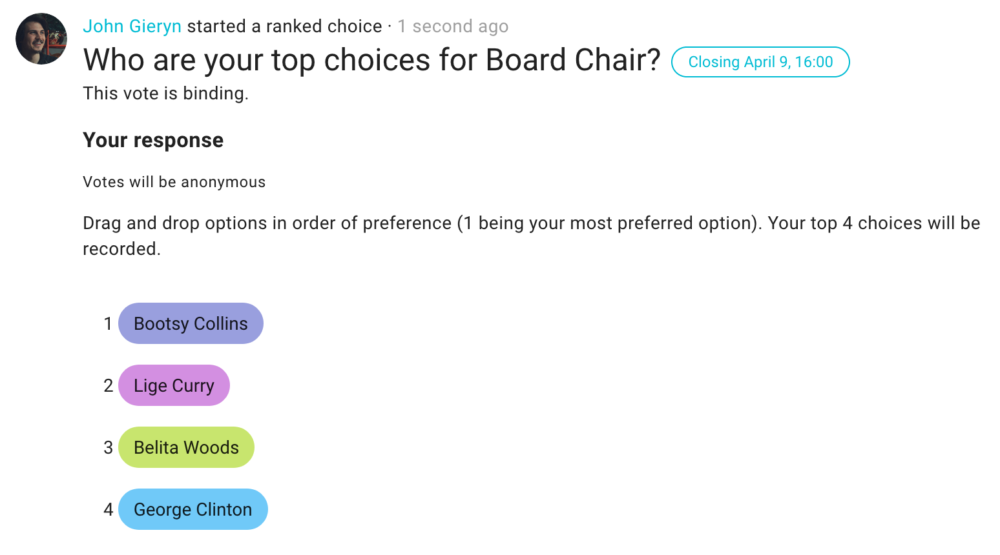
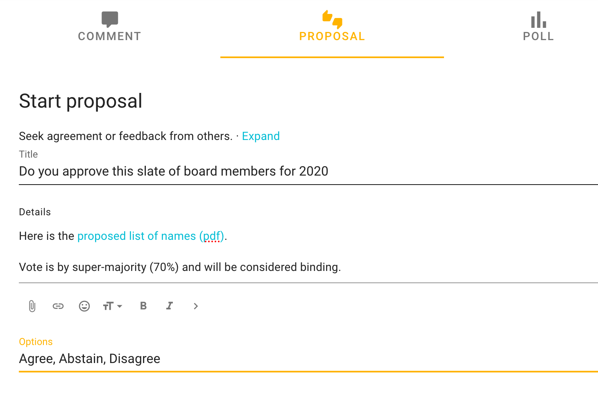
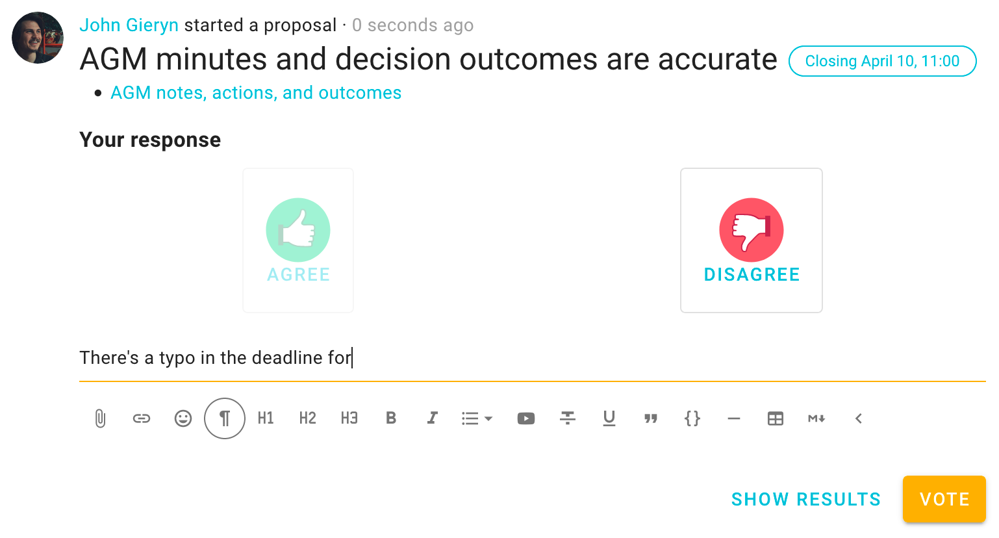

_Read time: 7 minutes._

In times of instability and uncertainty, and especially now, we can’t always gather in the same place at the same time. But life goes on and many organizations are still needing to continue running their big or formal meetings, to discuss and [make decisions as a board](../virtual_board_meetings) or even run an AGM.

This guide will help keep your business moving even while you can’t gather in person by helping you run productive AGMs, assemblies, and other big, formal or infrequent meetings.

## What you need to know before you begin

Before we begin, we will make a couple points about the tools you might need and why, and then help you run your next meeting step-by-step with Loomio’s communication and decision-making platform.

### Real-time is not always best

You can have some or even all of the interactions and engagement you would normally have at a formal meeting on Loomio. Loomio may not be the only tool you want to use – we also use [Jitsi](https://meet.jit.si)'s open source teleconferencing, or Zoom, and Google Drive for file sharing – but it can help you and your group to reduce real-time meetings by achieving some decisions or processes solely on Loomio.

> **Example:** This investment group prefers to meet online rather than in-person to discuss their [loan allocation](https://blog.loomio.org/2019/06/14/investing-in-community/#our-most-essential-tool) process.

It can also help you continue communication between meetings, better prepare for meetings,  and keep a good record of decisions, actions and accountabilities and follow-ups all in one place.

We know that using video conferencing can be incredibly important for quality discussions as some communications do require higher bandwidth. However, we believe all groups can benefit by doing some of their processes **asynchronously**, which can be understood as ‘on participants’ own time’ ( think mail or bulletin boards – read and written by people at a time that is convenient for them).

This type of communication can help you alleviate the time pressure in meetings, video-call fatigue, and scheduling nightmares. It often allows for more thoughtful conversation and considerate decisions, with time to ‘sleep on it.’

### AGM vs. General Assemblies vs. Board meetings…

Quick note: We’re using the example of an AGM to show how we can **achieve the purpose of big, formal meetings** remotely and efficiently. Your board or other formal meeting might follow all of these steps, or find a few of the tips are less necessary. Routine processes – such as  a [grant funding process](https://blog.loomio.org/2019/06/19/funding-community-renewable-projects/ "open in new tab") – are easy to operationalize with Loomio.

---

## How to have a better virtual AGM

These steps will take you from the first announcement to the final wrap-up and follow-up actions.

You’ll be able to get your organization started with Loomio in 10 minutes with these four simple steps:

1. Set up your group
2. Start a thread for your AGM
3. Invite people to join
4. Check for readiness and preparedness    And then we will teach you how to get even more out of your AGM…   
5. Elect directors and board members online
6. Get detailed input on the budget
7. Have your call!
8. Approve minutes
9. Follow-up actions

### 1. Set up your group

First, [click here to start a new organization on Loomio](https://loomio.org/g/new/ "open in new tab") if you haven't already. If you are considering using Loomio in other parts of your organization, we suggest setting up a [subgroup](/en/user_manual/groups/subgroups/#add-a-subgroup).

A Loomio group is a secure online place for your members, which helps you increase communication and continue work between meetings, connecting your members wherever they are and at a time that suits them.

**Edit group settings** to add your [Group description](/en/guides/getting_started/starting_a_group), so your members understand how you plan to use Loomio.

- Consider what type of decisions you will make in this AGM and how this fits with your organization’s constitution and legal compliance.
- Be clear who is involved and what people can expect of one another.

Set your group privacy to Secret so only members of your AGM can see it and participate in discussions.

### 2. Start a discussion thread for your AGM

**A month before your meeting, start a [discussion thread](/en/user_manual/discussion_threads/starting_threads/ "open in new tab")** to announce the AGM details. Include the video conferencing link, date and time in every key piece of communication.

___Note:___ _Some groups run their AGMs entirely on Loomio, without a video call at all._

**Attach the meeting materials and include the agenda** and any key documents, links, and files so that people have them all in one place. Putting this information in the thread’s context, which always remains at the top of the discussion, makes it easy for everyone to find it.

You may also invite members to ask questions prior to the meeting. This is helpful to gain some insight into any concerns or what people are thinking, so everyone can be better prepared for the upcoming meeting.

**Decide on roles** – who will serve as 'technical support' and 'facilitator' or 'host' – and let people know how to reach them (how to [@mention](/en/user_manual/threads/notifying_people/#mentioning-people) them on Loomio, phone numbers, email addresses, etc.) in this thread context.

**Tip:** Send people calendar invites to ensure they have reminders in their calendars.

### 3. Invite people in

First give participants access to the group or subgroup:

- Go to the MEMBERS tab and click INVITE
- If they were not already a part of your group, copy and paste participants’ emails

Immediately after that, send them the details so they know why they’ve been invited

- Go to the thread you just started
- Click invite people
 - Again, if they were not already a part of your group, copy and paste all their email addresses into the invite box.

**You’ve got your group started! Great! Before we move on,** here is a quick overview of Loomio’s great tools for facilitating and achieving better decisions…

### 4. Use ‘Checks’ to be better prepared

Use a [Check poll](/en/user_manual/polls/proposal_types/#check) (yes or no) from within a thread to raise everyone’s preparedness. For example:

**Clarify what is expected of participants.** Do they need to read reports or any important documents before the meeting? Will their input shape the agenda?

Inviting participants' input can help surface important information. This also lets you know who’s prepared and who has seen reminders.

You can also prepare by getting input, or even completing some decisions on Loomio.

### 5. Electing directors and appointing board members

Elections and appointments are easy with Loomio.

Loomio’s polls include [Ranked choice](/en/user_manual/polls/proposal_types/#ranked-choice) for ‘run-off voting;’ a popular election method.

Select Ranked choice from the Polls menu and add the candidates names; participants will then drag them into their order of preference

**Make your poll anonymous** to reduce political friction or interpersonal dynamics. To do this, just tick the appropriate box as shown above.

Or simply make a [proposal](/en/user_manual/polls/proposal_types/#proposals) if the Directors and Board members have been pre-selected.

### 6. Get input on allocation of surplus

Loomio’s [Allocation](/en/user_manual/polls/proposal_types/#allocation) (a.k.a. Dot voting) poll makes it simple to synthesise how much of a set of funds people want to spend against each of the options presented. You can give each participant a number of points that represents the entire portion, or divide the amount amongst the participants.

### 7. Have your meeting!

Running a video meeting with a large number of people requires careful preparation, tight controls, and good facilitation.

Canarie Inc. shared a number of [great tips (and a how to)](https://www.canarie.ca/so-you-want-to-have-a-virtual-annual-general-meeting/) on the actual hosting of your call. Their contingency planning, and dry runs/ practice suggestions, are good to keep in mind.

**Tip:** Save time during your video conference and move your minutes sign-off process to Loomio by recording key actions as comments in a Loomio thread.

### 8. Sign off the minutes
Raise a check poll so that members can acknowledge and sign off the minutes.

**Tip:** Include actions, decisions and  any key outcomes at the top of the minutes so that sending to participants can remind them of any actions and responsibilities, with a clear record.

This can also help you keep your group engaged after the meeting:

### 9. Follow up

Keep track of follow-on actions by commenting with status updates (or completion notes) in the same thread. This can spark ongoing conversations and lead to a more connected organization and the ability to make certain decisions between meetings.

---

## Onwards

Now that you know how to get better outcomes from your virtual AGM with Loomio, **start your [free trial](http://loomio.org/?utm_campaign=virtual_board_guide&utm_term=help/)** so you’re ready when the time comes! (You could even find the best date using Loomio’s time poll).

Have you run an AGM, Assembly, or Board meeting online?

We’d love to hear about it – [connect with us](http://loomio.org/contact/?utm_campaign=virtual_board_guide&utm_term=help/ "open in new tab").
