_Read time: 8 minutes_.

In times of crisis, good governance and clear communication within your board are more important than ever. However, doing this can be challenging when some or all of your board members are remote.

In this guide, you will learn how to:

- Run a virtual board meeting in a way that is truly effective – giving everyone a voice, working through all the items on the agenda and creating space for meaningful discussions.

- Ensure quality governance by preparing your board in advance, dealing with administrative matters, and giving members time to consider important issues and make better decisions.

So, let’s dig in.

## Building your online communication toolkit

Key principles of good governance include; participation, equity, a voice in decision making, transparency, accountability, responsiveness, board consensus and strategic leadership. Underpinning all of these principles is good communication.

So what happens when you can’t meet in person? How do you maintain clear communication channels then?

Firstly, you will need to consider the tools you will need to help members communicate and record decisions made.

- Loomio works well alongside real time video conference tools like Zoom and tools for sharing or storing files.

### Video Conferencing

- Zoom video conferencing is great for meeting together online, assuming everyone is equipped with a camera, microphone and a broadband internet service
 - However it can still be hard to get everyone together at the same time
 - to keep attention in the face of other distractions at home or office
 - and the concentration required for members can be exhausting - _how do you feel in long, back-to-back calls?_
- Real time video conferencing is best kept focused and to a minimum.

### Document Storage

- For board documents, agenda and records, consider using document and file repository tools like dedicated board document management tools, Google Docs and Sharepoint.
 - Just bear in mind that you will still need to discuss and comment on the documents.

### Communicating Between Board Meetings

> “You can’t do governance by email!” says Richard Westlake (Westlake Governance)

Using Loomio cuts unnecessary email discussions, where documents get lost, people are missed in the conversation and confusion can result.

A Loomio group is a secure online place for your board. A Loomio group helps you increase communication and continue work between meetings; connecting your members wherever they are and at a time that suits them.

Every member can access, contribute to discussions, create proposals, take part in decisions and see what has been decided already.

Get your board started with Loomio in less than 10 minutes with these five simple steps:

1. Set up your group
2. Invite board members
3. Start a thread for your next board meeting  
4. Agree on the agenda
5. Set an outcome

These steps are detailed below with some examples. It is a great way to help your board members prepare for the Zoom conference meeting, while becoming familiar with Loomio.

## Preparing for your virtual Board meeting

### 1. Set up your group

First, [click here](https://loomio.org/g/new/?utm_campaign=virtual_board_guide&utm_term=help) to start a new organization on Loomio if you haven't already. If you are considering using Loomio in other parts of your organization, I suggest setting up a [subgroup](/en/user_manual/groups/subgroups) for your board.

Edit group settings to add your Group description, so your board understands how you plan to use Loomio.

- Write a clear purpose statement explaining why you have set up this group and a reason why people should join.
- Consider what type of decisions you will make in this group and how this fits with your organization’s constitution and legal compliance.
- Be clear about who is involved and what is expected of each member.

Set group privacy to secret so only members of your board can see and participate.

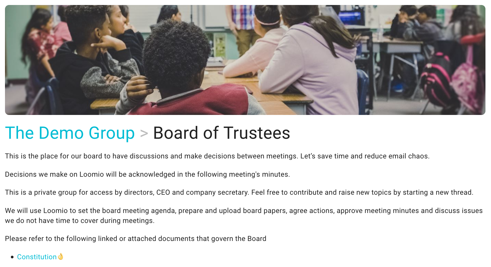

### 2. Invite team members

Invite board members to your new Loomio group with an email invitation.

1. On your group page go to the MEMBERS tab
2. Click INVITE
3. Paste in email addresses and SEND.

Participants will receive an invitation email with a link to the group. When they accept, a new Loomio user account will be created and they can participate in board discussions straight away.

### 3. Start a discussion thread for your next board meeting

A week before your meeting, start a discussion thread to announce the details of your meeting.

Click NEW THREAD from your [group page](https://help.loomio.org/en/user_manual/users/navigation/?utm_campaign=virtual_board_guide&utm_term=help/#group-pages/).

Give the thread a clear title, and explain in the ‘context’ section what this particular thread is about.

Attach board documents and include all relevant details, like links and files, so that people have them all in one place.

Putting this information in the thread’s context, which always remains at the top of the discussion, makes it easy for everyone to find.

Invite members to ask any questions prior to the meeting. This is helpful to gain insights about what people are thinking, so everyone can be better prepared for the actual board meeting.

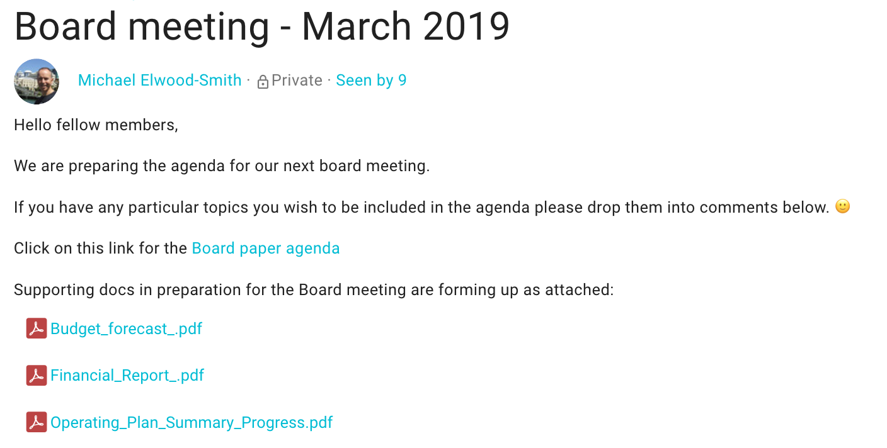

### 4. Agree on the agenda

Invite board members to read board papers and submit any agenda items. This is a great way to confirm everyone is prepared for the meeting.

Use a [Check poll](https://help.loomio.org/en/user_manual/polls/proposal_types/#check) to request a response. Set it to close before the time the meeting starts; so that everyone will get a reminder 24 hours beforehand.

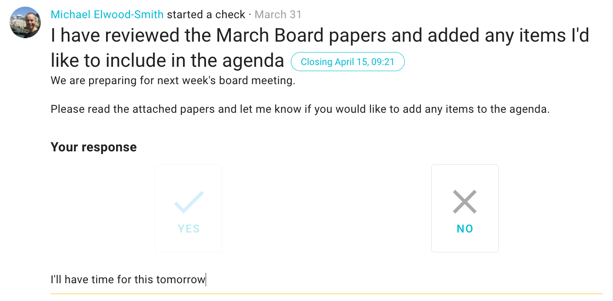

### 5. Set up an Outcome

Setting an Outcome lets everyone know what has been decided and what to expect, reducing time waste and confusion for board members.

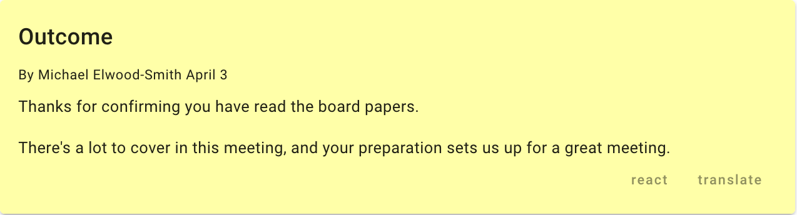

## During your meeting

Run the board meeting at the appointed time on Zoom or Skype as usual, following the agreed agenda and accessing board papers as needed.

Chairing a remote board meeting takes real energy. Richard Westlake observes;

- _First, you’re managing the process of the meeting. To most people, this is your main role._
- _Second, you’re still a director – not just a facilitator._
- _Third, as chair, you can’t afford to miss a beat: you need your antennae up the whole time, to know who should speak, who shouldn’t, and when to move on._

[Read Richard’s six tips for chairing a remote board meeting.](https://chairingtheboard.com/2020/04/01/chairing-in-the-time-of-physical-separation-six-tips-for-chairing-remote-board-meetings/?utm_campaign=virtual_board_guide&utm_term=help/)

You may find that some parts of your meeting are already reduced by using Loomio to help members arrive better prepared. For example, the minutes of the previous meeting already agreed on Loomio.

- During the meeting, minutes can be taken as usual or written directly into a Loomio thread.
- Members may add comments in the agenda or discussion topic threads within Loomio.  
- You may run a decision and record votes within Loomio.

Here are a few practices we find helpful, when using Loomio:

1. Checking in together
2. Ratify decisions made on Loomio
2. Extend discussion on topics between meetings  

### 1. Check-ins

Checking in with each other is always good practice – even more so when you are in a virtual meeting.

A quick check-in round where everyone has the opportunity to briefly say something – a personal experience and/or comment relevant to the business at hand – helps people to focus on the matters at hand and reveals if there’s any special circumstances that need attending to.

[You can even run check-ins on Loomio](https://help.loomio.org/en/facilitators_guide/commencing/#check-in).

### 2. Ratify decisions made on Loomio

If your constitution or legal requirement does not provide for online decision-making, you can note and ratify any decisions you have made in Loomio since the last board meeting.

We find it helpful to recognize decisions made on Loomio in the formal meeting minutes.

### 3. Extend discussion on topics between meetings

When an agenda item cannot be resolved within the time available in your board meeting, you can move this for further discussion to Loomio. Direct people to the relevant thread, or start a new one and notify your board members.

This relieves pressure on your board, allows more time for information gathering, discussion and deeper reflection which often results in a better quality decision.

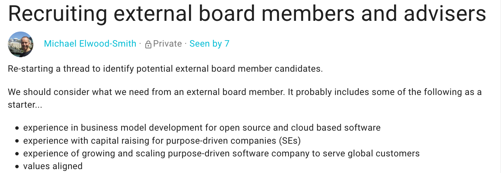

## After your Board meeting

Now that you have completed your first Board meeting with Loomio, here are some next steps to try:

1. Agree or ratify minutes
2. Make a decision between meetings
3. Agree a time for your next meeting
3. Review history and build an auditable archive

### 1. Agree or ratify minutes
After the meeting, update the meeting thread with a summary of what was discussed and note what action items were agreed on.

Create another [Check poll](https://help.loomio.org/en/user_manual/polls/proposal_types/#check) in the same thread, and attach or link to the meeting minutes document. Give people a few days to sign off the minutes and confirm their action points.

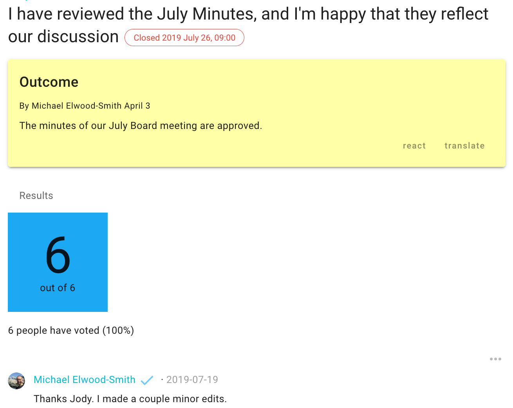

### 2. Make a decision between meetings
You can use Loomio to make a decision between meetings.

Save valuable time in meetings by pushing administrative decisions onto Loomio, such as approving an insurance renewal.

Loomio is also great for making time-sensitive decisions when action is needed before your next board meeting. For example, you may need to approve a special budget change, to deal with a problem or take advantage of an opportunity.  

Start a thread and open a discussion with clear context, relevant information and your request. When ready, raise a [Proposal](https://help.loomio.org/en/user_manual/polls/starting_proposals), and invite members to vote. You will soon hear if members need more information to vote.

[Loomio guides](https://help.loomio.org/en/guides) include detailed information about decision-making processes you can use.

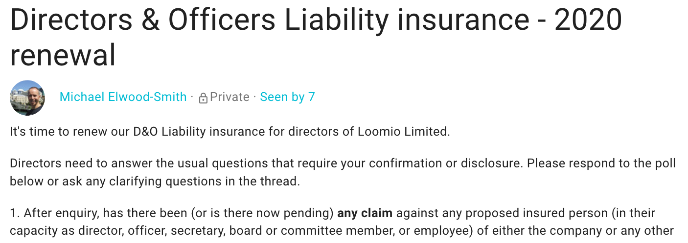

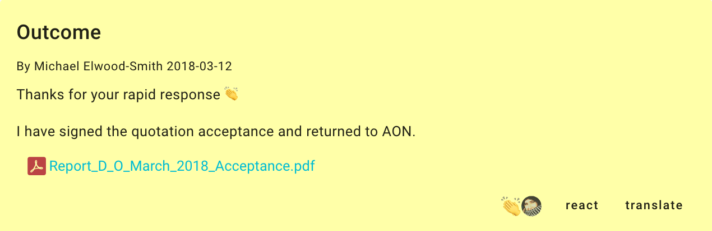

### 3. Agree on a time for your next meeting

You can use a [Time poll](https://help.loomio.org/en/user_manual/polls/proposal_types/#time-poll) to agree on a time for your next board meeting. Time polls are especially helpful when people are in different time zones.

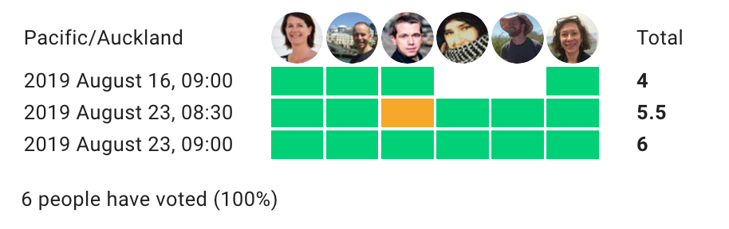

### 4. Review history and build an auditable archive

In your board Loomio group, you can easily search for past board meetings, and see the discussion that led to decisions made.

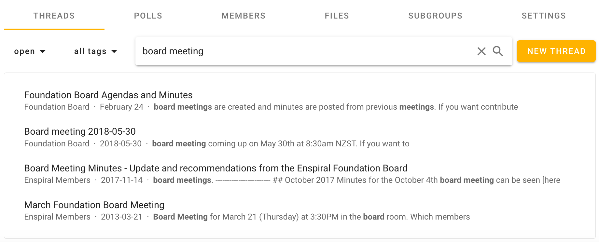

Within a thread, the timeline view helps to see progress of the meeting and quickly navigate to event milestones.

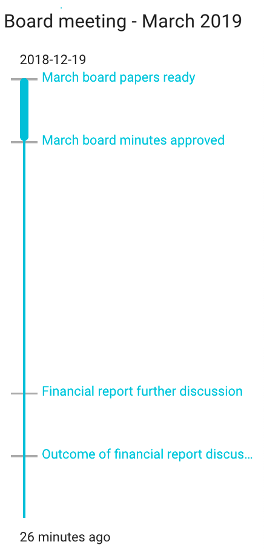

Find everything you need, when you need it, all in one place – great for audits.

---

## Onwards

Now that you know how to get better outcomes from your virtual AGM with Loomio, **start your [free trial](http://loomio.org/?utm_campaign=virtual_board_guide&utm_term=help/)** so you’re ready when the time comes!

Have you run an AGM or Board meeting online?

We’d love to hear about it – [connect with us](http://loomio.org/contact/?utm_campaign=virtual_board_guide&utm_term=help/).
