OS: Ubuntu 18.04 or Android 8.0.0

Browsers: Firefox, Chromium, or Chrome

Firefox version: 67.0.3

Chrome version: 75.0.3770.101

Chromium version: 75.0.3770.90 (Official Build) snap (64-bit)

All Chrome examples are on Android.

All Firefox and Chromium ex. on Ubuntu.

---

1/ Groups that have not uploaded a logo have a missing/broken image box where the logo would be as they're navigating threads etc in Firefox/Chromium

---

2/ Top navigation links feel redundant to the ones just above the thread title as much as I like how it describes the thread's relationship to the group... if you've seen some feedback that listing the group > subgroup above the thread name doesn't already achieve this, I still wonder if there's a more elegant way to achieve this...

3/ I can see how the [Group] > [Subgroup] over the top of the banner image can help people know where they are but maybe there's something that's left-aligned and smaller that could be a little less noisey and +aesthetic?

maybe Tonielle would have a suggestion after our exercise with Help that touched on this design choice?

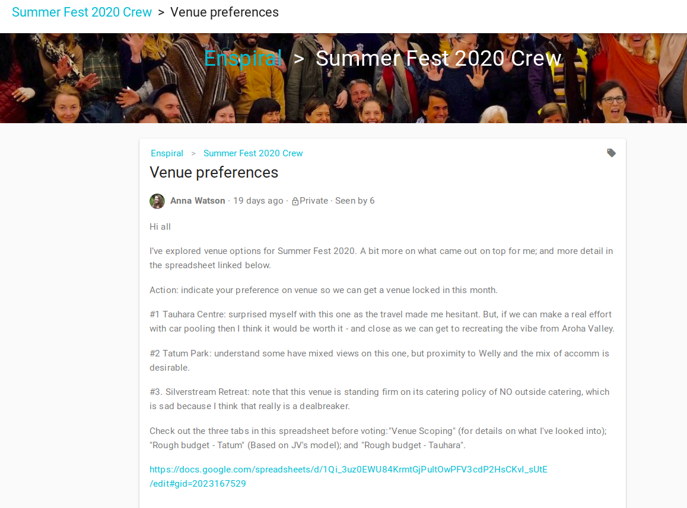

---

4/ old emojis breaking

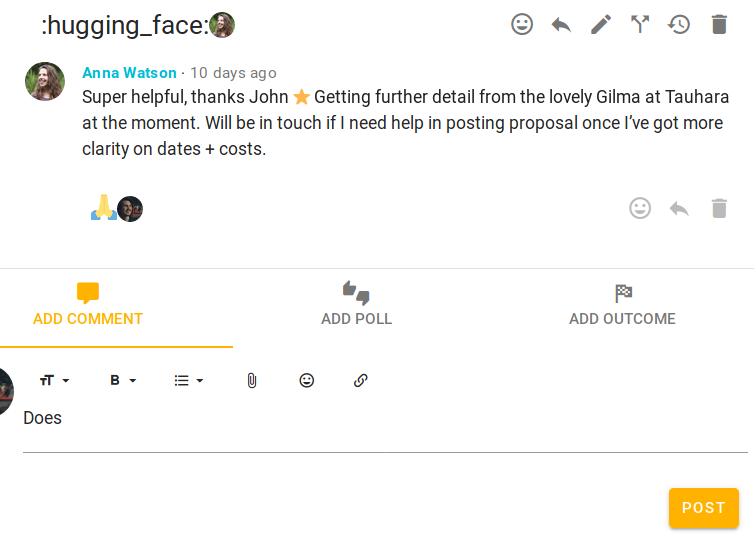

---
5/ redundant information... not sure why not displaying his initials

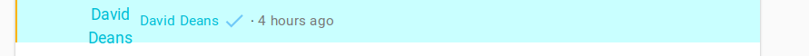

for Dave Deans @dave209 there's actually some issues going on in Loomio 1.0... maybe just a bad image file

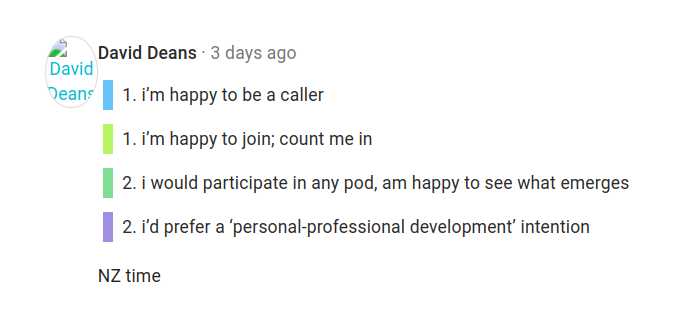

---

6/ When "Invite to thread" modal appears after thread context edits it should still read, "Notify of edits" possibly with the sub-text, "Who would you like to notify about your changes?" as it currently reads in Loomio 1.0

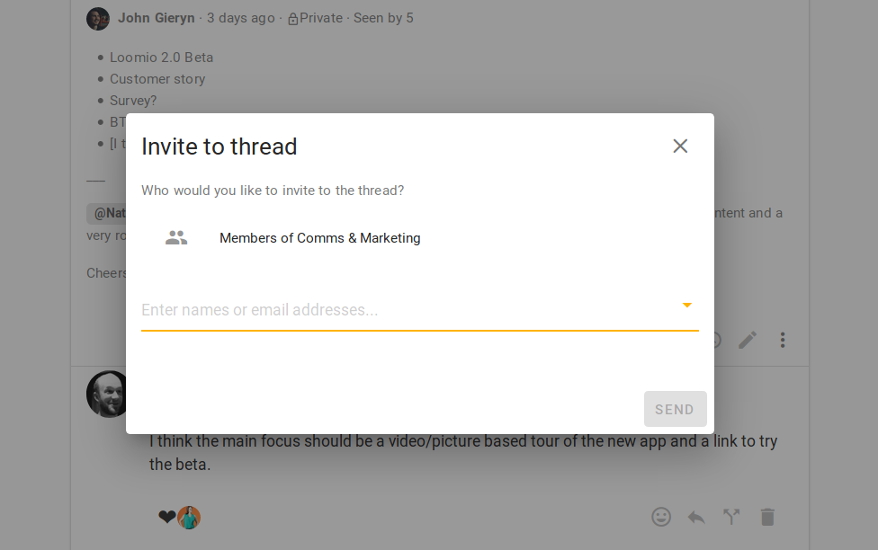

---

7/ Polls from another thread appearing in unrelated thread (in this example, Assembly Sprint opt in is appearing in a relatively new thread... likely because I'd recently visited said Assembly Sprint thread page?)

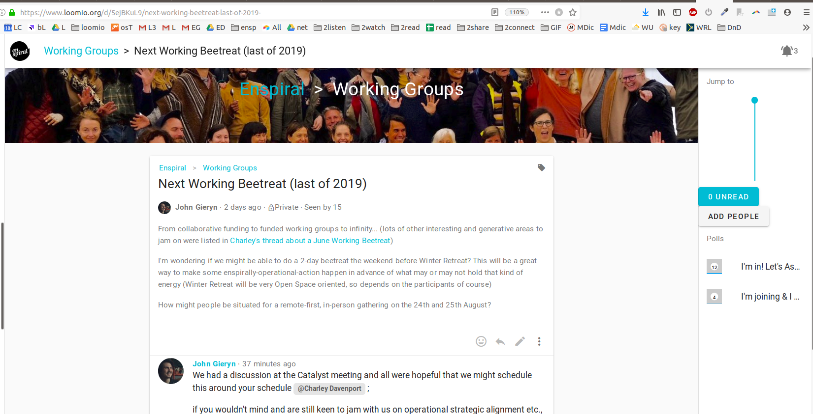

---

8/ Text suggestion (the greyed out text suggestion that sits in forms) sometimes comes back with certain actions... in this first example it may be related to the weird issues I was getting after trying to make a tickbox

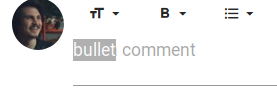

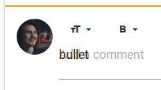

8a/ ... in this context I think the four underscores might have had something to do with it?

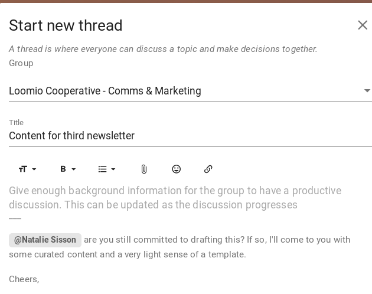

---

9/ Can't apply a link to text in Firefox

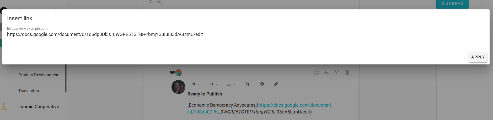

---

10/ When I paste a link wherein one might find some stuff that could be mistaken for markdown I get weird behavior [Firefox]

11/ No way to remove links [Chromium] [Firefox]

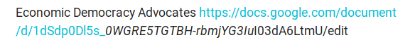

---

12/ On Firefox I get a mix of styles in the emojis; some look more like unicode symbols.

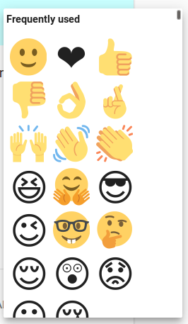

However on Chrome or Chromium it looks uniform/better.

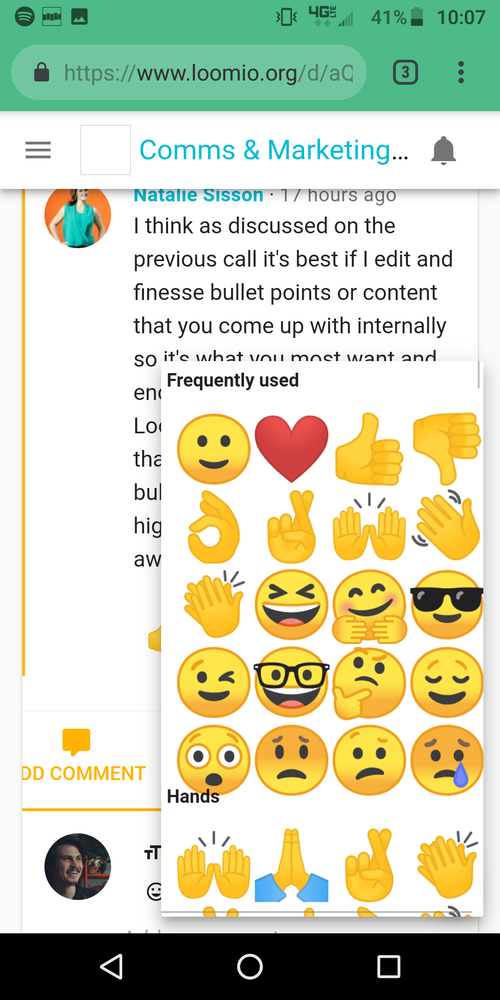

---

13/ Can't start polls that have custom poll_count_options;

14/ they also have are trying to pull up an icon and failing

14a/ and append a techno-string to my naming

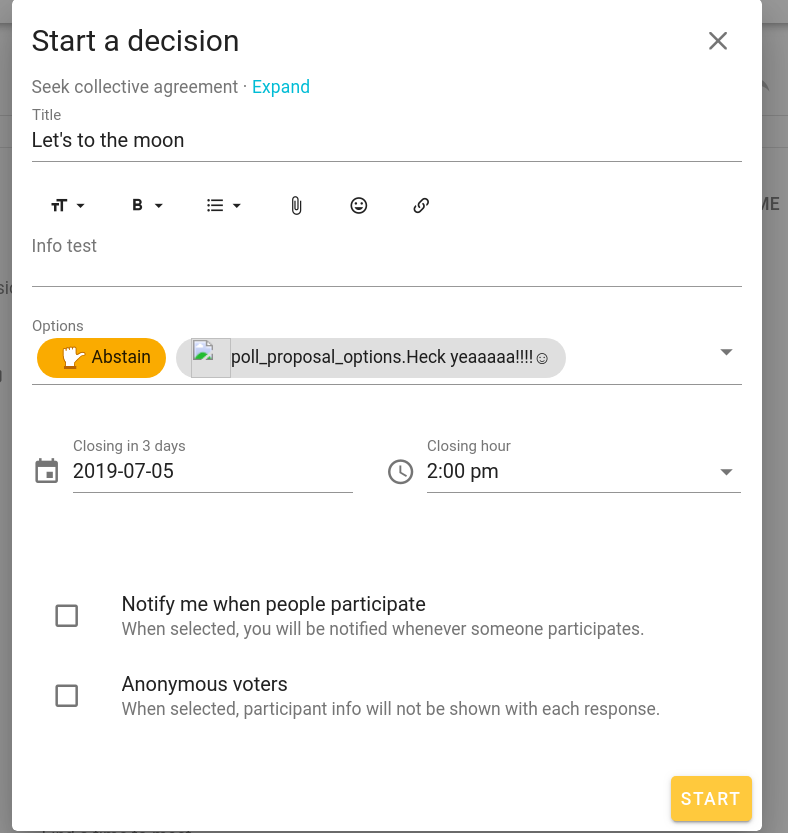

15/ When Yes and No are in the box I don't expect to see them in the dropdown; upon seeing them down there and perhaps interacting with that toggle, I expect to see the poll options I add added to the list. Maybe just one of these toggles?

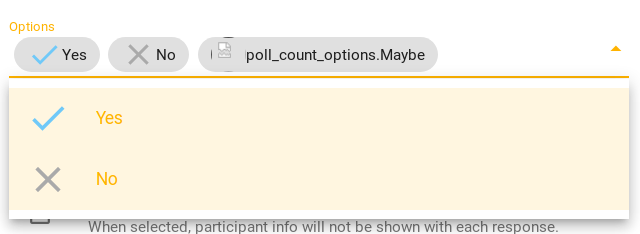

16/ If I run a check with just "No" (removed "Yes") the word "No" disappears leaving only the 'X'

17/ and the alignment and/or spacing hit me strangely

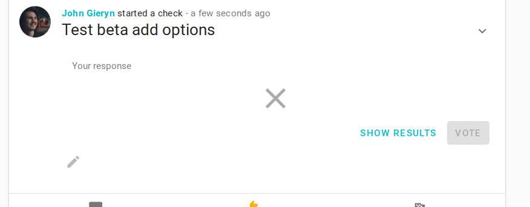

---

18/ Icon spacing and/or header size around/of "Edit check" needs adjustment

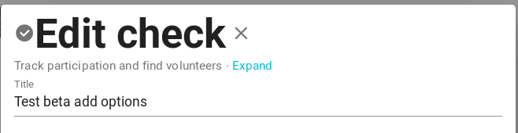

---

19/ Cannot use the (x) symbol by people's names to remove them from 'Invite to thread' modal. Using the text-cursor and backspace, or clicking names in the dropdown (dropping up...) do work fine

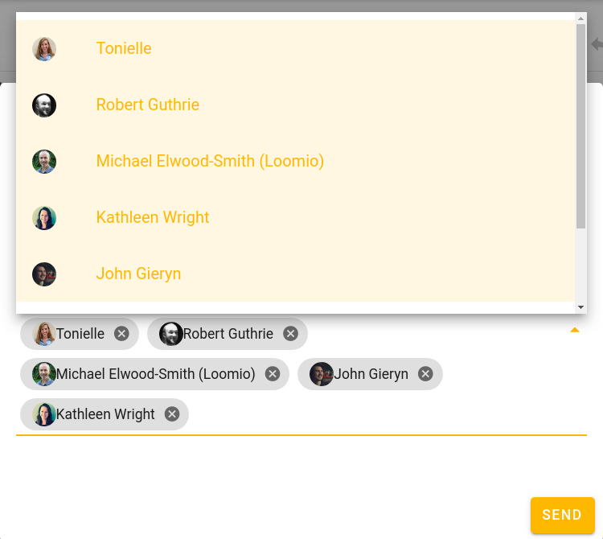

---

# Mobile

20/ Upon navigating to Loomio with browser that is not logged in I don't automatically get prompted with sign-in modal in Chrome... Just looks like Recent Threads page is failing to laod

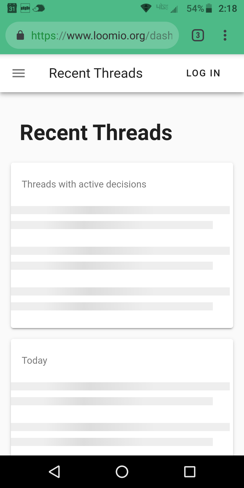

---

21/ There's some html code in the footer of this sign-in modal.

22/ Buttons need padding.

---

23/ Reaction images are too big

24/ I want to be able to read more about these notifications (who/where they're from)... I think Josef Davies-Coates made a similar feedback to us recently that should be in Customer Support Analysis

Towards the latter I've included an example of how Facebook's mobile app does it:

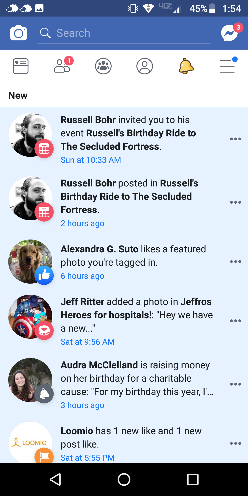

---

25/ "Include subgroups" going off page

26/ 'Show more' needs padding

27/ I wonder if it'd be easy for the '<' to the left of Threads to not appear until you side-scroll that tab-bar to the right? I'd see more perhaps?

28/ I wonder if we changed "Powered by Loomio" to just "Loomio", we could get that footer onto one line? Or, could we just remove the frontpage link? Though I vaguely remember Michael reporting some customer feedback that made us include that in the first place... hm...

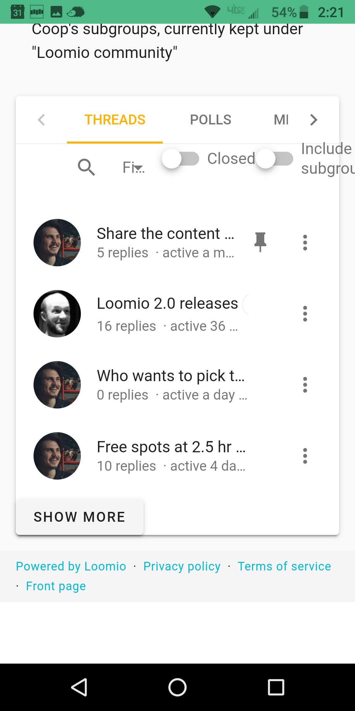

---

29/ I don't think I've seen the loading bar working across mobile or desktop
