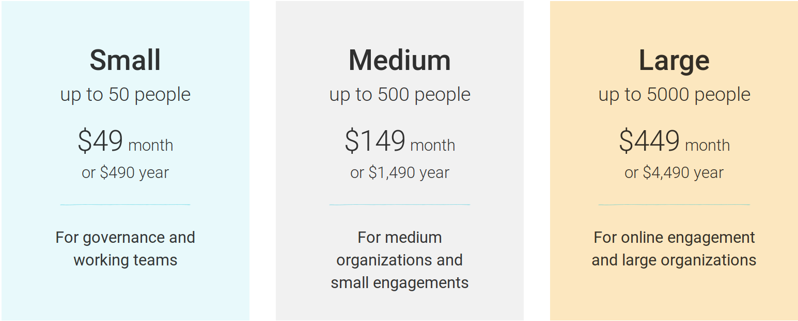
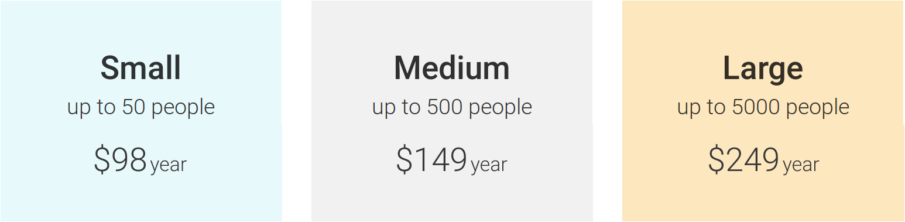

# Overview

Loomio exists to make it easy for anyone, anywhere, to participate in decisions that affect their lives. Our vision is to help organizations like yours work better together, now and into the future.

As a social enterprise and worker cooperative, our values are reflected in both the design of the software and how we operate as a business.

**Inclusive pricing model**

Our goal is to continue providing Loomio to as many people as possible, while also developing the Loomio platform so it can better serve you. To sustainably work towards our vision and support you, we have structured our pricing based on the type of organization we serve.  

We aim to provide a competitive price for commercial customers, an attractive and affordable price for volunteer organizations (e.g., member- or donor-funded), as well as a free option for unfunded community groups. [Learn more](/subscription_plans/#Loomio-subscription-plans).

**No time-limit on free trials**

We offer free trials to all new Loomio users, giving you the chance to evaluate Loomio and see if it is the right fit for your group. There is no time limit for the free trial. However, please note that trials are limited to 20 users and 10 threads. [Learn more](/subscription_plans/#Free-trial).

**Protecting your data**

The privacy of your data is our top priority. We will never sell your data or use it for advertising purposes. We only share personal data when it is necessary for the provision of our service.

## Loomio subscription plans

To keep it simple, any Loomio subscription is one price per group. Individual users are not charged to use Loomio.

A group coordinator can set up a subscription by clicking the Upgrade button, _near the top right of the group page_.

All subscription plans come with the full range of Loomio features including:

- Unlimited threads and decisions
- Slack and Microsoft Teams integration
- 100 GB file storage
- Subgroups and Tagging
- Training webinar with a Loomio expert
- Help desk – responsive support all year round
- Data export as CSV and JSON

---

### Free trial

All new groups start on a free trial, giving your group the opportunity to experience Loomio and see how it can support your needs.

Free trials are currently limited to 20 people and 20 threads. Contact us if you need to extend your group’s trial for any reason.

There is no time limit for the trial. [Sign up for a free trial](https://www.loomio.org/g/new).

### Small

Small plans are limited to 50 people and are typically used by working groups, teams, governance boards, and small groups.

### Medium

Medium plans are limited to 500 people and used by small to medium organizations, often collaborating in multiple subgroups and small networks. Many groups of this size also use Loomio for stakeholder engagement.

### Large

Large plans are limited to 5000 people and used by large organizations and networks, and for online stakeholder engagement.

If your organization or network is greater than 5000 people, [contact us](https://loomio.org/contact) to discuss options.

---

## Loomio pricing

We price Loomio according to the type of organization we support. This enables us to provide an inclusive service model that supports a diverse range of groups; businesses and government organizations, right through to non-profits, activist and volunteer groups.

### Funded and commercial organizations

Business, government, and other revenue-generating commercial organizations may choose monthly or annual payments.

### Funded nonprofit organizations
Legally-recognized nonprofit organizations, typically paying staff salaries—including NGOs, school boards, and trustee boards, political parties and religious organizations—**get 35% off**.

As a not-for-profit, you are eligible to receive a 35% discount on all plans. Simply enter coupon code **NPLOOMIO** at upgrade to redeem your discount.

[Upgrade here](https://loomio.org/upgrade).

### Volunteer and member supported organizations

**Special rates for volunteer organizations**

Apply to our [Volunteer Organization Application form](https://forms.gle/yg2HpRZkmYmGEyBq7)  to access these special rates for volunteer organizations. At completion, you will receive the coupon codes for the plans.

_Please note_ that volunteer organization rates are only available for annual payments.

**Does your group qualify?**

Volunteer organizations are supported by members giving their time to achieve the organization’s purpose. They have limited funds provided by members or donations, do not pay full-time staff salaries nor generate income from commercial operations.

Volunteer organizations include community and activist organizations, collectives, sports, and other clubs, and spiritual groups.

[Apply here](https://forms.gle/t2MfecjSua7JE9Wu5).

### Unfunded Community Groups

**Use Loomio for FREE**

As an unfunded community group, you can apply to our Community Application form to use Loomio for Free.

We have many groups around the world using Loomio for free. We aim to approve applications within 48 hours.

**Does your group qualify?**

Unfunded community groups and organizations do not have any funds or a bank account, no one is paid, and the group is not generating income.

Unfunded groups typically include local community groups, activists, hobby groups, co-housing groups, classroom education, families and friends.

[Apply here](https://goo.gl/forms/07y18PLA7ykcgbhJ2).
