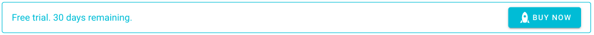

## Introduction
Loomio uses the Chargify billing and subscription management service to manage subscription records, initiate payments, process upgrades and cancellations.

Prices are based on debit/credit card payment via an automated billing portal.

## Upgrading your group
To continue to use Loomio beyond your free trial, you can upgrade your group to a paid subscription plan.

You may upgrade your group at any time by clicking the __Buy now__ button.

You'll then be able to choose the right plan for your group's needs and setup a subscription with your credit card.

Complete the required fields to set up your subscription, including:
- Customer Information (name and email address)
- Billing Information (credit or debit card details)
- Billing Address (to insure sales taxes are applied correctly)
- Confirm details and click the ‘Place my order’ button.

The subscription is activated immediately and your group automatically upgraded. You will receive a tax invoice/statement confirming successful payment.

## Automatic payment and statement generation
Your credit or debit card details are held securely by our subscription management service provider Chargify, PCI DSS Level 1 Compliant, for future recurring payments.
Monthly or annual payments via Chargify are automatic, and an invoice/statement is issued on successful payment.
You can access statements, and update card and contact details at any time using the secure Account Management link to the billing portal. Look for the ‘Account Management’ link at the bottom of your statement.

## Billing problems
Chargify may be unable to process a payment to your card when due.
If a payment is unsuccessful, an email notification will be sent to the email address we have on file, along with a link to the billing portal where you can update card details. The billing system will continue to retry the payment once a week, and if payment is not successful after four (4) attempts, the subscription plan will be cancelled (day 28).
Card payment problems are often caused by:
- Insufficient funds
- Expired card
- Bank restrictions on new cards or changes to existing cards. Please make sure your credit or debit card is authorized for “international payments” and “internet transactions” (“Prch” and “Auth”).
The billing system will issue an alert via email when your credit card is nearing expiry.

## Alternate payment options
Alternate payment options are only available for annual plan subscriptions.

### Payment via invoice and bank transfer
Contact us to set up payment via invoice and bank transfer.

### Payment via bank transfer must be made within 20 days of invoice.
Bank and international transfer fees must be added to the payment so that the full subscription fee due is paid.

There is an administration charge for manual invoice and purchase order processing of $US 25.00.

### Other currencies
Invoices raised in currencies other than in USD are converted at the daily Telegraphic Transfer rate plus 5%.

## Change your plan

[Click here to change your plan.](https://www.loomio.org/upgrade/)

You will see a list of all the groups you belong to.

Find the group you wish to change and click the 'Change' link.

This link takes you to the Loomio billing portal operated by Chargify where you can change your subscription plan. You may need to enter your email address to receive a secure link to the portal.

Click on the 'Change Plan' link and select your new plan.

Check the details of plan, price and payment frequency in the Plan Summary table are correct.

## Cancel your plan
If you would like to cancel your Loomio subscription, you can do this via your billing portal. A link to this portal is included at the bottom of your Loomio invoice/statements called ‘Account management’.

Follow that link to the billing portal, then:

1. Find ‘Plan Details’, click on ‘Cancel’ (on the right).
2. Tell us why you are canceling the plan.
3. Choose 'Cancel Now' or 'Cancel At End of Period'.

If you’re having issues finding your billing portal link, please contact us.

### What happens when a subscription is cancelled?

Your group data and membership remain and you can continue to comment on existing threads and vote on existing decisions, however you will no longer be able to start new threads or invite new members to the group.  

You can reinstate the subscription at any time. If you no longer require the group, you may deactivate it.

## Fair refund policy
When it comes to refunds, we treat our customers how we ourselves would like to be treated. Please see our [Fair refund policy]()
