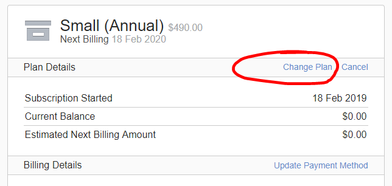
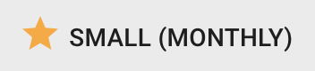
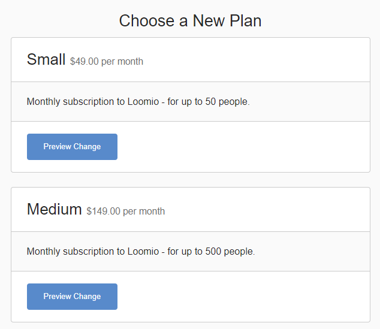

## Introduction
Loomio uses the Chargify billing and subscription management service to manage subscription records, initiate payments, process upgrades and cancellations.

Prices are based on debit/credit card payment via the Loomio automated billing portal.

When setting up a subscription, you can use a coupon code if applicable.

## Upgrading your group
When the limits of your Loomio trial are reached, you will be asked to upgrade to continue using Loomio.

If your group grows beyond the plan limit, you will be asked to upgrade to the next plan to continue using Loomio. For example if your group is on Small plan and you wish to invite more than 50 people into the group you will be asked to upgrade to the Medium plan.

You may upgrade your group at any time.

## Multiple group consolidation
If you have several groups, you may wish to consolidate these under a single group subscription.  In most cases we can move groups to become subgroups of a parent group. To do this, please [contact us](https://www.loomio.org/contact).

Groups moved to become subgroups retain all privacy and member permissions.

[Note to add to Group settings page: Subgroups
Subgroups have an additional permission you can enable if you wish. For example a Closed subgroup includes the permission - "Members of [parent group] can see private threads". This allows members of the parent group to see discussions within the subgroup. The default setting for this permission is 'off'.]

## Automatic payment and statement generation
Payments via Chargify are automatic either monthly or annually, and a statement is issued on successful payment.

You can update card and contact details at any time using the secure Account Management link to the billing portal. This is located at the bottom of the statement.

## Billing problems
If Chargify is unable to process a payment to your card when due, an email notification will be sent to the email address we have on file, along with a link to the billing portal where you can update card details.   The billing system will continue to retry the payment once a week, and if payment is not successful after four (4) attempts, the subscription plan will be cancelled (day 28).

The billing system also issues an alert via email when your credit card is nearing expiry.

Card payment problems are sometimes caused by bank restrictions. Please make sure "international payments" and "internet transactions" are enabled on your card.

## Alternate Payment Options
Alternate payment options are only available for annual subscriptions.

### Bank Transfer payment
We accept payment via bank transfer for payment within 20 days of invoice.

### Manual Invoices
There is a 10% administration charge for manual invoice and purchase order processing.

### Other Currencies
Invoices raised in currencies other than in USD are converted at the daily Telegraphic Transfer rate plus 5%.

## Managing Subscription

### Upgrade plan
To upgrade from a trial or free plan, click the ‘Upgrade’ button located near top right of your group page.

You will see a list of all the groups you belong to.

Find the group you wish to upgrade and click the Upgrade link.

Select the subscription plan you wish to purchase and click ‘Pay monthly’ or ‘Pay annually’
This link takes you to the Loomio billing portal operated by Chargify.  Here you can set up your subscription.  Check the details of plan, price and payment frequency in the Plan Summary table are correct.

Enter or paste in a coupon code if applicable and confirm that the price has been adjusted accordingly.

Complete the required fields to set up your subscription, including:

- Customer Information (name and email address)
- Billing Information (credit card details)
- Billing Address (to insure sales taxes are applied correctly)

Confirm details and click the ‘Place my order’ button.

The subscription is activated immediately and your group automatically upgraded.  You will receive a tax invoice/statement confirming successful payment.

### Change plan
To change your plan, click the plan status button located near top right of your group page. For example:

You will see a list of all the groups you belong to.

Find the group you wish to change and click the Change link.

This link takes you to the Loomio billing portal operated by Chargify.  Here you can change your subscription plan.  

Check the details of plan, price and payment frequency in the Plan Summary table are correct.

### Cancel plan
If you would like to cancel your Loomio subscription, you can do this via your billing portal. A link to this portal is included at the bottom of your Loomio invoice/statements called ‘Account management’.

Follow that link to the billing portal, then:

1. Under ‘Plan Details’, click on ‘Change Plan’ (on the right)
2. Choose a new plan 
3. Confirm changes.

If you’re having issues finding your billing portal link, please contact us.

### What happens when a subscription is cancelled?

Your group data and membership remain and you can continue to comment on existing threads and vote on existing decisions, however you will no longer be able to start new threads or invite new members to the group.  

You can reinstate the subscription at any time. If you no longer require the group, you may deactivate it.

## No refund policy
Loomio will not provide any refund for any remaining prepaid subscription payment.

If you believe a payment has been made in error, contact us with details and we will assess the situation on a case by case basis.
