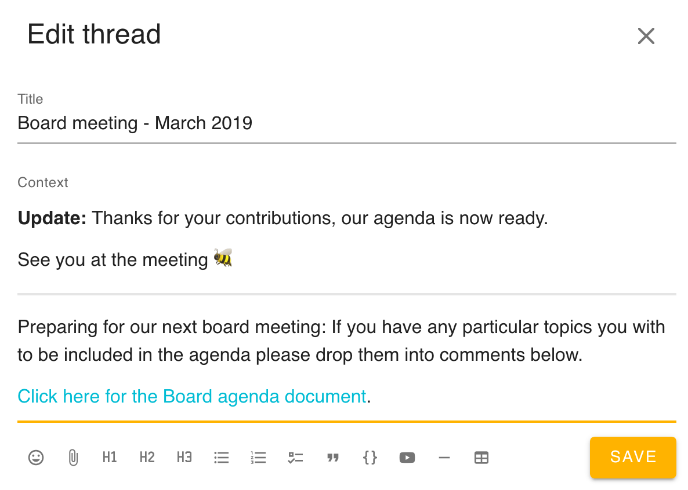

Use Loomio's _threads_ to have discussion that result in clear outcomes.

<iframe width="100%" height="380px" src="https://www.youtube-nocookie.com/embed/MtpDOtmwXGI" frameborder="0" allowfullscreen></iframe>

_Facilitation_ means “to make easier; help forward”. Discussions on Loomio always work best when there is a clearly identified _facilitator_, someone whose role is to help the discussion move forward. There are a lot of things you can do to help your group have productive discussions — and you don't have to be a pro - in fact, anyone in a group can make little acts of facilitation.

## Keep the topic concise

Making the thread title and context clear and engaging is the best way to ensure a productive discussion. Take a little time to consider what contribution you would like from the group. For example:

- Are you calling for personal experiences or asking for thoughts about some information?
- Over what time frame will the discussion take place?
- Will a decision be made within the thread?

As the person who started the thread, people may be expecting you to host the discussion and keep things on track as it progresses.

## Maintain a safe environment

> A [study of more than 180 teams within Google](https://rework.withgoogle.com/blog/five-keys-to-a-successful-google-team/) tells us that the number one factor in team performance is **psychological safety**.

Respectful disagreement is essential to finding the best solution for the group, but it can be challenging work. For real discussion to happen, you must hold space for differing opinions. Help people express themselves, in a way that allows others to express themselves too.

If someone is distressed, being unconstructive, or is in a minority opinion they feel strongly about, it’s a good indication that a face-to-face or phone conversation might be helpful.

For more guidance, see [Resolving conflict on Loomio](http://joshuavial.com/loomio-conflict/).

## Use simple language

Be careful with humour and avoid sarcasm. These don't translate through text well, and it's easy for people to mistake a funny comment as something mean.

Be expressive and say what is on your mind. Use an emoji to add colour, fun, and extra meaning to your comments. Images can also help communicate effectively.

Long comments can be hard to follow. If you must write a long comment, divide it into paragraphs and add a summary to the top.

If your comment is tangential to the discussion, start a new thread to avoid distraction from that topic.

## Getting attention

Effective use of Loomio means knowing how and when to get attention from the group.

If you ask for attention when it's really important, and avoid it when it's not, people will keep paying attention.

**Start a discussion**

When you start a discussion, you can choose to select all members of a group, or a select number of them. When you select the whole group, you can assume it will get everyone's attention.

**Mentioning**

A direct way of asking for someone's attention. Use the `@` symbol and select the person's name. It's generally expected that you will respond when someone _mentions_ you.

**Replying**

_Replies_ to another users comment will notify that user; this means you don't have to `@`mention them.

**Reacting**

Use the smiley face `😃` button to _react_ to comments and contexts (threads). You might use a reaction when you want to share how you feel, a brief opinion, or indicate that you have seen the comment. _Reactions_ are helpful because they are less disruptive than mentions, replies, or comments.

**Invite to Thread**

When you start a thread, your whole group can access it immediately. If you want more people's participation, or want their participation sooner, you can additionally send them an alert using _Invite to thread_, which you will find in the Thread Members panel of your right-hand column.

_Invite to thread_ also enables you to invite people outside of your group; see "Invite non-members to a discussion", below, for details.

**Start a decision**

The most powerful way to get attention from your group. Ensure that you have a clear decision description so people know how to participate. Loomio will notify everyone you choose (the whole group, everyone in the thread, or selected individuals) about new decisions. Loomio will also remind participants, and those you invite to the decision, before the closing deadline.

**Disagreeing and Blocking**

Disagreement is an indicator that someone wants to be listened to, and gives valuable information that can lead to new thinking. Give them an opportunity to explain themselves. Remember, everyone can change their mind while a decision is still open.

## Who's not present?

If someone's missing, invite them!

Bring group members into a specific discussion by mentioning them: type “@” followed by their name. Try to notice people who have not participated and invite their input.

High quality decisions come from gathering the right inputs. Are there other people the decision affects, who have not shared an opinion? Are there experts in the field that you could bring into the room?

**Invite non-members to a discussion**

You can invite people from outside of your group to a specific thread by using _Invite to thread_ in the Thread Members panel, as depicted above. They will have access to this thread alone and to no other part of your group. This can be useful if you have contracted an expert (e.g., a lawyer) and you would like to make the conversation accessible to your group. It helps you keep tidy records, saving you time and effort copying and pasting communications that have occurred outside of Loomio.

**Inviting diverse participation**

Remember to look out for those people who tend to be quiet. Don't just call them out, but consider how best to bring their perspective in, and why they might be participating or vocalizing less than others.

## Keep discussion on Loomio

The same topic being discussed in multiple locations at once can quickly get messy. If you've decided to use Loomio, but people are reverting to email, consistently remind people to move the discussion to Loomio.

It takes time to build new habits, so be patient and consistent. It's helpful to take the intiative to start a Loomio thread and copy in the discussion so far, and reply to emails with the link, so people can jump straight in.

If a topic progresses offline, update the Loomio thread with the new information, so later you have all the context in one place.

## Keep the title and context relevant

Loomio threads are designed to evolve with a discussion, which is why the title and context box are editable. The thread context always remains at the top of the thread in order to frame and guide the conversation or decision. Make it easy for people have a clear, shared understanding of where things are at, or to catch up, by updating the thread context and title with the latest info. This also helps you later if you want to refer back to a previous discussion and quickly remind yourself what happened.

The pencil icon is the quickest way to edit a thread context and title.

Here's an example in which the facilitator is notifying the group what has happened as a result of their agenda suggestions.

Updating the context with an outcome lets group members know what is next.

## Break down complex issues

**Working Groups or Committees**

Sometimes an issue is helped by delegating a small group to do background research, frame up options, or summarise data. They can work together and then come back to the larger group when they're ready to present a decision. Or you can decide to mandate them to move forward autonomously.

**Mutiple threads or sequential proposals**

If a complex discussion is raised, think about breaking it down into multiple threads, one for each different aspect. Or, you might want to raise a series of proposals in the same thread to address different smaller decisions in the same topic. That way, all the context stays in one place.

**Subgroups**

If you have an area of collaboration requiring many threads and ongoing collaboration, but it only affects certain people, you can create a [subgroup](../../groups/settings/#create-sub-groups). For example, offices in different geographical locations, teams working on different projects, or groups with a specific mandate like a governance board.

## Going in-depth on Facilitation

See the [Facilitators Guide to Loomio](../../../guides/facilitators_guide/) for information on all these topics and more.
