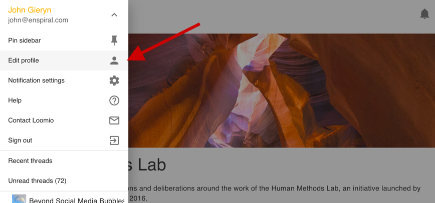
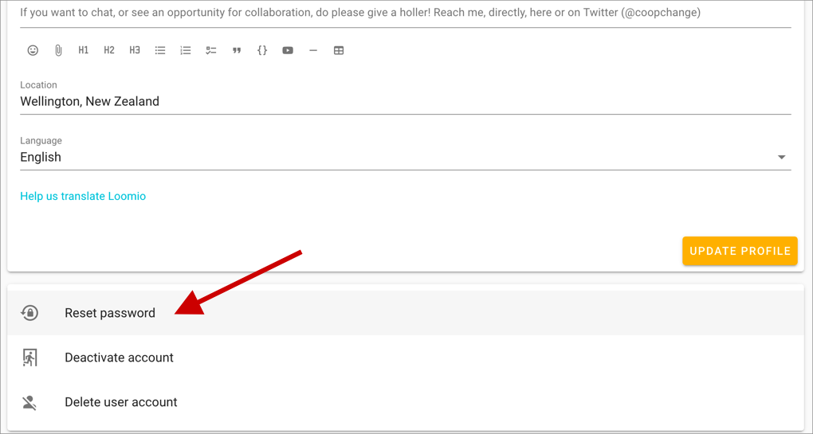

## Configure your email settings

Email notifications are an important way for Loomio to keep people updated on what's happening in your group.

<iframe width="100%" height="380px" src="https://www.youtube-nocookie.com/embed/0Mb2_D74ktM" frameborder="0" allowfullscreen></iframe>

When you (or your group members) start your account, by _default,_ Loomio will:

- send you a **daily summary email** of everything you missed the day before
- let you know when someone's trying to get your attention via **mentions & replies**
- **subscribe upon participation**, sending emails for every comment on threads you're interested in.
- immediately email you **when someone asks for your attention**: notifications of polls or proposals or thread invitations

This helps to keep people engaged in the early stages of a group. We set this default assuming that you and your group members will not yet have a habit of using Loomio regularly. For this reason, the default makes it easier for you to stay up to date via your email inbox.

To change these settings, go to your [notification settings](https://www.loomio.org/email_preferences), where all of your overarching notification settings live. Find it in the user menu by clicking on your name in the top-left; _if it is closed, click on the menu icon (top-left) to open it._ Then click the cog icon / **Notification settings**.

<iframe width="100%" height="380px" src="https://www.youtube-nocookie.com/embed/VMhTAL5oXI8" frameborder="0" allowfullscreen></iframe>

### Notification preferences: all groups

In this section of the overarching **Notification settings** page, you can select the defaults that affect all your groups:

- receive emails **whenever there is activity** (subscribed)
- use the **normal** setting (again, **when someone asks for your attention**)
- choose to receive **no notifications** (ignore)

### Notification preferences: a specific group

Notification settings for each specific group are found in your Loomio group. To find it

1. Click on your group page
2. Click on the tab, **Settings**
3. **Email settings** will be the first listed

You can apply this setting to the **organization** (a.k.a. parent group) alone _or_ to the parent group and all of its subgroups.

## Profile settings

Your profile page lets you customize your Loomio identity. To visit your profile page select the **edit profile** option in the user menu.

## Uploading a profile photo
When you first create a Loomio account, your initials will be the default image associated with your profile. You can upload a profile photo by clicking on your picture on the profile page. If you have a [Gravatar](https://en.gravatar.com/) you can set that as your profile picture by selecting **Use Gravatar**. You can also choose for Loomio to use the photo you use for other common platforms/tools.

## Update your personal info

You can update:

* **your name**
* **your email address** - this email receives your Loomio notifications (on, by default)
* **your username** - your username is a name people can use to alert you with an @mention in threads
* **your introduction** - a few lines to let others in your group know more about you
* **your location** - useful for distributed or remote groups so people can get an idea of where others are

## Language settings
Loomio is developed in English, but [is translated by volunteers into many languages](https://www.loomio.org/g/cpaM3Hsv/loomio-community-translation).

Loomio will detect your browser’s language settings, but you can manually set your preferred language from the profile page.

<iframe width="100%" height="380px" src="https://www.youtube-nocookie.com/embed/0llDGzowrXU" frameborder="0" allowfullscreen></iframe>

## Resetting your password
You can change your password by visiting your profile page and clicking _Reset Password_. The profile page is located via the user menu; the video just above will show you where.

## Deactivating your account

For more information on deactivating, or recovering, your account, go to the [Your Profile article](/en/user_manual/users/user_profile)

---

## Next up

Now that you have the basics under your belt... [→ Activate your group](../activating)
