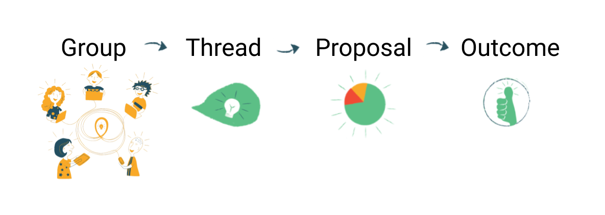

Loomio makes is easy for groups of all shapes and sizes to collaborate and make decisions across time and space. Simple to use and easy to get started with, Loomio can save you hundreds of hours and thousands of dollars, supporting your group to be more effective in your decision-making and collaboration with our simple, online tool.

<iframe width="100%" height="380px" src="https://www.youtube-nocookie.com/embed/JMda6WYx9jM" frameborder="0" allowfullscreen></iframe>

## The big picture

To start using Loomio well, you just need to understand four main elements.

**Groups** hold everything in one place for a specific set of people.

Discussion **threads** are where you go to discuss topics and make decisions, using tools such as the **proposal** – or other **polls** – which help you visualize where the group is at on a given proposal, question, or topic.

Finally, you'll use an **outcome** to share what's going to happen next so everyone has a clear understanding and there's a useful record.

At its most basic, Loomio is a forum with tools that help you facilitate conversations and decisions, helping you start and hold conversations that move to clear outcomes.

**Ready to take the next step on your collaboration journey?**

Let's [start your group](../starting_a_group)!

---

## About us
Loomio is a cooperative social enterprise based in Wellington, Aotearoa New Zealand. Our mission is to empower anyone, anywhere to participate in decisions that affect their lives. [Find out more](https://www.loomio.org/about).
