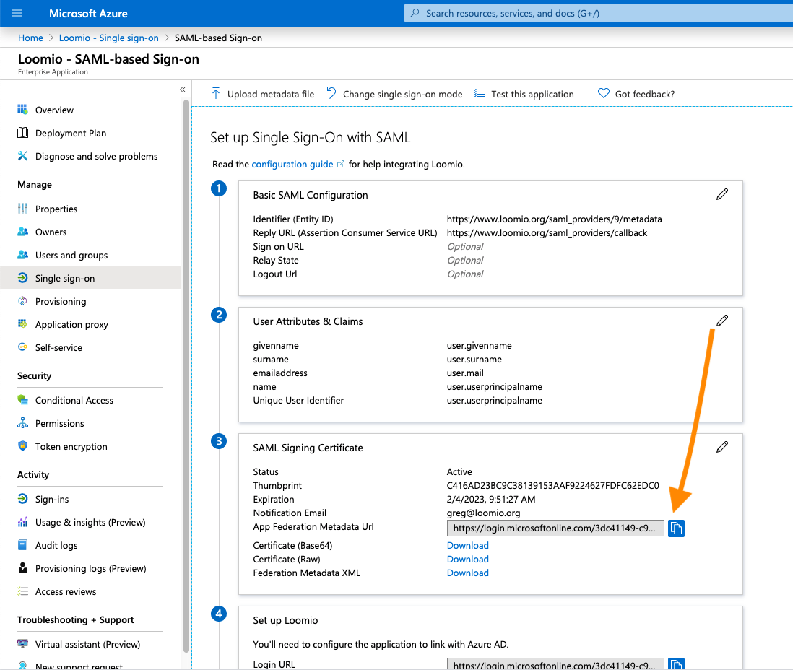
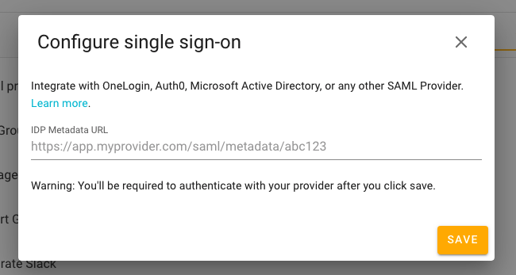
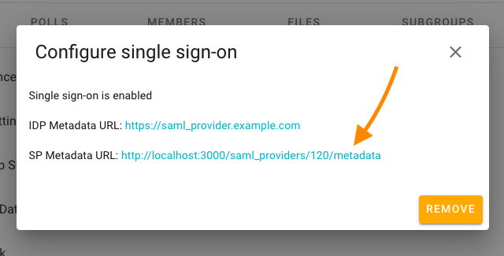
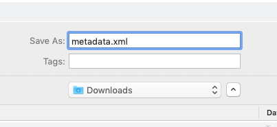
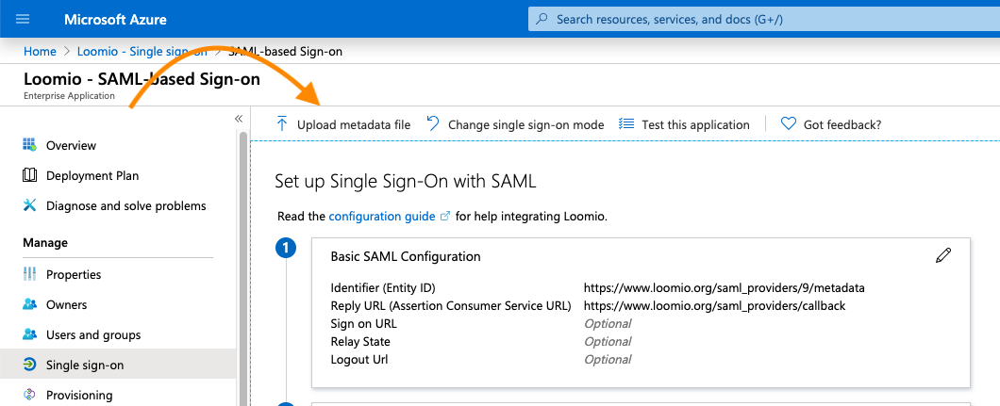
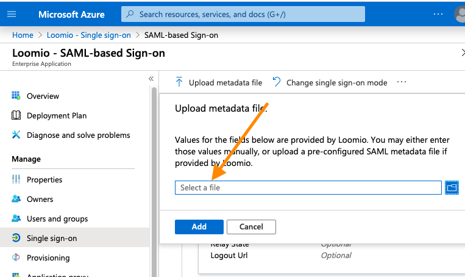
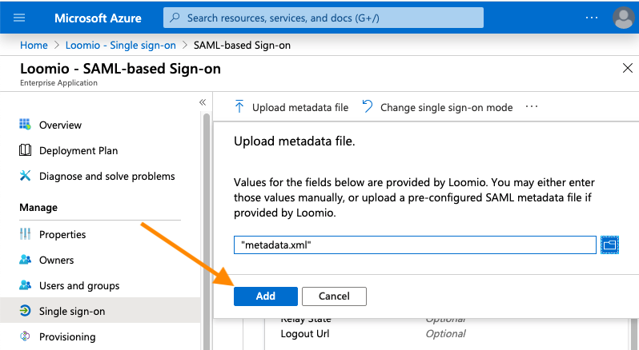
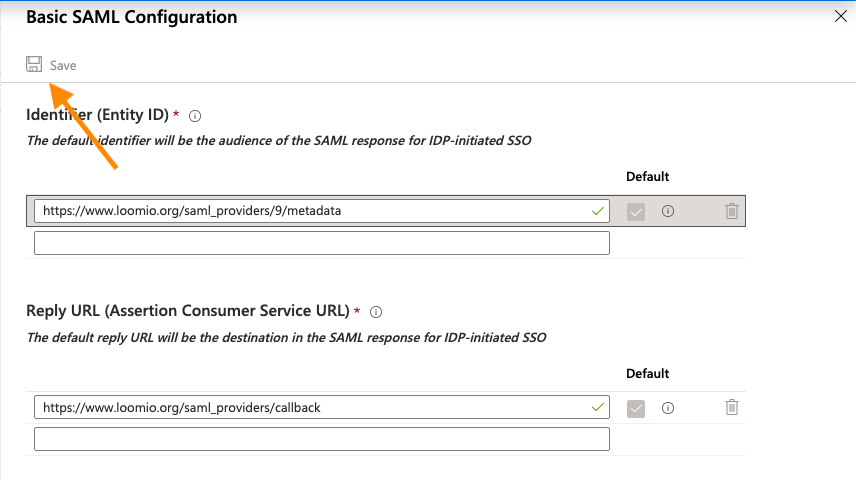

Setup your Active Directory enterprise application and start your SAML configuration by following this guide: [Configure SAML-based single sign-on to non-gallery applications](https://docs.microsoft.com/en-us/azure/active-directory/manage-apps/configure-single-sign-on-non-gallery-applications)

Once your enterprise application has been setup, here are the Loomio-specific steps.

__First, grab the metadata URL from the following field in Active Directory:__

Next, head to your Loomio group's Settings tab > Configure single sign-on.
__Paste the metadata URL into the field and click Save:__

Once successfully saved, go back to the Configure single sign-on window.
__There should now be an "SP Metadata URL" field. Click on the link:__

__Save the metadata.xml file to a location on your computer:__

Next, return to your Active Directory SAML Configuration screen.
__Click the 'Upload metadata file' button near the top of the screen:__

__Click the "Select a file" box, then locate the metadata.xml file you downloaded previously:__

__Once you've located the file, click "Add":__

You should then see the following screen.
__Click "Save" in the top-left:__

And you're done! Users that have been assigned to the Active Directory application should now be able to login to your Loomio group via SAML.

__When an assigned user attempts to view your Loomio group page for the first time, they will be directed to Active Directory to login, after which they will be redirected back to the Loomio group page.__
