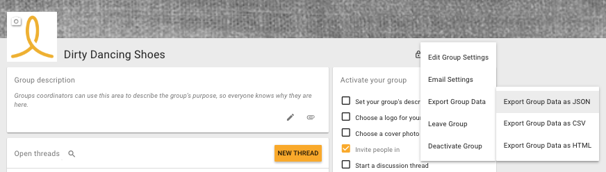

## Export

Open the _Options_ menu on the group page and select _Export Group Data_.

### Export group data as CSV

*For working with the group data in a spreadsheet, such as with MS Excel or Google Sheets.*

You'll be prompted to choose a destination on your computer for the CSV file.

### Export group data as HTML

*For when you want to save the data for archival purposes.*

This will open the HTML file in another tab in your browser. If you want to save the file, right-click anywhere on the page and click "Save as".

### Export group data as JSON

*For when you want to move your group data to a self-hosted Loomio instance.*

You'll shortly receive an email with a link to downloading the JSON file.

## Import

If you are hosting your own Loomio deployment, and would like to import your exported data:

Copy the .json file to the container instance's `import` folder:

`scp your-group-data.json username@some-domain.org:loomio-deploy/import`

Access the running Rails console:

`docker exec -ti loomio-app rails console`

Call the service:

`GroupExportService.import('/import/your-group-data.json')`
