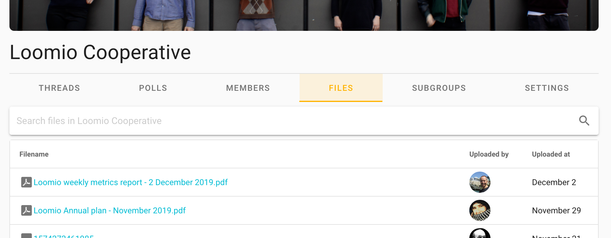

Loomio tracks all the files that are shared in a given group or subgroup and displays them in the **Files** tab, accessible from the relevant group page.

Files that appear here include files attached to

- Group description
- Thread contexts

…but _not_ from  comments.

The organization (parent group) will _not_ display files located within its subgroups.
