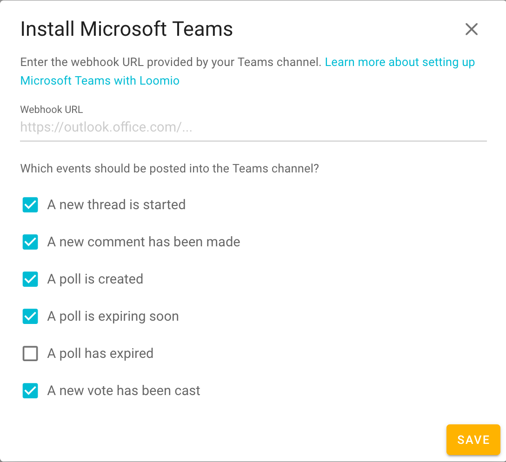

## Slack integration
LoomioBot publishes activity from your Loomio group into your Slack channel so people can participate directly from Slack.

From your group page's **Settings** tab, click **Integrate Slack** and follow the prompts in order to connect the LoomioBot Slack integration to your Slack team.

<iframe width="100%" height="380px" src="https://www.youtube-nocookie.com/embed/ZwZD4ecfaM4" frameborder="0" allowfullscreen></iframe>
*Setting up my first Slack integration.*

This associates the chosen Slack team with your user account.

Only one Slack team may be associated to any given user account. If you wish to associate two or more Loomio groups with channels in two or more distinct Slack teams, you will need to arrange for different users (or user accounts) for each distinct Slack team that has channels with which you want your groups to be integrated.

Once you have it installed, **it's easy to associate additional groups** or subgroups to different channels of your Slack team.

<iframe width="100%" height="380px" src="https://www.youtube-nocookie.com/embed/u2H3HEsvTAQ" frameborder="0" allowfullscreen></iframe>

## Microsoft Teams

Navigate to your group's Settings tab (similar to the above [video clip](#set-up-slack-integration)) and click **Integrate Microsoft Teams**

From Microsoft teams you need to add a new connector. See [this page](https://kb.itglue.com/hc/en-us/articles/115001798191-Setting-up-Microsoft-Teams-webhook-notifications) for help with that.

Hopefully from your time in the MS teams connector interface, you'll have a Webhook URL that you can put into Loomio.

Enter the webhook URL and select which events you'd like to see mentioned within the microsoft teams interface.

You'll receive a success message in Loomio as well as a message within Teams saying you're connected.

## Single Sign On (SAML)

If your organization uses an authentication service such as OneLogin, Auth0, or Microsoft Teams, you can integrate this with your Loomio group.

This feature is available to all organizations with a Pro subscription and is in a public beta.

As this is a beta release we are currently working on documenting the setup proces for each Sign on Provider. Please email contact@loomio.org for support to connect your specific provider to your Loomio group.

We provide instructions specific to each provider. If your provider isn't listed, please contact us.

[Microsoft Azure Active Directory](../configure_azure_sso)

---

_Loomio is not created by, affiliated with, or supported by Slack Technologies Inc., Microsoft Corporation, nor OneLogin._
