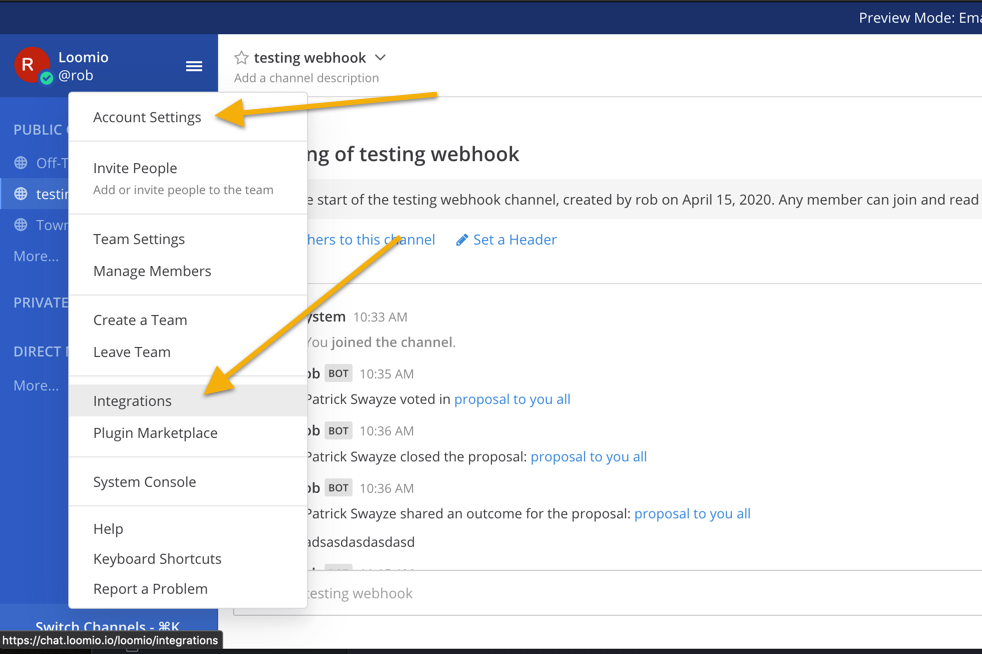
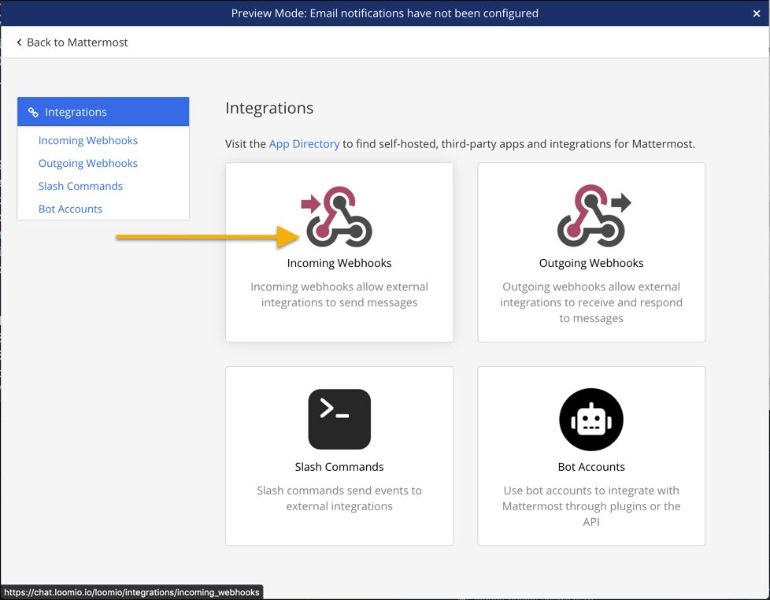
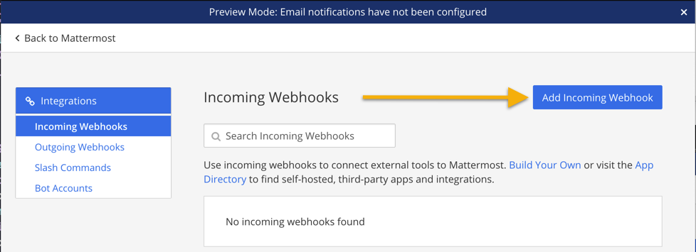
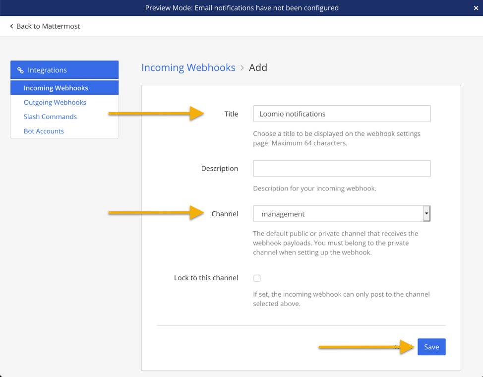
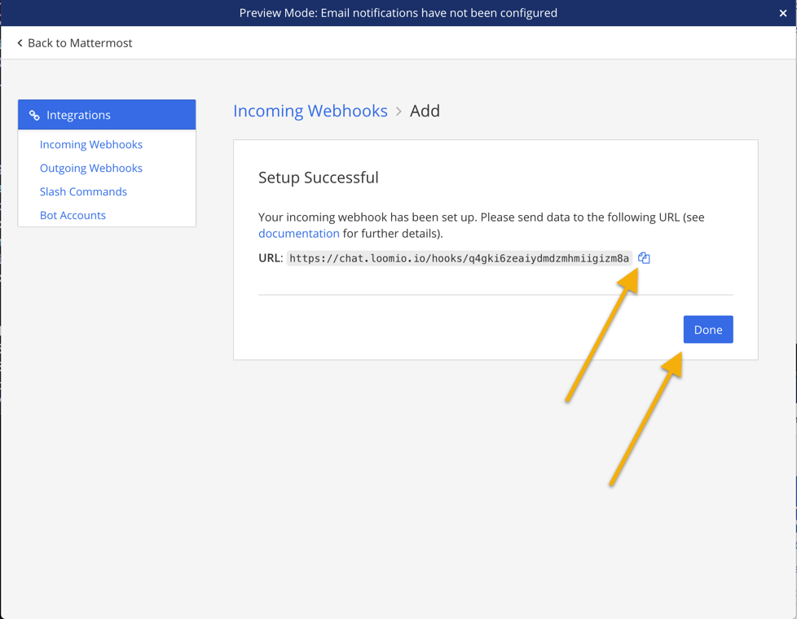
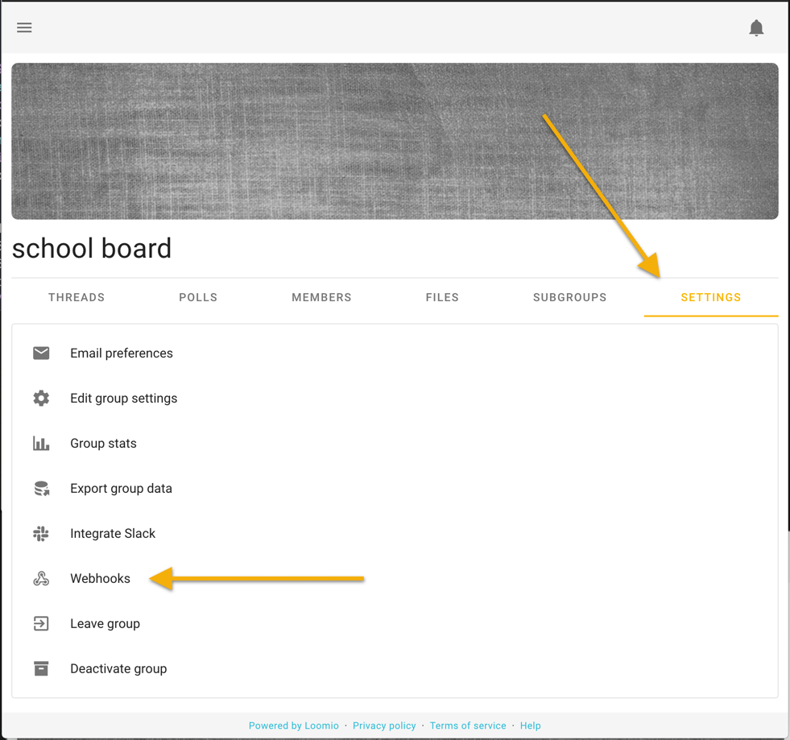
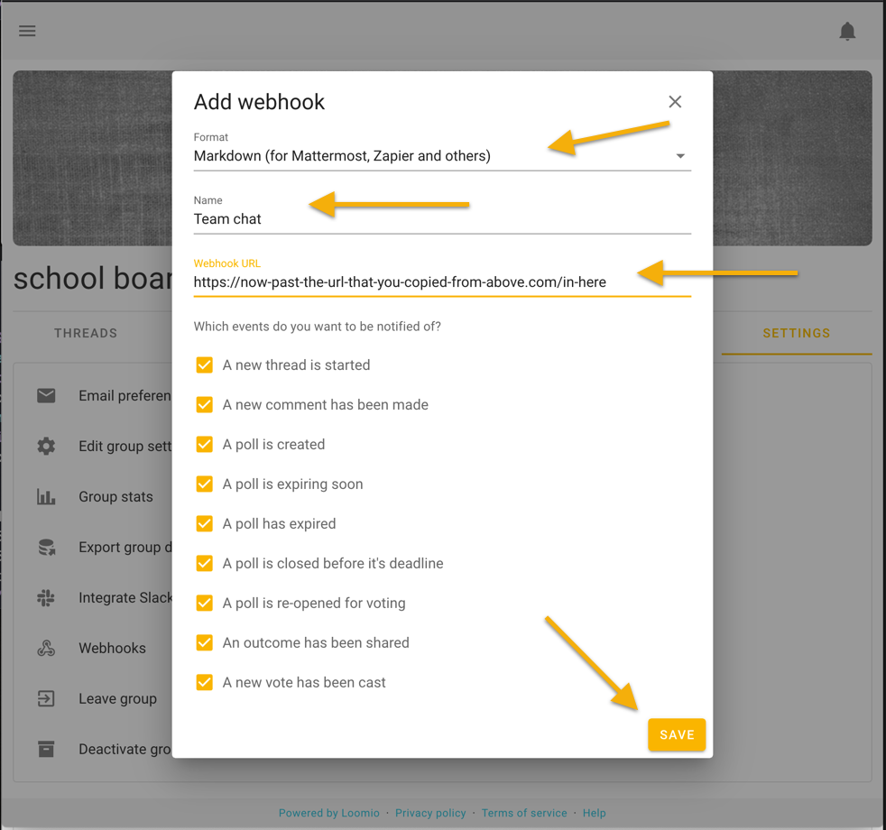

Start from your Mattermost team in your browser. Then open the Integrations settings page.

Click "Incoming Webhooks"

Then click  "Add Incoming Webhook"

Give it a simple name, select the channel for notifications to appear within, and click Save

Copy the Webhook URL to your clipboard, you're going to need it the next step.

Visit your Loomio group Settings page, then click Webhooks, then Add Webhook.

Select "Markdown (For Mattermost..)", give it a name, paste your URL from above, and click Save.

_Loomio is not created by, affiliated with, or supported by Mattermost._
