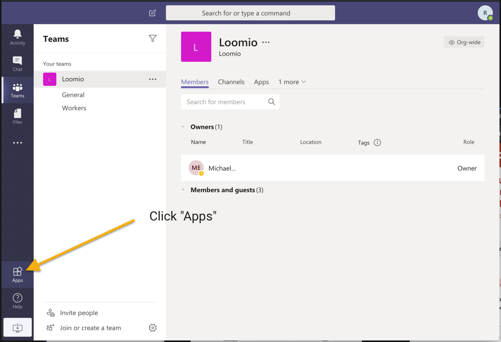
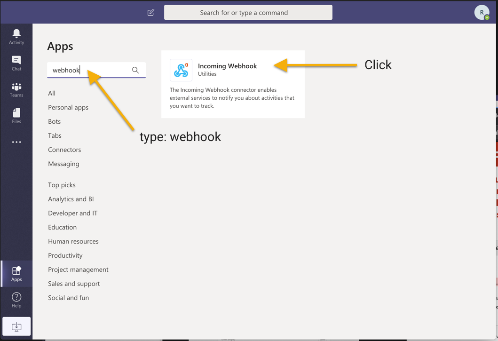
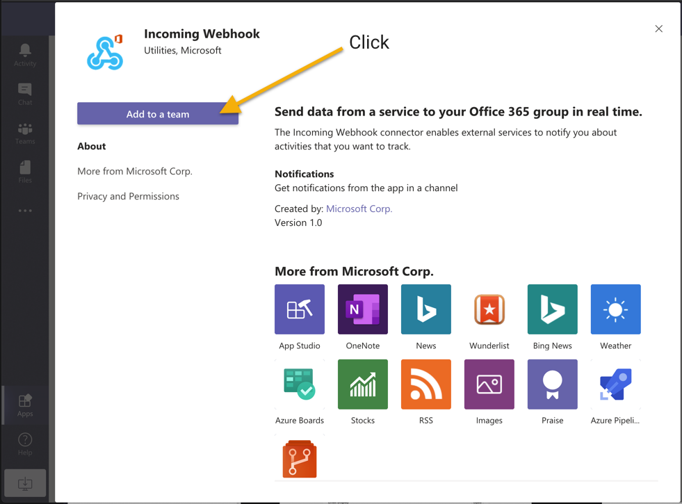
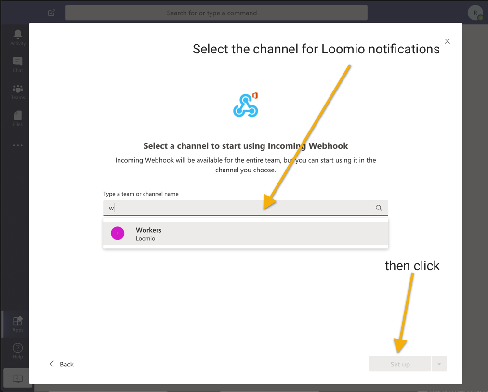
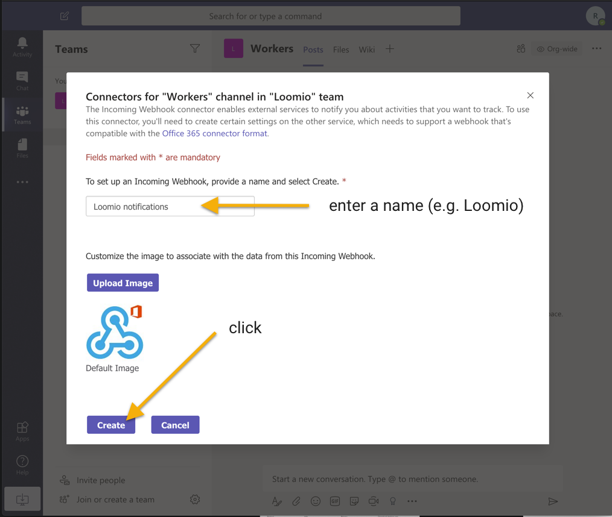
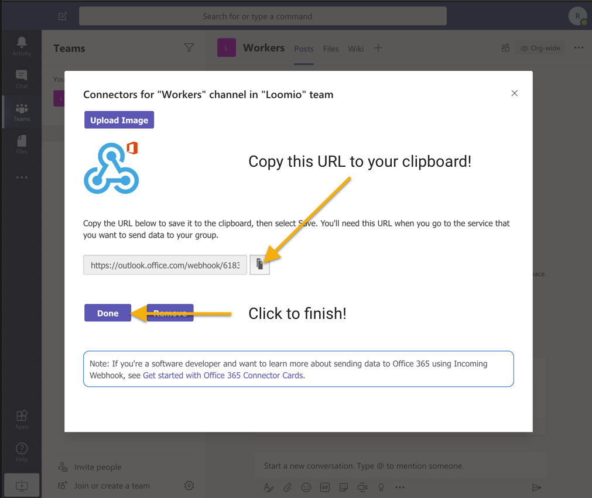
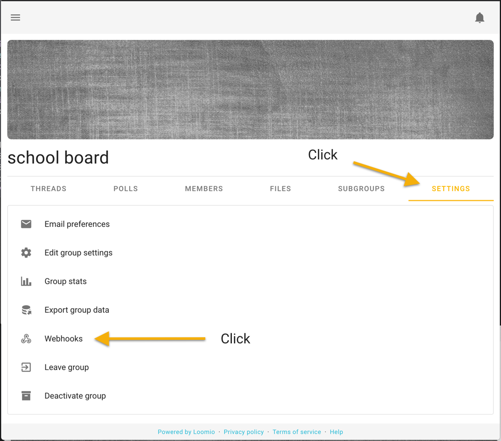
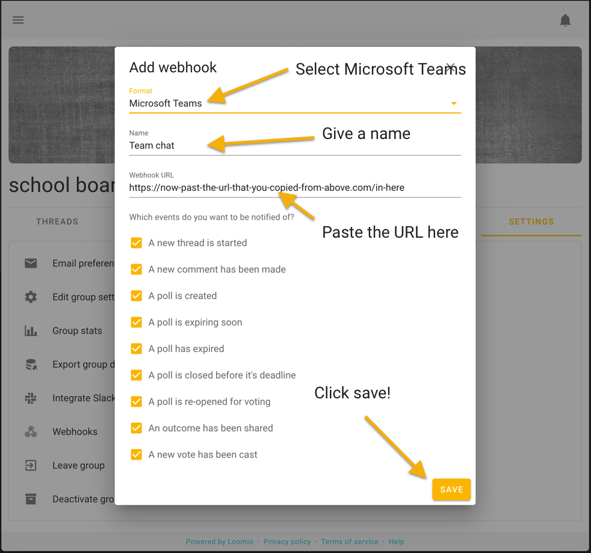

Integrate Loomio groups into one or more Microsoft Teams channels to get key updates, at the right time, on the discussions and decisions that move your efforts forward.

Choose the channels you want to receive notifications from which Loomio groups or subgroups and choose which kinds of events you want that channel to be notified of (comments, polls, outcomes... [see below](#select-notifications)).

_These webhook integrations are currently in public beta testing, we would like to hear your [feedback](https://loomio.org/contact/?utm_campaign=teams-integration-help&utm_term=help) about how it works for your group._

---

Visit [https://teams.microsoft.com](https://teams.microsoft.com) then click Apps

Search for "webhook" in the search field, then click Incoming Webhook

Click "Add to a team"

Type and select the channel you want Loomio notifications to appear within.

Give it a name, such as "Loomio notifications", then click "Create"

Copy the URL it gives you, you'll paste it into Loomio in the last step.

Go to your Loomio group Settings then click Webhooks

Select Microsoft Teams, give it a name, paste the URL, and click Save.

## Select notifications

Along with the ability to choose which events in Loomio will create a post in your chosen channel, you can also choose whether you'd like a snippet of the text from the comment, proposal, outcome, etc. by using the first option.

_Loomio is not created by, affiliated with, or supported by Microsoft._
