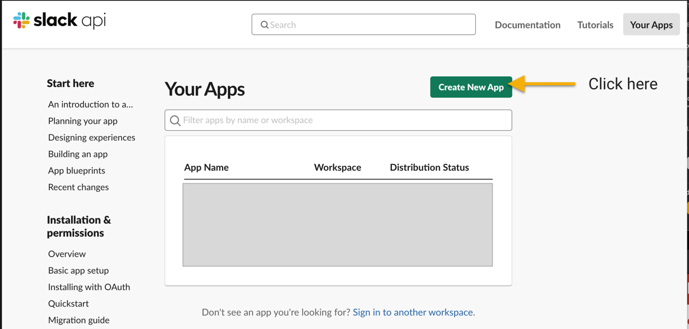
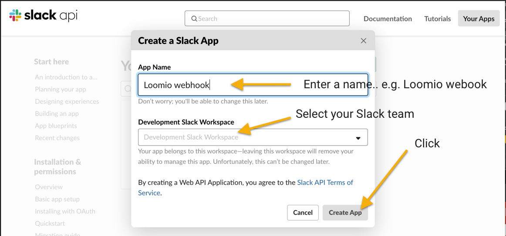
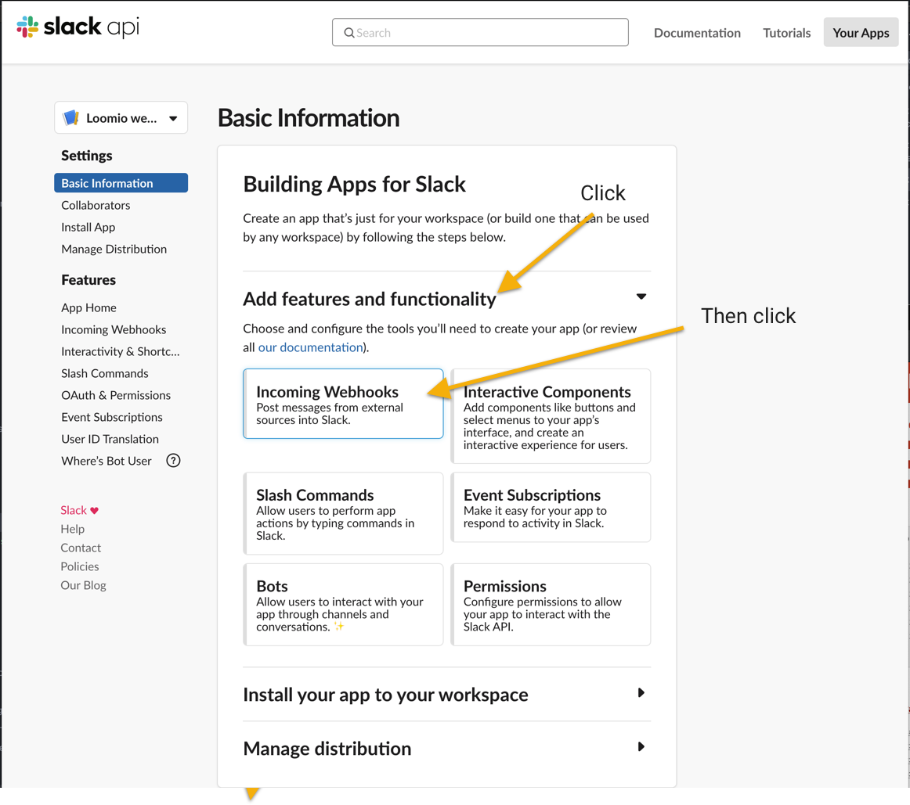
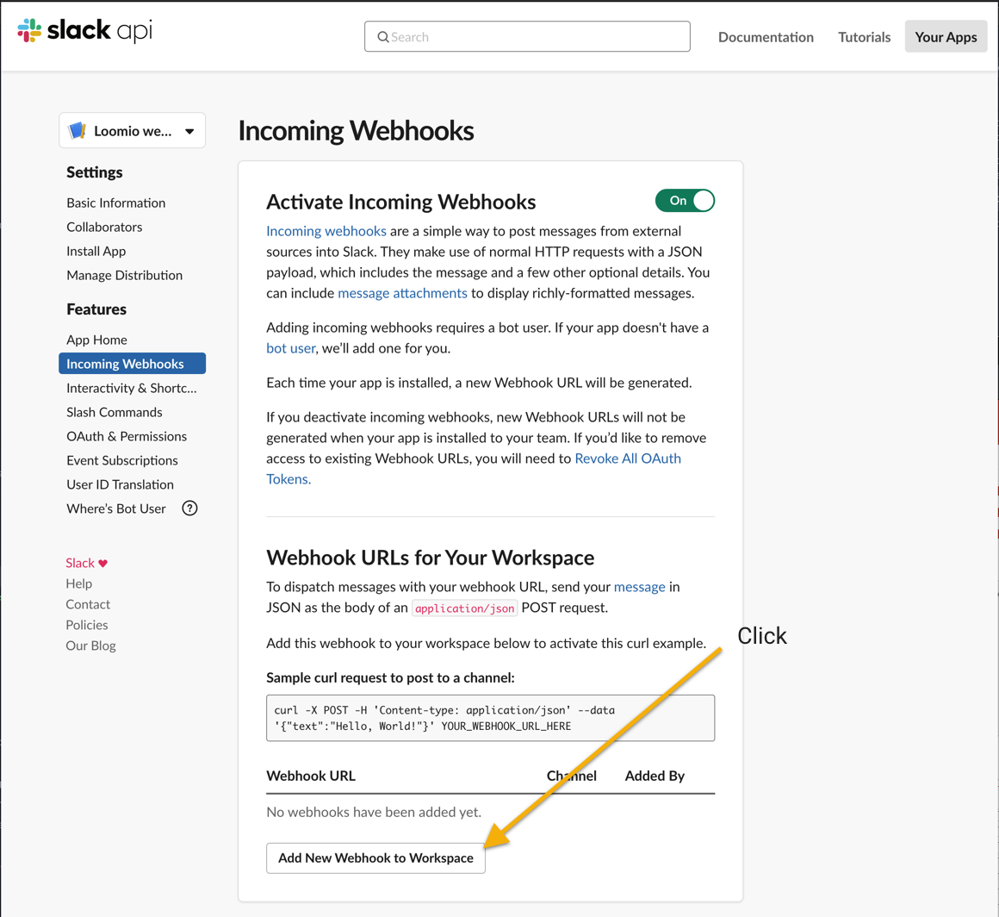
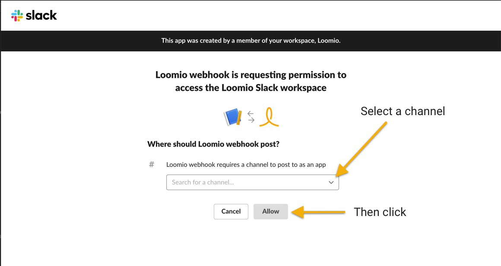
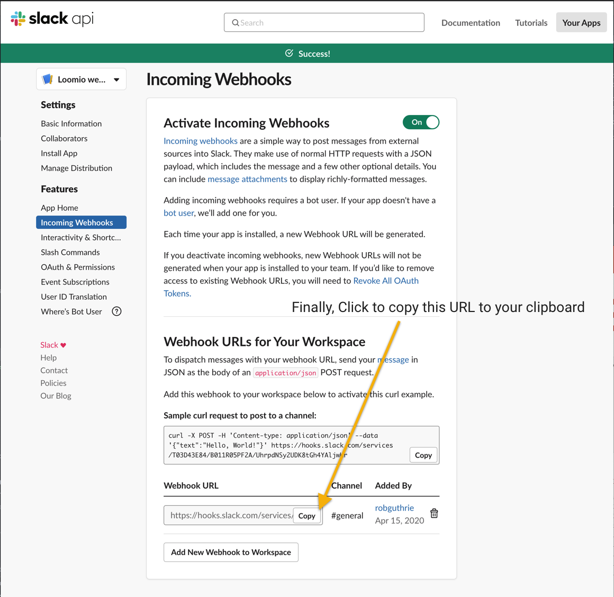
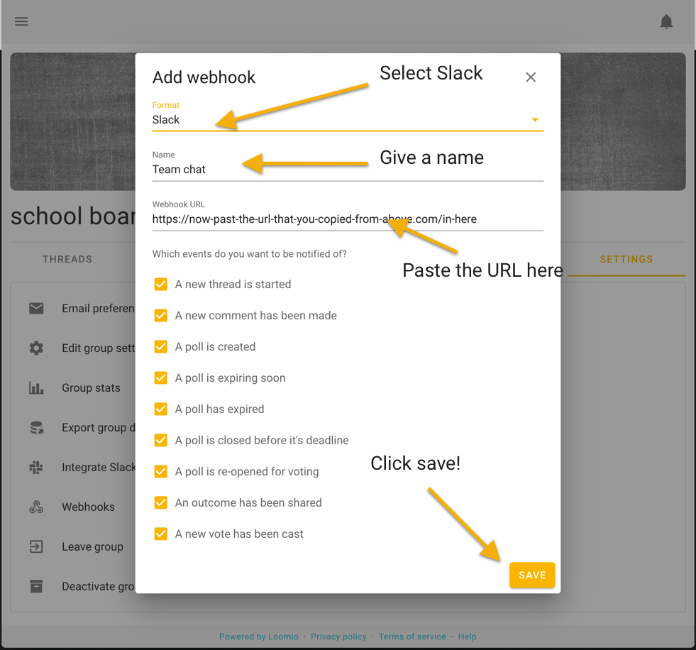

Start by visiting [https://api.slack.com](https://api.slack.com), signing in if you are not already, then clicking Create New App

Give you Slack app a name

Add incoming webhooks support

Then enable the function

Then add a new webhook

Select a channel

Copy the webhook URL to your clipboard

Go to Webhooks in your Loomio group settings

Select Slack, give it a name, paste the URL, and save. You're done!

_Loomio is not created by, affiliated with, or supported by Microsoft._
