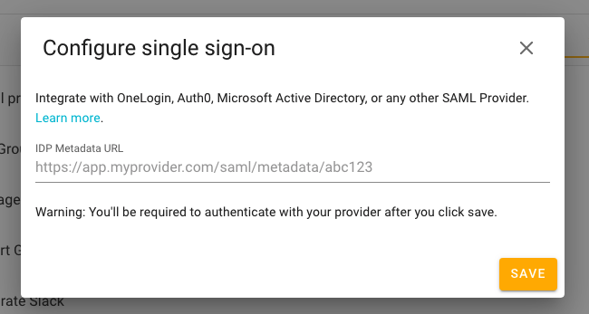
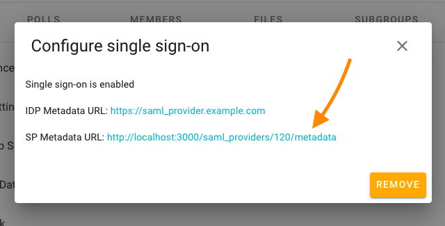
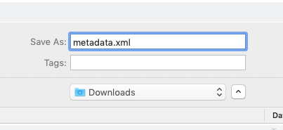
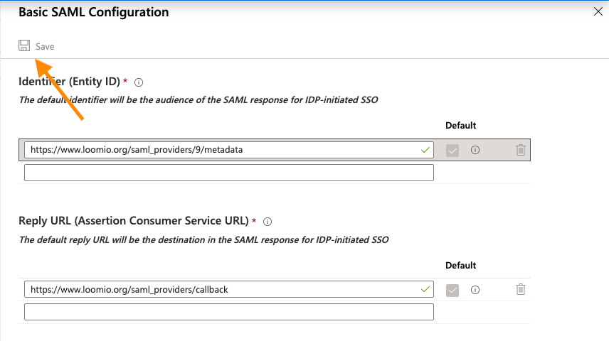

**Allow users that have been assigned to the Active Directory application to login to your Loomio group via SAML.**

Setup your Active Directory enterprise application and start your SAML configuration by following this guide: [Configure SAML-based single sign-on to non-gallery applications](https://docs.microsoft.com/en-us/azure/active-directory/manage-apps/configure-single-sign-on-non-gallery-applications)

Once your enterprise application has been setup, here are the Loomio-specific steps.

First, grab the metadata URL from the following field in Active Directory:

Next, head to your Loomio group's **Settings** tab and click **Single sign-on**.
Paste the metadata URL into the field and click **Save**.

Once successfully saved, return to **Single sign-on** in Settings.
Click the **SP Metadata URL** link:

Save the metadata.xml file to a location on your computer:

Next, return to your Active Directory SAML Configuration screen.
Click the **Upload metadata file** button near the top of the screen:

Click the **Select a file** box, then locate the metadata.xml file you downloaded previously:

Once you've located the file, click **Add**:

You should then see the following screen.
Click **Save** in the top-left:

And you're done! Users that have been assigned to the Active Directory application will now be able to login to your Loomio group via SAML.

**Note:** When an assigned user attempts to view your Loomio group page for the first time, they will be directed to Active Directory to login, after which they will be redirected back to the Loomio group page.
