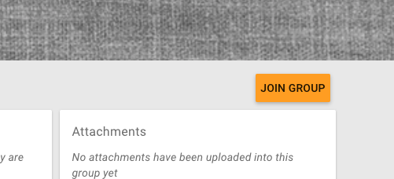
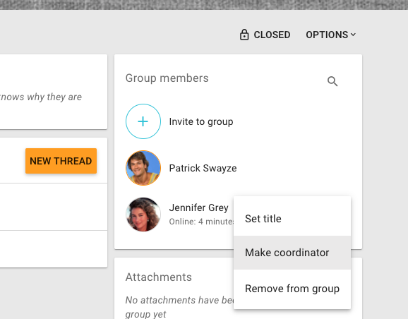
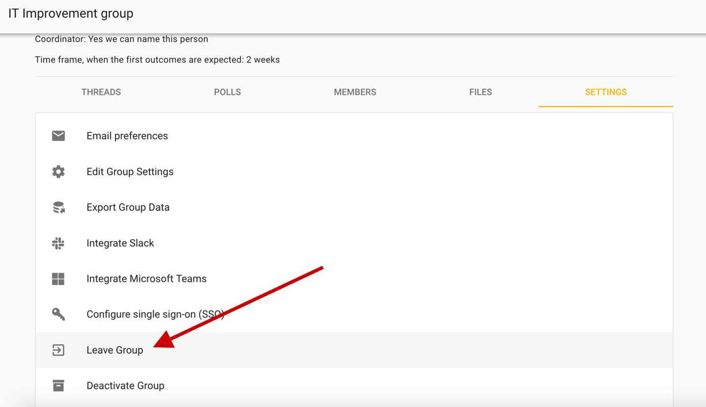

## Inviting people

To add members to your group

1. visit your group page and click the **Members** tab to access member management

2. click one of two options

* **Invite people:** If you have their email addresses, you can send invitations to each member of your group.
* **Shareable link:** Or you can share the invitation link via email or however your team communicates.

<iframe width="100%" height="380px" src="https://www.youtube-nocookie.com/embed/EZzTe6jJL7c" frameborder="0" allowfullscreen></iframe>

### Getting people on board

Follow up on people who don't make it into the group and give them a nudge. You don't want to leave people out of key conversations or decisions. You can see pending invitations – when people have yet to accept the invitation you sent – by clicking the drop down that reads  **everyone** by default, and then click **invitations**.

If people join but don't begin to participate right away, you might like to welcome them to the group with an @mention, for example:

> “Welcome to the group @Jane :) It's great to have you here! Would you saying a little bit about your work in this space?”

## Invite people via their email

Clicking **Invite people** on the Member tab of your group page will send a _single-use_ link allowing the recipient to start an account in your group or associate an existing account to your group.

You only need to be sure that they go into their email inbox (or Loomio account) to receive the invitation, it does not need to go to their "best" email address (eg, to the email they may already use for Loomio). The invite is not fixed to the email address you sent it to. So if someone already has a Loomio account and you send them an invitation to another email address, they can accept the invitation with their existing account.

### Invite many at once

You can send multiple invitations by entering multiple email addresses into the who to invite field (separated by commas or spaces). When you submit the form (ie, click **Send**) an email will be sent to each of the email addresses you supplied, containing a unique invitation link that can only be used once. This email will be sent in your current language.

There is a limit to the number of invitation emails you can send. Any person can only have 100 unaccepted invitations at any time. This is a necessary limit to prevent spam emails / malintent. If you need to send more than this to start your group, send everyone the shareable link.

> For example: At first, you can send 100 invitations. After 50 people accept their invitations, you can send another 50 invitations.

## Managing invitations

You can also make people coordinators or set their title (eg, "IT Support") within the group before they accept their invitation.

## Cancelling invitations
If you entered the wrong email address, or have changed your mind about inviting someone, you can cancel an invitation. Select **Cancel Invitation** from the dropdown menu on the invitations panel.

## Managing memberships

You will find the "Group members" management panel in the right column of your group or subroup. Click on the three dots to adjust group members' settings and permissions as described below.

## Coordinators
Also known as "Admin" status. Group coordinators can add and remove members, grant and remove coordinator permissions and modify group settings.

You can grant or remove coordinator permission **Group Members** panel, which is on the top right-hand side of your Group page.

Click on the three dots next to the person you want to make a coordinator, and then choose 'Make Coordinator'. You will now see that the person's avatar has an orange ring around it. Everyone with an orange ring is a coordinator.

We recommend that you share the coordinator permission with everyone who is trusted to look after the group.

## Coordinating subgroups
If you are the Coordinator of a parent group, you have additional permissions with regards to any __closed__ subgroups.

You will be able to join any closed subgroup by clicking the "Join Group" button at the top-right of the subgroup page.

Once you have joined the subgroup, you will also be able to make yourself the Coordinator of that subgroup, by choosing the "Make coordinator" option from the "Group members" panel.

*N.B. these permissions do not extend to secret subgroups.*

## Removing group members
On the **Members** page, next to every member there is a **Remove from group** option.

When you click **Remove from group** you'll see a confirmation box explaining what removal will mean.

## Leaving a group
To leave a group click the _options_ button next to your group name on the group page.

## Assigning titles
You can name the role someone has within the group, or identify which organisation they represent using the **title** feature. Just click "Set title" from the memberships panel.

## Membership requests

If your group's [advanced settings](../settings/#privacy) allow people to join your group _by request_, a coordinator will need to approve each membership request. Group coordinators will receive an email each time there is a new membership request. The link in the notification email will take you to the **Membership requests** page, where you can approve or decline the request.

If there is a pending membership request it will also be visible on your group page in a **Membership requests** panel.
