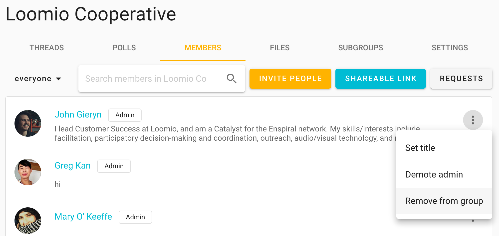
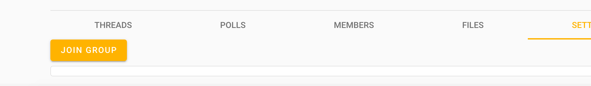
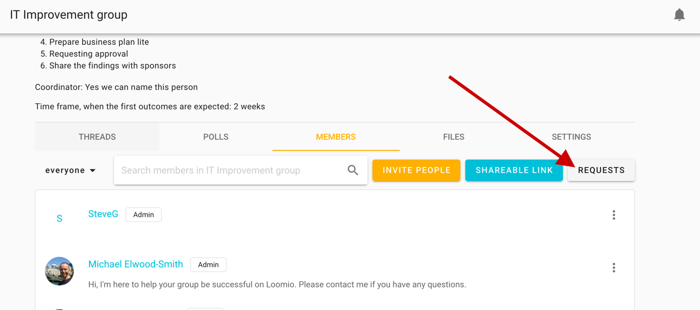

## Inviting people

To add members to your group…

First, visit your group page and click the **Members** tab to access member management

Second, click one of two options

1. **Invite**: If you have their email addresses, you can send invitations to each member of your group.
2. **Share**: Or you can share the **Reusable invitation link** via email or however your team communicates.

<iframe width="100%" height="380px" src="https://www.youtube-nocookie.com/embed/RGv0Yq6sv8g?rel=0" frameborder="0" allowfullscreen></iframe>

### Invite people to Closed groups

If your group's privacy is **closed** then you can additionally invite people by sharing your `loomio.org/handle`. When people arrive at your group page, they will see the title, the description, and a button **Join group** to request membership. They become a group member when their request is approved.

> Reminder: Closed groups are basically private, but – unlike Secret groups – disclose their Group Name and Group Description publicly.

### Invite people to subgroups

You will follow the same process as above.

You can invite people to an organization, or parent group, and one or more subgroups simultaneously when you invite them with the **Invite people** button. Tick the boxes next to the subgroups you want them to immediately be a part of when they join the group. See it demonstrated in the video clip [just above](#inviting-people).

### Getting people on board

Follow up on people who don't make it into the group and give them a nudge. You don't want to leave people out of key conversations or decisions. You can see pending invitations – when people have yet to accept the invitation you sent – by clicking the drop down that reads  **everyone** by default, and then click **invitations**.

If people join but don't begin to participate right away, you might like to welcome them to the group with an @mention, for example:

> “Welcome to the group @Jane :) It's great to have you here! Would you saying a little bit about your work in this space?”

## Invite people via their email

Clicking **Invite people** on the Member tab of your group page will send a _single-use_ link allowing the recipient to start an account in your group or associate an existing account to your group.

You only need to be sure that they go into their email inbox (or Loomio account) to receive the invitation, it does not need to go to their "best" email address (eg, to the email they may already use for Loomio). The invite is not fixed to the email address you sent it to. So if someone already has a Loomio account and you send them an invitation to another email address, they can accept the invitation with their existing account.

### Invite many at once

You can send multiple invitations by entering (or copy pasting) multiple email addresses into the who to invite field (separated by commas or spaces). When you submit the form (ie, click **Send**) an email will be sent to each of the email addresses you supplied, containing a unique invitation link that can only be used once. This email will be sent in your current language.

## Managing invitations

To manage invitations, open the filter/ drop down from the Members tab of your Group page and select **invitations**; choose the three dots to the right of the invitation/ person in question.

<iframe width="100%" height="380px" src="https://www.youtube-nocookie.com/embed/BH0x494sZlU?rel=0" frameborder="0" allowfullscreen></iframe>

You can also make people coordinators or set their title (eg, "IT Support") within the group before they accept their invitation.

### Cancelling invitations
If you entered the wrong email address, or have changed your mind about inviting someone, you can cancel an invitation from the Members tab on your Group page. Select **Cancel Invitation** from the same drop down (**⋮**) as demonstrated [just above](/#managing-invitations). To cancel invitations shared by **reusable invitation link**…

### Reset invitation link

To cancel your previous invitation link and generate a new one, click **Share** and then **Reset**. This will disallow any further people from joining using that previous link. You can share the new [reusable invitation link](#inviting-people) as before.

## Managing memberships

Managing members is easy. The following management actions are available from the Members tab on your Group page. Just click on the three dots (**⋮**) to the right of the group member you wish to remove, promote or demote from **admin**, or assign a **title**.

### Admin
Admin are those with the _most_ permissions in a group. Admin can add and remove members, grant and remove admin permissions and modify group settings.

Click on the three dots (**⋮**) next to the person you want to make an admin, and then choose **Make admin**. You will now see that there is an `Admin` tag to the right of their name. Everyone with this tag is an admin.

We recommend that you share the coordinator permission with everyone who is trusted to look after the group.

#### Coordinating subgroups
If you are the admin of a parent group, or organization, you have additional permissions with regards to any __closed__ subgroups.

You will be able to join any closed subgroup by clicking the "Join Group" button on the left of the Subgroup page in question (just under the tabs).

Once you have joined the subgroup, you will also be able to make yourself the admin of that subgroup, just as you would promote anyone to admin ([see above](#admin)).

***Note:*** *these permissions do not extend to* ***secret*** *subgroups.*

### Removing group members
When you click **Remove from group** you'll be asked to confirm the removal. Upon removal, this user will no longer have access to the group's pages, threads, polls, or proposals. They will, of course, still have access to any emails they had been sent via Loomio up to this date, but they will receive no further emails of group activity.

### Leaving a group
To leave a group go to the Group page's **Settings** tab and click **Leave group**.

### Assigning titles
You can name the role someone has within the group, or identify which organization they represent using the **title** feature. You or an admin can change yours by clicking **set title** from the dropdown near your name in the desired group's Members tab.

You can even have different titles in different subgroups.

## Membership requests

If your group's [advanced settings](../settings/#advanced-settings) allow people to join your group **by request**, an admin will need to approve each membership request. Group coordinators will receive an email each time there is a new membership request. The link in the notification email will take you to the **Requests** page, where you can approve or decline the request.

To find pending requests for memberships, navigate to the Members tab of your Group page and click the **Requests** button on the right.

