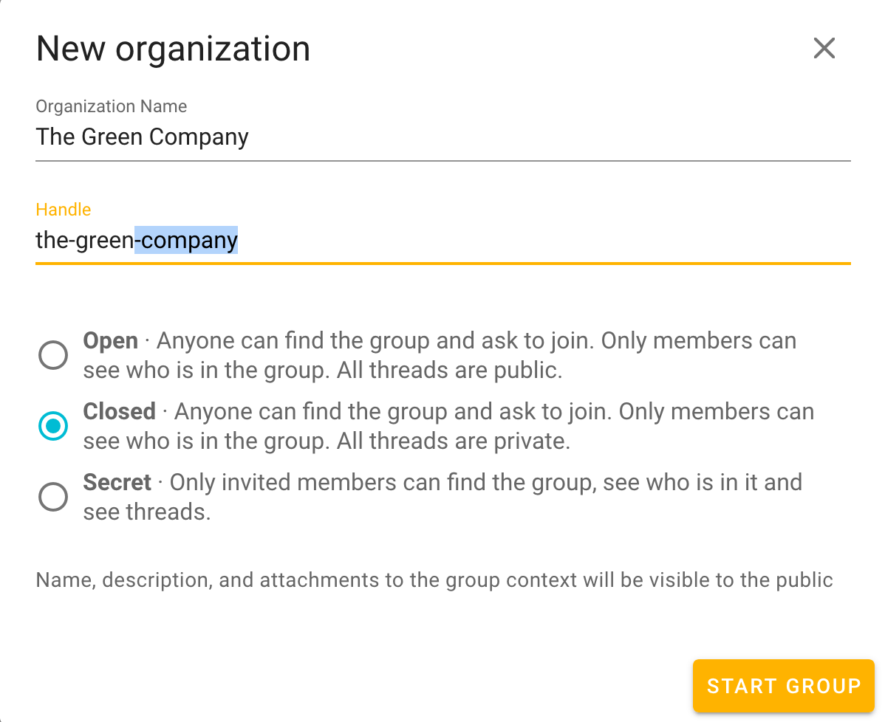
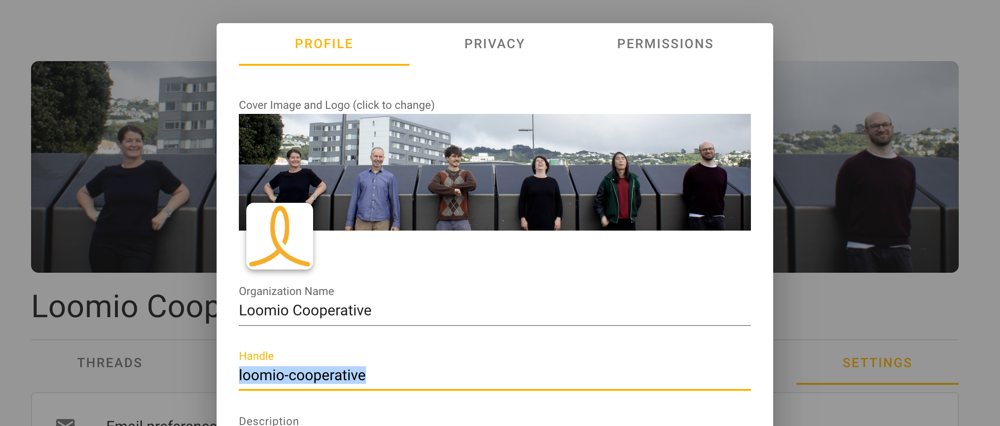

# Admin

Only a group's admin can edit group settings.

As an admin of a Loomio group, you are responsible for guiding your group through the process of learning how to use a new piece of software, as well as learning new processes for collaborating more effectively and making good decisions together. The tasks outlined below can only be performed by group admin.

To learn how to edit the basics such as your Group description or Cover photo, see [starting a group](/en/user_manual/getting_started/starting_a_group).

## Group handle

By default, Loomio will make this `your-group-name` but when you started your organization (or parent group) you were invited to change this to any unused, alphanumeric handle (hyphens optional) of your choice.

Navigating to the URL loomio.org/[your-group-handle] will take you directly to your group page.

You can always change you group handle by navigating to the **Settings** tab of your group's page and choosing **Edit Group Settings**. For navigation guidance, see the video demonstration in the very next section.

# Advanced Group Settings

Admin can change group permissions and configure what members can do in any group or subgroup by

1. navigating to the **Settings** tab of your group's page
2. selecting **Edit Group Settings**
3. clicking a tab (**Privacy** or **Permissions** options are described below)

<iframe width="100%" height="380px" src="https://www.youtube-nocookie.com/embed/ye08QEnP1_A?rel=0" frameborder="0" allowfullscreen></iframe>

## Privacy

Group's [basic privacy settings are described here](/en/user_manual/getting_started/starting_a_group/#privacy).

## Permissions

### Anyone can join (Open groups)

In _open groups_ you can use the option, **Anyone can join**, in order for the public to be able to join without any action by any member of the group.

### Requiring approval of membership requests (Open groups)

If you select this option, rather than letting people walk in the door voluntarily (self-select to join your group), then admin will have the option to approve or ignore people's requests to join.

- You can also give group members the permission to approve requests, also in the **Permissions** tab of Group Settings.

### Allow members of parent group to see threads

In _closed subgroups_ you can allow members of the parent group to see discussions within the subgroup.
Select, **Members of [parent group] can see private threads** to enable this feature. This feature is off by default. For more on subgroups, [see here](../subgroups).

### Invite and approve new members

This allows everyone in your group to invite new people in, and approve any membership requests. When it is deselected only group admin will be able to invite and approve new members.

### Create subgroups

This allows everyone in your group to create subgroups. When it is deselected only group admin will be able to create subgroups.

### Start threads

This allows everyone in your group to start new threads. When it is deselected only group admin will be able to start discussions.

### Edit the context of any thread in the group

This allows everyone in your group to edit the context of any thread. When it is deselected only group admin and the thread author will be able to edit the thread context.

### Edit their comments at any time

This allows everyone in your group to [edit their comments](../../threads/#editing-comments) at any time. When it is deselected, a comment can only be edited until someone else participates in the thread.

### Raise proposals

This allows anyone in your group to start a proposal within a thread. When this box is deselected only group admin will be able to raise proposals.

## Vote on proposals

This allows everyone in your group to state their position on proposals. When it is deselected only group admin will be able to state their position on proposals.

# Deactivating/archiving a group

Deactivating your group means that you and the rest of the group members will no longer be able to access the group. If you wish to deactivate your group you can do so by selecting **Deactivate Group** from the **Options** menu on the group page. To reactivate your deactivated group, [contact Loomio support](https://www.loomio.org/contact).
