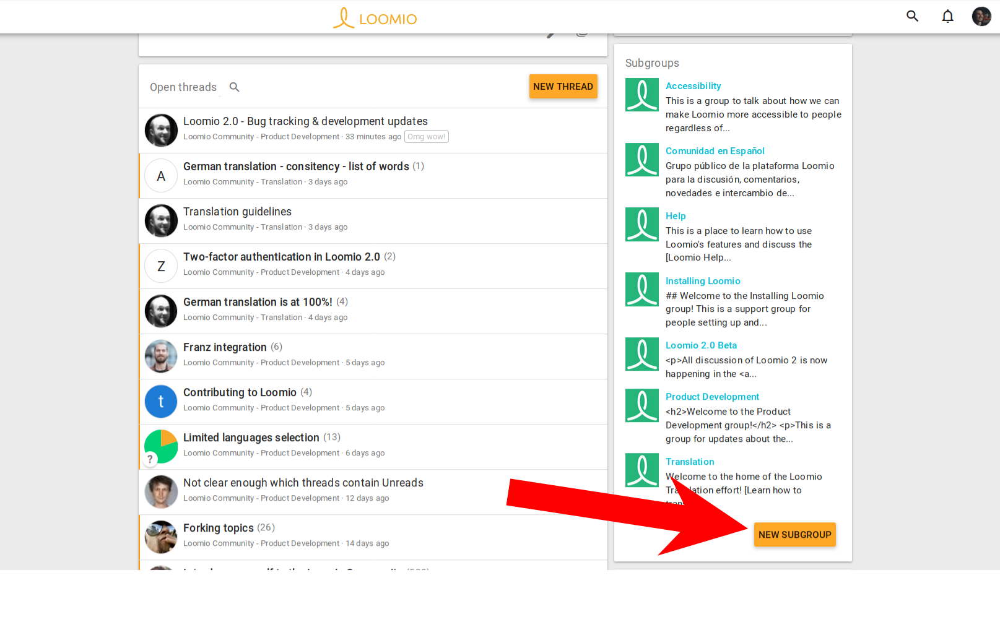

Subgroups help you organize your communications and members so that the right people are engaged in their work together.

For example, you can use subgroups for your organization's…
- governance board
- working team or a project working group
- a topic (such as 'strategy' or 'learning')

Subgroups work just like groups do, but are located within your group/organization, which we call the "parent group". Most of the features and settings are the same as what you encounter in your parent group.

## Add a subgroup

To add a subgroup in your group:

1. access your group page
2. scroll down and find, on the right, "Add subgroup", in the Subgroup card
3. name the subgroup, adjust any settings, and then invite people in just like you would in a group

## Manage your subgroups

### Permissions

Subgroups can operate independently of the main group. For example, if the subgroup privacy setting is set to _Secret_, then only invited members can find this subgroup, see who is in it, and see threads. More on privacy below.

Subgroups can have their own coordinators, and, thus, the coordinators of a subgroup may not be the same as the coordinators of the parent group.

Any coordinator of the parent group may independently make themselves coordinator of any subgroups therein.

### Privacy

_Closed_ subgroups have an additional "Advanced setting" that allow members of its parent group to see private threads, or not.

Otherwise, the privacy settings are the same as those for groups; [learn anything else you need to know here](/en/user_manual/getting_started/starting_a_group/#privacy).

![arrow pointing to the option for "Members of [Group name] can see private threads"](members_view_private_subgroup.png)

### Deactivate a subgroup (and other group options)

Coordinators can deactivate a subgroup in the same way they would a group. Learn [how to deactivate groups](/en/user_manual/groups/deleting_archiving). Export data, set up your Slack integration, and in all other ways use this subgroup just like you would a group; check our [help articles on _groups_ for more](/en/user_manual/groups/).

## Are subgroups for my organization?

Does your organization have a number of working groups, committees, or task forces? Are there times when you want to alert or ask a question of a department or specific set of people who have responsibility, or are experts, in a certain area?

If you answered yes, then you probably will find subgroups useful.

Subgroups help if you want to…

- Keep a conversation private to a smaller number of people in your group
- Keep people from being bothered by conversations that don't matter to them; _bonus: subgroups have their own notification settings_
- Make sure to notify _all_ the people related to a specific topic, project, expertise… _every_ time
