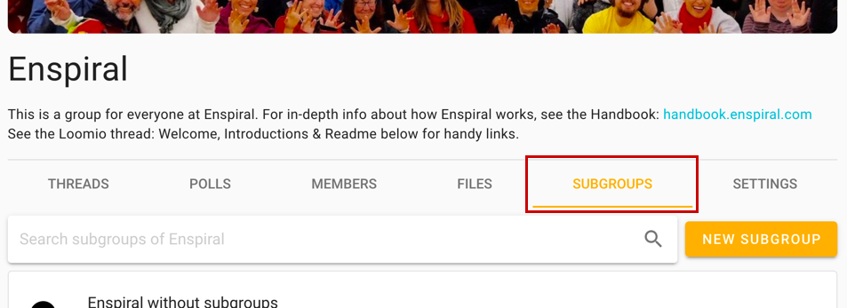
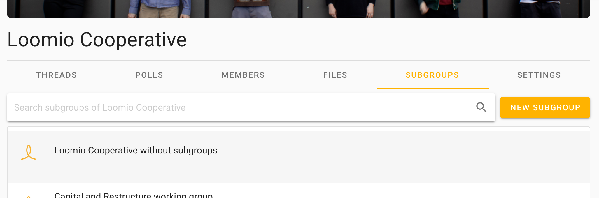

Subgroups help you organize your communications and members so that the right people are engaged in their work together.

For example, you can use subgroups for your organization's

- governance board
- working team or a project working group
- a topic (such as 'strategy' or 'learning')

Unlike tags, subgroups create a separate space for a group of people. [Tags](/en/user_manual/threads/thread_admin/#using-category-tags) are a way to organize your threads. Subgroups allows you to change the permissions, notifications, and more for a set of threads and people.

Subgroups work just like groups do, but are located within your group/organization, which we call the "parent group". Most of the features and settings are the same as what you encounter in your parent group.

## Add a subgroup

To add a subgroup in your group, go to the **Subgroups** tab.

Click the **New subgroup** button, give it a meaningful title and decide on the desired [privacy](/en/guides/getting_started/starting_a_group/#privacy)) setting, and click **Start subgroup**. You can now start threads and invite people in.

However, similar to [starting a group](/en/guides/getting_started/starting_a_group), you may want to 'prepare the space,' so to speak, for those you will soon invite. A group description, and adjusting any settings including the banner image, can help people feel comfortable in the Loomio group and with the others who will be participating here. Again, this supports psychological safety – proven to improve performance.

<iframe width="100%" height="380px" src="https://www.youtube-nocookie.com/embed/U4qmHlEMq8E?rel=0" frameborder="0" allowfullscreen></iframe>

[Invite people](/en/guides/getting_started/starting_a_group/#invite-people) just like you would in a group.

### Who can see it

Subgroups [privacy](/en/guides/getting_started/starting_a_group/#privacy) works the same as groups' do. A secret subgroup will not be visible to group members.

Closed subgroups will be listed in the **Subgroups** tab, and, by default, members of the parent group can request and – upon approval by an admin – join them.

See below for more on privacy.

## Manage your subgroups

### Permissions

Subgroups can operate independently of the main group. For example, if the subgroup privacy setting is set to **Secret**, then only invited members can find this subgroup, see who is in it, and see threads.

Subgroups can have their own coordinators, and, thus, the coordinators of a subgroup may not be the same as the coordinators of the parent group.

Any coordinator of the parent group may independently make themselves coordinator of any subgroups therein.

### Privacy

**Closed** subgroups have an additional **Advanced setting** that allow members of its parent group to see private threads, or not.

Otherwise, the privacy settings are the same as those for groups; [learn anything else you need to know here](/en/guides/getting_started/starting_a_group/#privacy).

![arrow pointing to the option for "Members of [Group name] can see private threads"](parent_group_can_see_private_threads.png)

### Invitations

Invite people just like you would invite them into a group. If they're already in your parent group you can just type their name. You can also quickly select everyone from the parent group.

#### Simultaneously invite people to subgroups and parent group

If you use the **Invite people** button from your parent group's **Members** tab, you can invite people to multiple subgroups at the same time by ticking the boxes of those you would like them to join immediately.

<iframe width="100%" height="380px" src="https://www.youtube-nocookie.com/embed/EZzTe6jJL7c?rel=0" frameborder="0" allowfullscreen></iframe>

### Deactivate a subgroup

Coordinators can deactivate a subgroup in the same way they would a group. Learn [how to deactivate groups](/en/user_manual/groups/deleting_archiving).

### Other group options

Export data, set up your Slack integration, and in all other ways use this subgroup just like you would a group; check our [help articles on **groups** for more](/en/user_manual/groups/).

## Are subgroups for my organization?

Does your organization have a number of working groups, committees, or task forces? Are there times when you want to alert or ask a question of a department or specific set of people who have responsibility, or are experts, in a certain area?

If you answered yes, then you probably will find subgroups useful.

Subgroups help if you want to…

- Keep a conversation private to a smaller number of people in your group
- Keep people from being bothered by conversations that don't matter to them; *bonus: subgroups have their own [notification settings](/en/user_manual/users/email_settings)*
- Make sure to notify _all_ the people related to a specific topic, project, expertise… _every_ time

## Group page shows subgroup threads

By default, when you go to your parent group you will see a list of its threads and the threads of its subgroups _that you are in_.

If you wish to see _only_ threads that were started or belong to the parent group, click the **Subgroups** tab and select the first option (**…without subgroups**).

