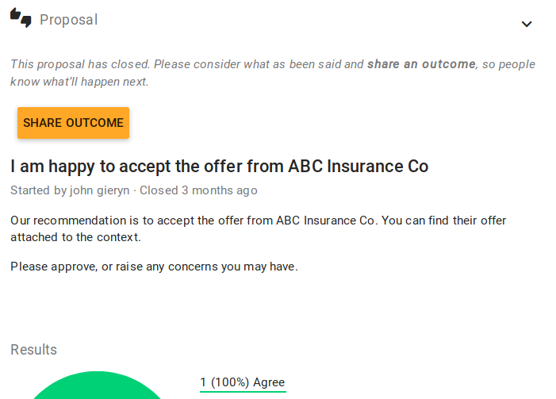
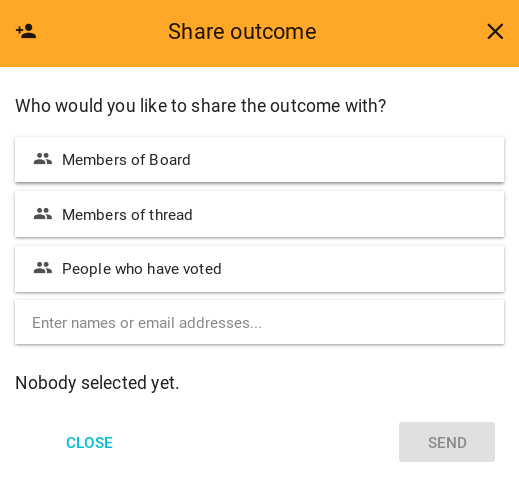

When your proposal closes, you’ll be prompted to set a proposal outcome.

In Loomio, it's not assumed that majority wins - the outcome or conclusion of a decision is up to you to define on behalf of the group. Sometimes it makes sense to go with the majority, but sometimes even one dissenting voice means it's a no.

 

Group members can be notified of the _outcome_—see how in the screenshot below—so it's a very useful tool for keeping people in the loop. You can clearly define next steps and name specific actions, or summarize what was learned from the process.

To give a poll or proposal some closure with **Share outcome**, click on the decision in _Previous decisions_ or from the _Decisions_ page, or when prompted.

 
**Example outcomes**:

> _This proposal did not reach consensus because several people were concerned about budget impacts. George and Jimena will do some financial modelling and raise a new proposal next week._

or

> _I've taken on board everyone's input. As the project manager, this is my call to make and I've decided we are going to extend the timeline by 10 days._

 
Setting outcomes makes your decision archive easy to search, because you have a succinct statement for each proposal.

After you select **Share outcome**, you will have the ability to alert group members and/or voters as depicted below.

 

 You can always click on the **X**, if you are happy for people to encounter the outcome on their own time. Outcomes, like comments, will cause a thread to indicate it is unread.
