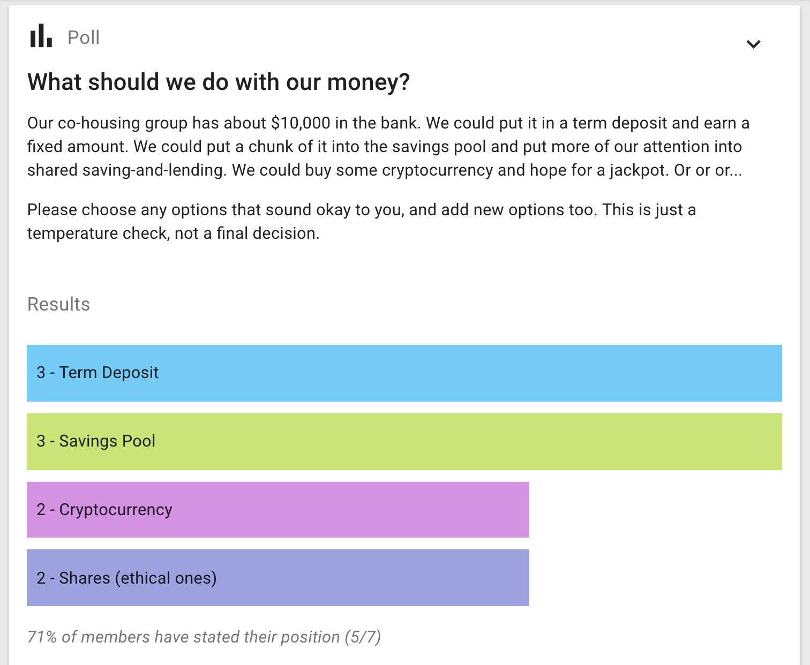

## Time poll

_Find a time to meet_

Time poll makes it easy to identify when is the best time to meet.

Enter a selection of times and share the poll with the people involved. Participants tick the times they can attend and the result is a table showing who is available when, so you're able to pick the best time for the group.

So that you can arrange calls with people in other parts of the world, Loomio adjusts times so they are correct when displayed for each participant.

If the times don't work, participants can suggest alternatives using the message field. You can then update the poll with new times.

[Try our live demo of the time poll here](https://www.loomio.org/p/example/meeting)

## Check

_Request or track participation_

Make an offer or ask people to take some action. Think of it as the online equilavent of asking a room of people "Please raise your hand if you…".

There are many ways you can use a check, but only two ways to respond: a Tick \(✔\), meaning affirmative, or an X mark \(✘\) meaning no or unsure.

Examples:

* I've checked my contact details are correct
* I've read the document and left my feedback
* I'm coming to the event
* I'll join the working group.

A benefit of Check is that it automatically notifies those people who forget to participate, giving people a little encouragement to get the job done.

[Try our live demo of the check here](https://www.loomio.org/p/example/count)

## Poll

_Measure popularity or offer a choice_

Enter a question and provide some options for people to choose from. People vote for one or more options - depending on if you allow single or multiple choice.

Write any details about the options all together in the details field, then just enter the name of the option in each poll option field.

Examples:

* Where should we have our Christmas party?
* Which catering company should we use?
* What size t-shirt would you like?
* If we ran a workshop, how likely are you to attend?

[Try our live demo of the poll here](https://www.loomio.org/p/example/poll)

## Score poll

_Express the degree of preference for each option_

The score poll is commonly used for general surveys or 'temperature checks', in which electing a single 'winning' option is not necessarily the point.

People get to express their desire, preference or interest in each option. The poll produces more granular results than a simple majority vote.

Examples:

* How would you rate your interest in these topics for the next meeting agenda?
* How important is each of these principles to you when considering our team vision?
* How much would you like to see each of the following speakers at the next conference?

[Try our live demo of the score poll here](https://www.loomio.org/p/example/score)

## Dot vote

_Prioritise options together_

Everyone gets a number of dots to allocate against a set of options to represent their priorities. This can build a more detailed picture than a simple poll.

Examples:

* You're given $100 to spend on the business; how would you spend it?

See [dotmocracy.org](http://dotmocracy.org/) for more tips and resources about this voting method.

[Try our live demo of the dot vote here](https://www.loomio.org/p/example/dot_vote)

## Ranked choice

_Rank options in the order of preference._

Offers a series of options for people to vote in their preferred order. You can choose the number of votes people can give and rank. This decision-making type allows people to express their opinion in more detail than traditional polls.

Ranked choice is particularly useful when you have a large number of options or an election setting, where you are concerned with two somewhat similar options 'stealing' votes from one another, resulting in a less popular option gaining the plurality.

Examples:

* What would you like to eat at the company summer party?
* Who should be our next deputy mayor?

[Try our live demo of the ranked choice here](https://www.loomio.org/p/example/ranked_choice)

## Proposal

_Seek collective agreement_

Proposals are great for bringing a discussion to a clear outcome, developing or adopting policy, approving applications, and making decisions with input from others.

With good participation, a proposal creates support within the group to take action.

Participants can agree, abstain, disagree or block - and give a statement to explain their position.

Don't hesitate to start a proposal just because you're not sure everyone will agree - proposals are not only for when you have consensus, they're designed to surface issues that need resolving and are useful for clarifying disagreements.

You may be surprised by getting quick consensus on something you thought was going to be complicated.

For more guidance in making proposals, see the [Starting proposals](../starting_proposals) article, especially the section under [ways of doing proposals](../starting_proposals/#ways-of-using-proposals).

[Try our live demo of the proposal here](https://www.loomio.org/p/example/proposal)
