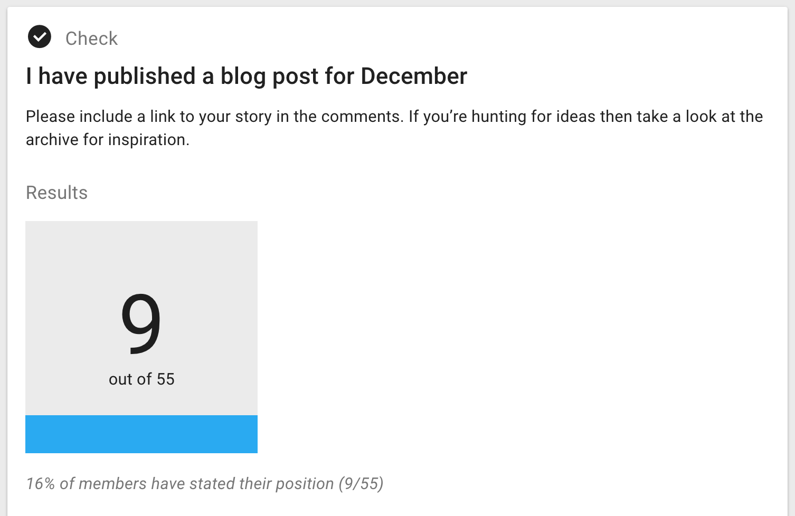
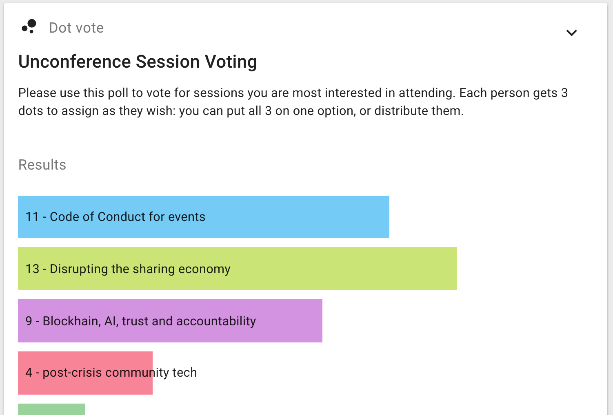

# Polls and Proposals

Loomio's unique advantage over other tools is our facilitation and decision-making tools, our **proposals** and **polls**. These are used within discussion threads in order to move conversations, and your group, to clear, shared outcomes.

There are a number of different types of polls. Below the thread context, switch from the **Comment** box to the **Poll** to see the variety of unique ways to get your group's input and/or visualise where the group stands on a given topic or question.

The **Proposal** tool also has a variety of options that allow you to run a number of distinct processes (eg, a 'questions & comments round'), as covered [below](#proposals).

## Time poll

_Find a time to meet_

Time poll makes it easy to identify when is the best time to meet.

Enter a selection of times and share the poll with the people involved. Participants tick the times they can attend and the result is a table showing who is available when, so you're able to pick the best time for the group.

So that you can arrange calls with people in other parts of the world, Loomio adjusts times so they are correct when displayed for each participant.

When you are selecting your times, Loomio will display your team’s most used time zones so you can quickly propose times that suit most members.

If the times don't work, participants can suggest alternatives using the message field. You can then update the poll with new times.

## Check

_Count how many people have completed a task, or ask for volunteers_

Make an offer or ask people to take some action. Think of it as the online equivalent of asking a room of people "Please raise your hand if you…".

There are many ways you can use a check, but only one or two ways to respond: a Tick \(✔\), meaning affirmative, or an X mark \(✘\) meaning no or unsure.

You can choose to use just one or the other if that makes more sense; _eg, it may not help to receive_ ***No*** _responses for an opt-in or volunteer opportunity, in which case you will select the_ ***Yes*** _option only_

<iframe width="100%" height="380px" src="https://www.youtube-nocookie.com/embed/b28F7mciATA?rel=0" frameborder="0" allowfullscreen></iframe>

Other examples:

* I've checked my contact details are correct
* I've read the document and left my feedback
* I'm coming to the event
* I'll join the working group.

A benefit of Count is that it automatically notifies those people who forget to participate, giving people a little encouragement to get the job done.

## Poll

_Measure popularity or offer a choice_

Enter a question and provide some options for people to choose from. People vote for one or more options - depending on if you allow single or multiple choice.

Write any details about the options all together in the details field, then just enter the name of the option in each poll option field.

Examples:

* Where should we have our Christmas party?
* Which catering company should we use?
* What size t-shirt would you like?
* If we ran a workshop, how likely are you to attend?

### Multiple choice

Select the tick box, **Multiple choice**, if you wish for people to be able to choose multiple options rather than just a single choice off of the list of options.

## Score Poll

_Express the degree of preference for each option_

The score poll is commonly used for general surveys or 'temperature checks', in which electing a single 'winning' option is not necessarily the point.

People get to express their desire, preference or interest in each option. The poll produces more granular results than a simple majority vote.

Examples:

* How would you rate your interest in these topics for the next meeting agenda?
* How important is each of these principles to you when considering our team vision?
* How much would you like to see each of the following speakers at the next conference?

## Dot vote

_Prioritise options together by allocating a 'budget' of points_

This style of poll is useful for groups trying to allocate a limited resource (even time) to a number of options (eg, agenda items, or budget line-items)

Everyone gets a number of dots to allocate against a set of options to represent their priorities. This can build a more detailed picture than a simple poll.

Examples:

* You're given $100 to spend on the business; how would you spend it?

See [dotmocracy.org](http://dotmocracy.org/) for more tips and resources about this voting method.

## Ranked choice

_Rank options in the order of preference._

Offers a series of options for people to vote in their preferred order. You can choose the number of votes people can give and rank. This decision-making type allows people to express their opinion in more detail than traditional polls.

Ranked choice is particularly useful when you have a large number of options or an election setting, where you are concerned with two somewhat similar options 'stealing' votes from one another, resulting in a less popular option gaining the plurality.

Examples:

* What would you like to eat at the company summer party?
* Who should be our next deputy mayor?

## Proposals

_Seek collective agreement_

Proposals are great for bringing a discussion to a clear outcome, developing or adopting policy, approving applications, and making decisions with input from others.

With good participation, a proposal creates support within the group to take action.

Participants can indicate their **position** and give a statement to explain why they chose it.

### Change which positions can be submitted

You can change the positions, or options, that proposal participants will have to choose from. There are several configurations for you to choose from.

_For example,_ you might decide to take a period of time for 'questions & comments' before you ask people to respond to the final proposal. In this case, you may even choose to have **No voting**. While you could invite questions & comments without a proposal, the proposal can be a useful way to create a very clear time box and invitation to comment on _this_ proposal. Using a proposal for questions & comments can also help remind people to participate with the notification sends 24 hours before the poll closes.

_Another example:_ If your group doesn't use a variant of [consent-based decision making](/en/guides/consent_process/#glossary) then you may choose to use a configuration without the "block" or "objection".

### Ways of using proposals

Don't hesitate to start a proposal just because you're not sure everyone will agree - proposals are not only for when you have consensus, they're designed to surface issues that need resolving and are useful for clarifying disagreements.

#### Uncover the controversy

_E.g. Let's put a bike stand next to the front desk_

If there are two or more competing ideas, propose supporting one. Controversial topics might require a series of proposals to build shared understanding.

#### Series of small Yes's

_E.g. We host the conference; dates and venue to be confirmed later_

Break down a complex issue into smaller parts and agree on them piece by piece.

#### Polarising Minority

_E.g. Share our pay rates publicly_

Sometimes loud voices can seem like they are representing more of the group than they really are. Raise a proposal to put their views in perspective.

#### Temperature Check

_E.g. Temperature Check: we should change the privacy policy_

A temperature check is a way to test how the group feels without concluding a fully realized proposal. Use it when you want to survey opinions, or test a hunch, rather than advocate for a particular position.

#### On disagreement

'Disagree' and 'block' are often controversial positions to take. We encourage you to see them as opportunities to understand where communication has been inadequate, points of view are under-represented, or as a source of valuable insight.

If things feel tense on a personal level, we recommend that you talk (one-on-one) with the person to hear their concerns.
