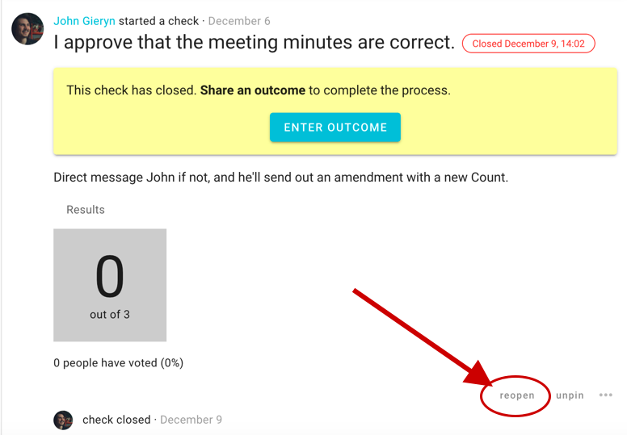
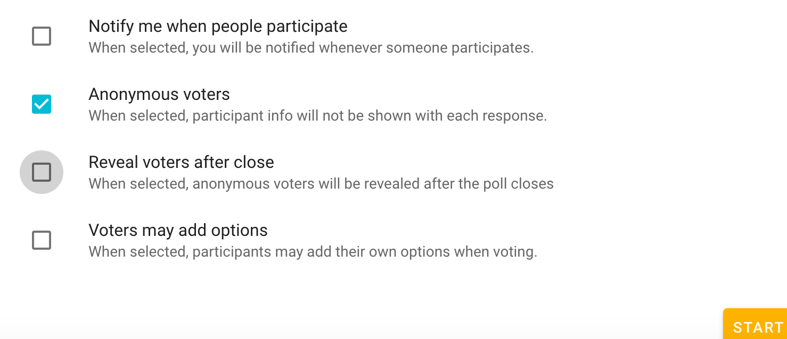

<iframe width="100%" height="380px" src="https://www.youtube-nocookie.com/embed/O-laa4di8kI" frameborder="0" allowfullscreen></iframe>

## Title and Details

**Writing proposals**

Include enough details so everyone knows what it means to agree or disagree.

Avoid combining a range of ideas in one proposal, because people might agree to some aspects but not others and be unsure how to respond. You can break complex decisions down into multiple proposals.

When making a proposal, state your expectations and describe the impact the proposal will have if adopted. If it's a formal or binding proposal it's often worth describing what a 'disagree' or 'block' means.

You might want to explore a few [ways of using proposals](../proposal_types/#ways-of-using-proposals), for some guidance and inspiration.

## Attachments

You can attach files to decisions using the paperclip icon, just underneath the details form. You will be prompted to select a file from your device.

## Dates and Duration

When you choose a **Closing time**, Loomio will let you know the length of time in which participants will be able to participate in the proposal or poll. During this window, people can submit their position or choice and leave a reason, and they can also edit these if they think on it again or receive new information or ideas, perhaps from others' votes.

Consider how the proposal closing time will affect engagement from your group members, and choose accordingly. You might want to time the proposal so it closes before a meeting, or avoid closing over a weekend.

Beyond considerations of inclusion (enough time) and urgency (deadlines), you may want to give additional consideration to the date and time the poll closes, as Loomio will send a reminder `24 hours` before it closes. You can sometimes improve engagement if your group members receive this at a time when they can respond right away.

You can extend the deadline of an open proposal. This can be a good idea if engagement is active and people are working through the issue, or if engagement has been sparse and you'd like to prompt more participation before concluding. To do so, edit the poll or proposal to change the closing time.

### Reopen

If a poll closes earlier than what is ideal for your group arriving to a clear shared outcome, you might want to **reopen** it, setting a new closing time.

### Close

Similarly, if you no longer need to let the poll or proposal continue, you can choose **close** to end it before its closing date. Don't forget to [set an outcome](../outcomes) so everyone is clear on where you got to and/or what's next!

## Invite Members

It's good to let people know when you're taking a poll or a vote. After you start your proposal you will see a box allowing you to **Invite to vote**, where you will have the opportunity to select **Members of group** or **Members of thread**, or input the names of some of your group. You can select all and then remove some people from the list. This will send a notification to all those listed.

### Invite guests or experts

Similar to the **invite people** feature, if you input the email of someone outside your group in the **invite people to vote** form they will be given permission to participate in _only_ that proposal or poll; _however_, they will be able to see the _whole_ thread in which their participation has been invited (but _not_ any of the group's content beyond that). They will not be able to comment or participate in other proposals or polls even though they can see those that are in the same thread.

## Step-by-step for all decision tools

1. You choose to use a poll or proposal (within a thread)
2. You name it, describe the question or proposal it represents, and set its duration
3. You notify group members (typically all, but you may select none or specific...)
3. Group members participate and share a tweet-length message with their selection
4. They can change their minds as understanding develops; live results are available
5. A reminder is sent out the day before closing
6. The poll closes, and everyone can see the results
7. The author sets an outcome, notifying everyone of what will happen next.

## Proposal options

There are some universal options that apply to most of the proposals and polls that Loomio offers. If you're interested in a specific tool's options (eg, the time poll's **if need be** option) see the section on the relevant tool… [→ Types of facilitation tools](../proposal_types)

### Anonymous voting

If you tick the **Anonymous voters** box, participant info will not be shown with each response. This means that you will not know who chose which positions or shared which responses.

You can be certain the box was ticked by you, or the person who started it, when you see the text, "**Votes will be anonymous**".

> **You will see your own name by your vote**; it's not visible to others if Anonymous voters was selected! This is so you can edit your own response, just like in any poll or proposal. Again, others will **not** be able to see **other participants' user names** nor **user photos** next to votes that are not their own.

Upon choosing this option, an additional option becomes available, **Reveal voters after close**. When your poll or proposal closes, the data (photos and names) associated with each response will be visible to group members as with non-anonymous votes.

### Notify me when people participate

When selected, you will be notified whenever someone participates – within the app, and by email (by default).

### Voters may add options

For all polls except the **Count**. When selected, participants may add their own options when voting.

When users add options the person who created the poll will be notified.

## Proposals can help in many situations

Don't hesitate to start a proposal just because you're not sure everyone will agree - proposals are not only for when you have consensus, they're designed to surface issues that need resolving and are useful for clarifying disagreements. We have identified a number of ways to take advantage and step towards clear, shared outcomes, from a 'series of small yeses' to 'temperature checks'… [→ Ways of using proposals](../proposal_types/#ways-of-using-proposals)
