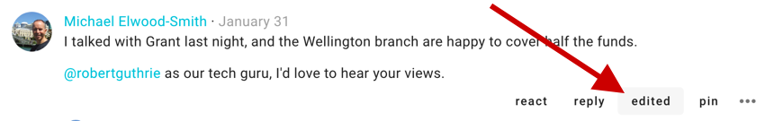

## Comments and replies
The most common activity in a thread is commenting. First look for **Comment** and your user photo/initials.

_Make sure that Comment is highlighted, not Proposal or Poll._

Write your comment and press **Post** to have your say.

Replies are like comments except in that the author of the original comment will be notified of your reply. Click **reply** on the comment you would like to associate your comment with, as it will be nested underneath theirs by default.

If Loomio has emailed you a comment and says you can reply to the email, you can reply directly from your email and your message will appear in the thread.

## Formatting comments

Use the formatting tools underneath the space in which you write. Hover the mouse/cursor over each item to know what it is. You can

- stylize (bold, italics, code block…)
- create lists (eg, check-lists)
- turn text into hyperlinks - _links icon_
- add attachments (from your device) - _paper clip icon_
- embed video - _play button icon_
- create and modify tables - _icon with four squares_.

## Editing comments

If you've made a typo, or want to add a bit more information to your comment shortly after you've posted it, you can edit your comment. Editing does not grab any attention, IE: No notifications will be sent, and your comment will not be marked as unread again.

Changes you've made will be visible via the "history" button, so you can see what people have changed in their comment.

If you have new information or are coming back after an extended period of time, just make a new comment, then people who have already read your comment will see that there is new information.

## Reactions

Reactions are for sharing how a comment made you feel, or acknowledging something someone has said, without writing a comment. They're an unobtrusive, light-weight way to participate without interrupting the conversation.

## Automatic translation
<video width="600" height="400" playsinline muted loop controls>
<source src="inline_translation.mp4" type="video/mp4">
</video>

Loomio can translate a comment from one language into another automatically (with the help of Google Translate). If the author of a comment uses a language other than yours, a translate button will show up; Just click to see the translation.

## Decision tools

There are a selection of "decision tools" available to you within the thread.
- Proposals are there to help you see if there is agreement about a statement or course of action, and surface the disagreement if that's what needs to happen. Often, you can use proposals to bring the discussion to conclusion.
- Polls are useful to understand preferences of the group.
- Use a time poll if you need to get everyone together, and want to find the best time for that meeting to happen.

Find out more about [decision tools](../getting_started/decision_tools).

## Email notifications
By default you'll be subscribed to receive email notifications about activity in threads in which you are participating. If you don't want email notifications, [edit your preferences](https://www.loomio.org/email_preferences) and turn off "Subscribe on participation".

If you're already subscribed to a thread, you'll need to turn off emails for it, because "subscribe on participation" only takes effect for threads you participate in after changing the setting.

The default setting is "Announcements", which means you'll get an email notification when someone wants to notify you about a decision, but you won't get an email about comments unless you're mentioned or someone replies to one of your comments.

