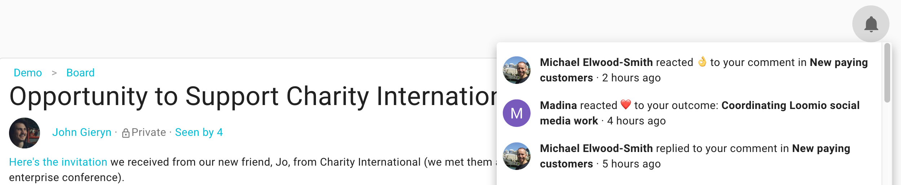

When you notify people, Loomio will send a notification within the app and, by default, to their email.

The bell icon in the top-right is where notifications are accessed within the app; a prominent number will display the number of notifications you have yet to read.

## Mentioning people

If you want to get the attention of a specific person, type **@** followed by their name to _mention_ them.  As you type, a menu will appear, listing the members in your group that match that name. Select the member you want and then click post or start. You can mention people in comments, thread contexts, or in the details of a decision. They will be notified that you’ve mentioned them.

<iframe width="100%" height="380px" src="https://www.youtube-nocookie.com/embed/VzM1AWnNP7c" frameborder="0" allowfullscreen></iframe>

## Replies

When you reply to a comment, the author of the original comment will be notified. Find the **reply** button on the bottom of the comment to which you wish to associate your reply (it will indented or nested under the comment you replied to, by default).

## Reactions

Reactions are for sharing how a comment made you feel, or acknowledging something someone has said, without writing a comment. React by clicking **react** beneath any comment or thread context. They're a simple way to participate without interrupting the conversation.

Reactions send a notification within Loomio, but do not send an email.

## Invite people

If the thread is an important announcement and contains information that's ready for the whole group to take notice of, you can notify people by first clicking **invite people** from the thread context. People you invite will get a notification immediately. ___Tip:___ _We've made it quick to select all of the members of the relevant group; click the link with your group's name._

> **Tip:** You can use the PREVIEW EMAIL button to check what will arrive to their inbox (if they have not turned off their email notifications).

### Inviting guests and experts to the thread.
If you want to involve people who are not in your group (or not on Loomio yet) you can invite them into the thread by entering their email address after clicking **invite people**. They won't get access to the rest of the threads in your group, just this one. _If you_ do _want them to be in the group, then invite them to join from the group page._

### Notify the right people every time

Subgroups are a great way to make it simple to send notifications to a specific set of people. If I click **invite people** from a thread in a subgroup, I can simply select **Members of `Subgroup Name`**.

It's great to remind your working group when there hasn't been much interaction with a thread. To increase the chances of good engagement, check that the [thread context and title include a clear invitation](/en/user_manual/getting_started/having_discussions/#keep-the-topic-concise), specifying how to participate.
