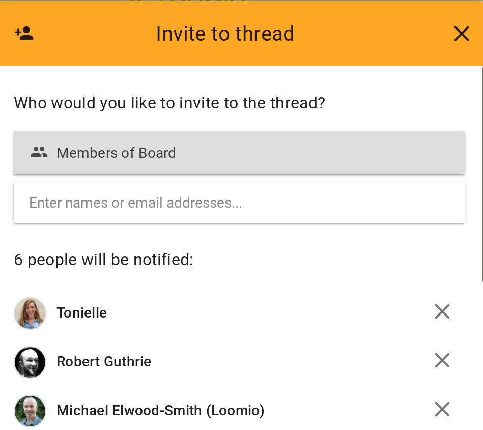

## Mentioning people

If you want to get the attention of a specific person, type **@** followed by their name to _mention_ them.  As you type, a menu will appear, listing the members in your group that match that name. Select the member you want and then click post or start. You can mention people in comments, thread contexts, or in the details of a decision. They will be notified that you’ve mentioned them.

<video width="600" height="400" playsinline muted loop controls>
<source src="mentioning.mp4" type="video/mp4">
</video>

## Replies

When you reply to a comment, the author of the original comment will be notified of your reply.

## Reactions

Reactions are for sharing how a comment made you feel, or acknowledging something someone has said, without writing a comment. React by clicking the **😃 emoji button** beneath any comment thread context. They're an unobtrusive, light-weight way to participate without interrupting the conversation.

Reactions send a notification within Loomio, but do not send an email.

## Invite to thread

If the thread is an important announcement and contains information that's ready for the whole group to take notice of, you can notify people with the _invite to thread_ tool. People you notify will get an email immediately with the title and context of the thread included.

### Inviting guests and experts to the thread.
If you want to involve people who are not in your group (or not on Loomio yet) you can invite them into the thread by entering their email address. They won't get access to the rest of the threads in your group; just this one. (If you do want them to be in the group, then invite them to join from the group page).

<video width="600" height="400" playsinline muted loop controls>
<source src="invite_to_thread.mp4" type="video/mp4">
</video>

### Notify the right people every time

Subgroups are a great way to make it simple to send notifications to a specific set of people. If I use _invite to thread_ from a thread in a subgroup, I can simply select "Members of [Subgroup_name]". For example, here I'm quickly notifying everyone who is on the Board:

It's great to remind your working group when there hasn't been much interaction with a thread. To increase the chances of good engagement, check that the [thread context and title include a clear invitation](/en/user_manual/getting_started/having_discussions/#keep-the-topic-concise), specifying how to participate.
