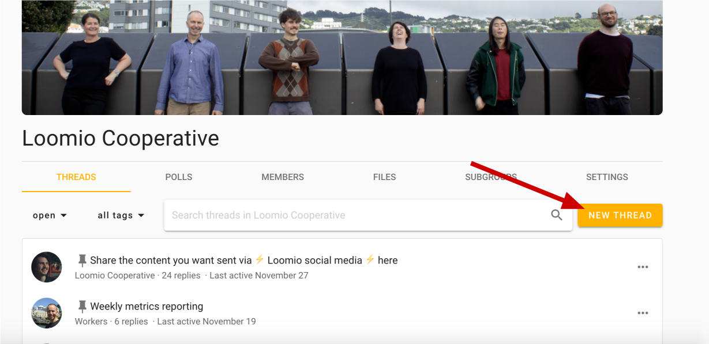
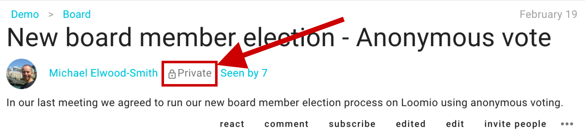

## New thread

You can start a thread by clicking **New thread** from a group page. When you start the thread, it will be visible to all of that group's members.

Give your thread a title; try to keep it short and to the point. You can always update the title of the thread later.

Use the thread **context** to introduce the topic. Give background information or links that people will need to participate, and explain what kind of participation you're looking for. The context will always stay at the top of the thread, above the thread's comments, proposals and polls.

## Thread privacy
If your group privacy is **Closed** or **Secret** then your threads will be **private**. Private means that only members of the group are able to view the threads started in this group (*except* when you **invite people** such as an expert or any guest not currently part of your group).

If your group is "Open" then all your threads will be public, meaning that anyone with the URL can view the thread.

For more on this subject… [→ Group privacy](/en/guides/getting_started/starting_a_group/#privacy)
