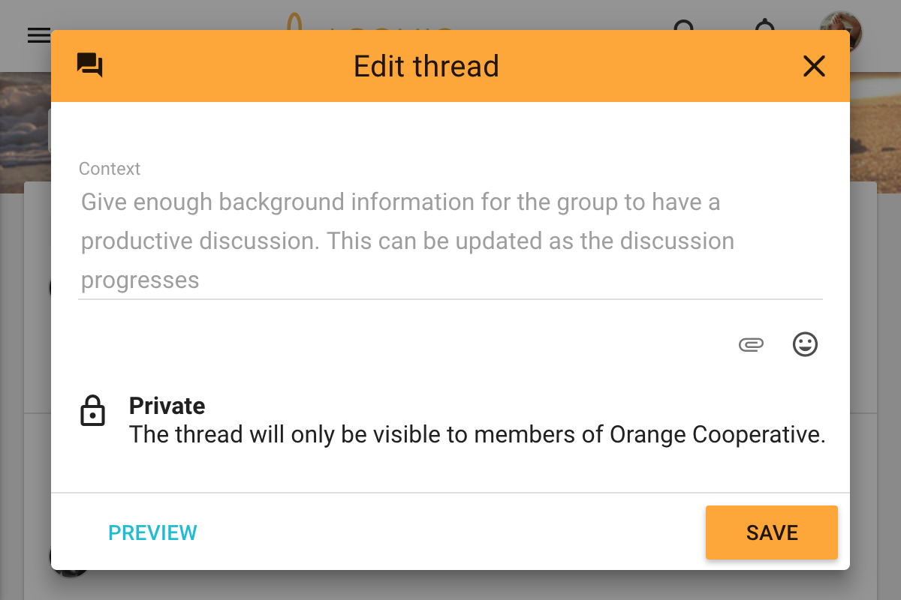

## New thread

You can start a thread by clicking _New thread_ on the sidebar.

<video width="600" height="400" playsinline muted loop controls>
<source src="start_thread_from_sidebar.mp4" type="video/mp4">
</video>

You can also start a thread from your group page.

<video width="600" height="400" playsinline muted loop controls>
<source src="start_thread_from_group_page.mp4" type="video/mp4">
</video>

Select the group you want to have the discussion within. If you started the thread from your group page, this group will be pre-selected.

Give your thread a title. Be concise with your words and try to keep it short. You can always update the title of the thread later.

Use the context panel to introduce the topic. Give background information or links that people will need to participate, and explain what kind of participation you're looking for.

## Thread privacy
If your group privacy is "Closed" or "Secret" then your threads will be private. Private means that only members of the group, and people you invite into the thread are able to view the thread.

If your group is "Open" then all your threads will be public, meaning that anyone with the url can view the thread.

If your group is "Closed" but you've enabled the [advanced group settting](/user_manual/groups/settings#allow-public-threads) "Allow public threads in this group" then you may choose to make your thread public, but by default threads are private.
