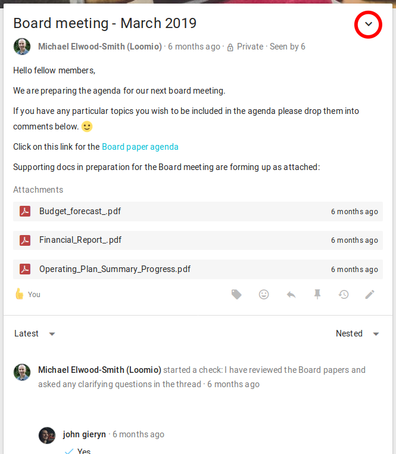
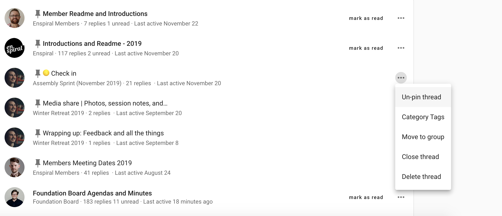
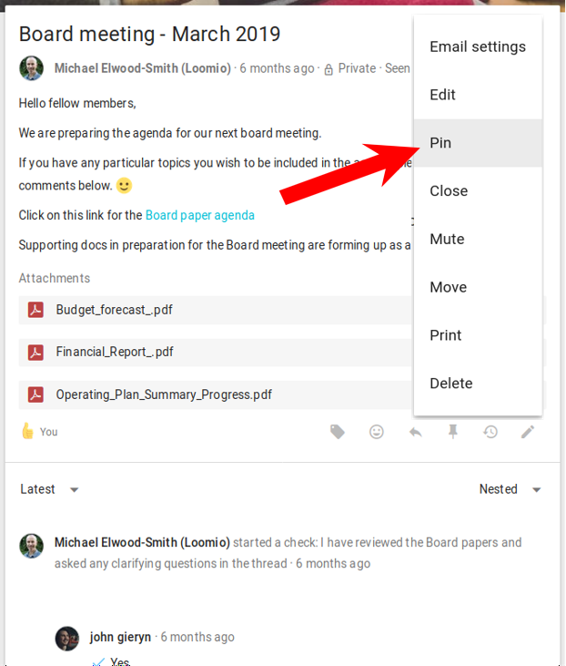
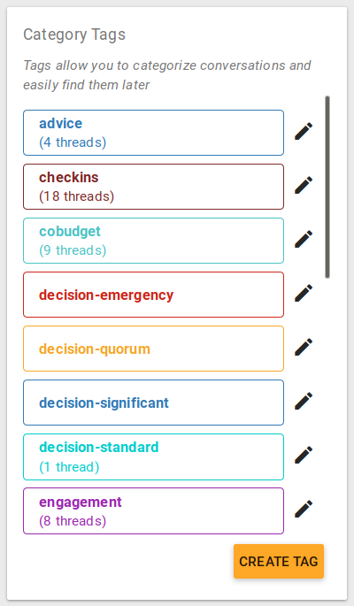
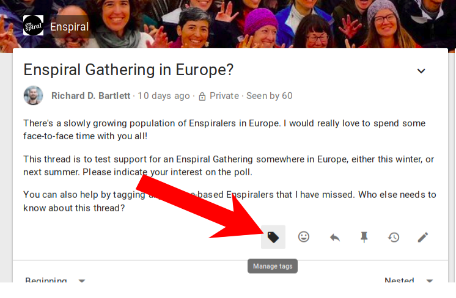
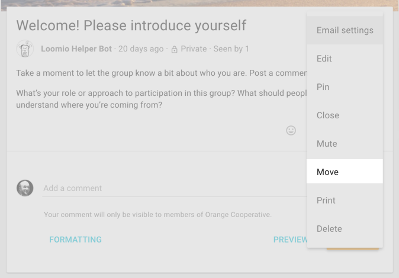
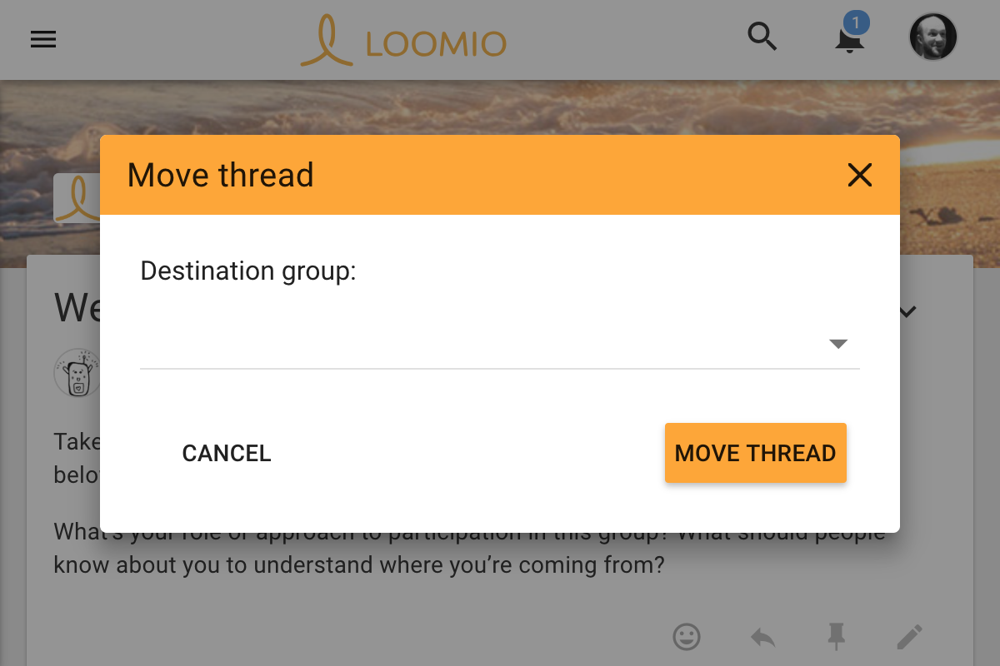
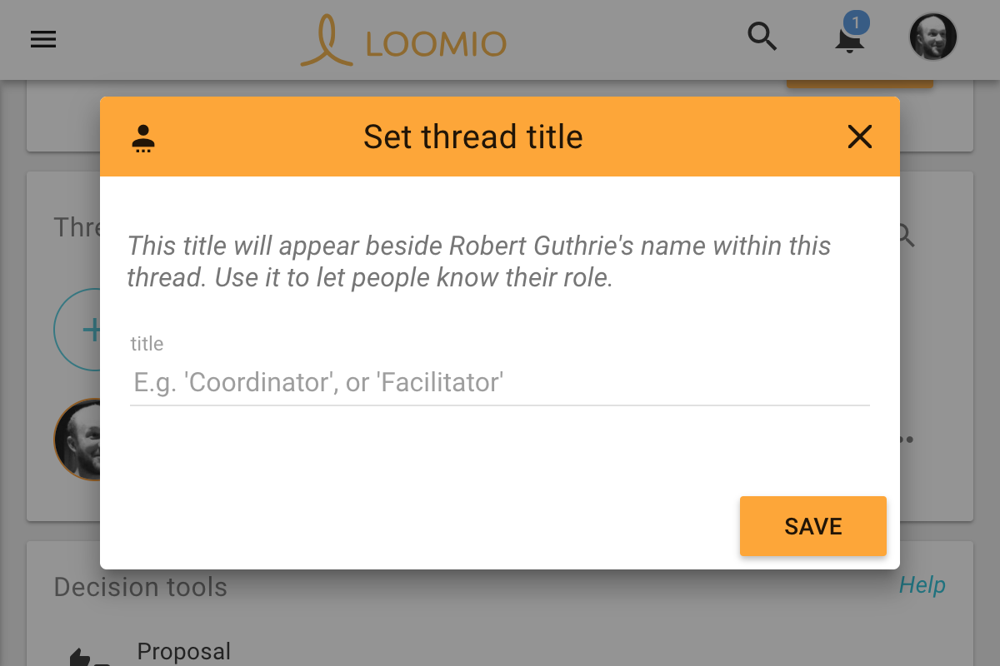

Administering your thread is primarily done from the page of the thread in question using the thread options, a drop-down menu near the thread's Title.

## Deleting comments and threads
You can delete your own comments at any time. If you're the coordinator of a group you can delete any thread – or comments in any of the threads – in the group. If you started a thread, you can delete that thread, or any comments within it.

## Pinning threads
If you are a coordinator, you can pin comments to order them and make them easier to find. Pinned threads will appear above your other threads and will be ordered alphanumerically within the group (and, if applicable, also the subgroup) to which they belong. You can easily pin or unpin threads by clicking the pin icon from the discussion thread's page.

Or, use the pin option from the thread menu.

## Using category tags

_Category Tags_ (or just "tags") let you group any number of threads by categories that you define. You can use them to make it easy to find threads of a certain type or topic.

To apply a tag to a thread, first navigate to your group page and create a tag from the column on the right. This tag panel is also where you can edit a tag's name or color.

Then navigate to the thread and click the tag icon in order to categorize a thread.

## Moving comments to a new thread (Forking)
<video width="600" height="400" playsinline muted loop controls>
<source src="forking_comments.mp4" type="video/mp4">
</video>

Sometimes a comment is useful, but off topic for the thread. In this case you can start a new discussion (forking), selecting the comments you want to take into it from the original thread.

## Moving threads between groups
You may want to move threads between groups and subgroups to keep things organised. To do this, select _Move_ from the thread options.

## Closing threads
To keep the list of discussions on your group page relevant, you can close threads which people don't need to see.

You can list all the closed threads. Just click the "x Closed" label at the top of the threads list on your group page.

## Printing threads

Select _Print thread_ in the thread options to create or print a PDF with all of the thread's contents.

## Thread members and roles
Everyone who's participated in the thread, or has been invited specicially to participate will show up in the members panel.

To highlight your role within the discussion, or to let people know why you're here, you can update your _title_ from the members card. The title will display next to your name wherever it appears within the thread.

