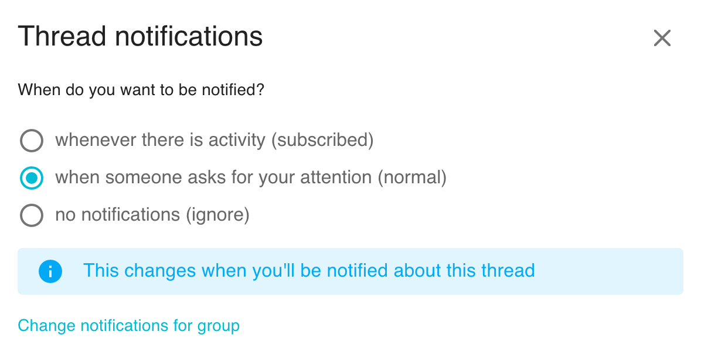

Loomio sends emails to keep you updated on the activity in your groups. The default settings assume that you don't have a habit of using Loomio regularly so are designed to ensure you can stay up to date by checking your emails.

<iframe width="100%" height="380px" src="https://www.youtube-nocookie.com/embed/0Mb2_D74ktM?start=2" frameborder="0" allowfullscreen></iframe>

Emails we send out include:

- A daily summary called **Yesterday on Loomio**. This includes activity from all your groups and threads, but only content which you have not read yet.

- **Mention** and **Reply** notifications. If someone replies to a comment you wrote, or they write a comment and mention you in it, you'll get an email with what they wrote.

- Invitations to threads and notification of polls or proposals. If someone wants to notify the group about a new decision or discussion thread, they can select everyone or just some people in the group to notify. Also be aware of **poll closing soon** and **outcome** notifications.

- Thread updates. If **subscribe on participation** is checked, then after you comment or vote within a thread, you'll be emailed any further activity.

For any thread-specific email (that's most except the Yesterday on Loomio email) you can reply directly from your email and your replies will be posted into the Loomio thread.

## User email settings

There are three settings that apply to every group you belong to.

* **Daily summary email** - Enabling this setting means each morning you will get an email with any activity that you missed the day before. This email provides an easy routine for staying up to date with Loomio activity.

* **Subscribe on participation** - Enabling this setting means when you participate in a thread, all further activity will be emailed to you immediately.

* **Mentions & Replies** - Enabling this setting means when someone wants to get your attention, they can @mention your name in a comment, which will notify you. We recommend you leave this setting on, so you'll get an email when this happens.

To adjust these settings, go to [Notification settings](https://www.loomio.org/email_preferences) in the user menu.

From **Notification settings** you can also change _all_ of your **Group email settings** at once.

## Group email settings

You can configure what notification emails you get for each group you belong to.

There are 3 settings per group:

- Receive emails **whenever there is activity** (subscribed) - if you want the experience of a traditional email mailing list, where you are emailed everything as it happens. You will be emailed whenever there is activity (comments, votes, new threads, proposals, and proposal outcomes) in this group.
- Use the **normal** setting (**when someone asks for your attention**) - When someone invites you to vote or participate in a thread you'll get an email. In these cases someone in your group is choosing to notify you.
- Choose to receive **no notifications** (ignore) - You won't get notification emails about this group. It's up to you to check into Loomio or read your daily summary email to stay updated.

You can also apply a particular setting to all of your groups by checking *Apply these settings to all my groups*.

## Thread email settings & Subscribe

The email settings for a thread are similar to those for a group. A thread will use the email settings for the group in which it resides unless you change it for that thread. To do so, go to the thread and click **subscribe** (at the bottom of the context).

Note that the **subscribe on participation** setting affects your thread email settings. If **subscribe on participation** is enabled, when you participate in a thread your email settings will change to "All activity" for that thread.

## Turn off all notifications

To turn off all email notifications go to [Notification settings](https://www.loomio.org/email_preferences/). First, untick all the boxes and **Save changes**. Lastly, choose **no notifications** and then **Update**.

