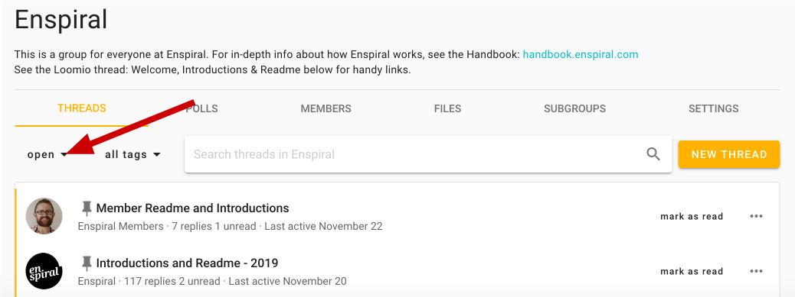

## Top level

There are 4 top level navigation tools within Loomio.

- Search
- Notifications
- Sidebar
- User menu

<iframe width="100%" height="380px" src="https://www.youtube-nocookie.com/embed/Q7L9NiG79gM?rel=0" frameborder="0" allowfullscreen></iframe>

When you first arrive or log in you will arrive to your **Group page**, or – if you are a member of multiple groups or subgroups – you will arrive to the **Recent threads** page described below.

## Search

The search field is easy to find above the list of discussion threads where you first arrive or on most pages. It will display threads containing your keyword(s) in their context, comments or decisions.

**From a Group page:** If you are on your group or subgroup's page, you can search _within_ that group. The search will exclude results from other groups or subgroups. _If you are unsure how to get to your Group page

**From Recent threads:** You can search for comments, decisions, or threads from any group or subgroup. Enter one or more key words to find the information you're looking for. _If you are unsure how to get to this page, see the video above or [Recent threads](#recent-threads), below._

## Notifications

The 🔔 bell icon, which lives on the top-right, will show all activities in threads you've started or participated in and all @mentions. Just click on one of them to see details or participate. If you check only one thing, check this.

When someone wants to get your attention, they'll send you a notification. This could be via an @mention or an invitation to participate in a thread or poll. [More on _notifying people_ here](/en/user_manual/threads/notifying_people/).

If you have unread notifications we'll display the number that are unread over the top of the bell-shaped notifications menu button.

## Sidebar
The sidebar is where you find your discussions, groups, and User menu. It will be collapsed by default, but can be opened or closed via the using the ☰ horizontal bars icon in the top-left of the screen.

### Pin sidebar
If you pin the sidebar open, then it will be open when you first arrive to any Loomio page, and will reopen (if you have closed it) upon navigation to any other page or tab.

**Pin sidebar** can be toggled on or off from the User menu (you will see the pushpin icon).

## User menu
The User menu is where you can access your user profile page, change your email preferences, find a link to this help manual, and sign out. Find it by clicking your name in the sidebar (see [video above](#top-level) for reference, you may have to first open the sidebar by clicking the ☰ icon in the top-left).

- You can view and update your user profile via **Edit profile**. Read the [User profile](../user_profile) page for more information.

- You can change your email preferences via **Email settings**. Read the [Email settings](../email_settings) page to find out how to set things up to your liking.

- You'll also find a link to all our help resources, including this user manual.

- You can log out of Loomio, _which is recommended if you're not using a personal device to access it._

# Easy ways to keep track

While search can be a quick way to navigate directly to something, there's a number of pages that will make it easy to navigate all of your threads, groups, and information

- Recent threads
- Unread threads
- Group pages

<iframe width="100%" height="380px" src="https://www.youtube-nocookie.com/embed/s_q8zyzlnJw?rel=0" frameborder="0" allowfullscreen></iframe>

These can all be accessed from the sidebar, and each display a different list of threads, or more specifically, **Thread previews**; learn more about the previews and high-level actions you can use to manage these [below](#understanding-thread-previews), as it's important to first understand the different pages that help with navigation:

## Recent threads

The **Recent threads** page gives you an overview of the most recent activity happening in your groups. You can access this page via the sidebar. If you are a member of multiple groups, the Recent threads page will be your landing page when you sign into Loomio _unless you are only a member of a single group._

The Recent Threads page displays content from your groups in an ordered list. Open proposals are at the top, followed by all of the threads from your groups, sorted by most recent activity (Today, Yesterday, This week, This month, Older than a month).

If a thread or proposal title is highlighted with a yellow line along its left border, then new activity has taken place since you last visited and this thread is considered **unread**.

## Unread threads

The **Unread threads** page shows all threads and proposals that have new content since you last visited, sorted by group. You can access this page via the sidebar. You can clear unread items without reading them by hovering over the thread preview and clicking **mark as read**.

## Group pages

Because Loomio is a place for your group, we have designed the **Group page** to be the hub and dashboard for your group.

Group pages are where you start threads, where most of the action happens.

By default, your group page lists all of the open threads in your group. You can use the thread filter on the left to show…

- threads that are archived or [closed](../../threads/thread_admin/#close-thread)
- only the unread threads
- all of the threads, open or closed.

### Category Tags help you sort threads

View all the threads that belong to a category by using the other thread filter. These options are created when people [tag threads](../../threads/thread_admin/#category-tags).

You can also access this filtered view from within any tagged thread; simply click the tag (the category you're interested in) from the thread's [page](../../threads/navigating_threads/#finding-the-right-thread).

You can always select **All tags** to exit the filtered view you accessed by choosing a tag from the filter menu.

### Search in your group

You can search the threads and polls in your group; read [more above](#search).

## Viewing your groups
All the groups you belong to are listed in the sidebar on the left-hand side. This allows you to easily navigate to or between them by clicking their name or logo.

Subgroups will not have a logo, but will appear directly under the organization, or parent group, that they belong to. Click their name to see their page just like you would for a group.

## Understanding thread previews

To help you stay on top of everything, the thread preview gives you the most important context for the thread; learn more… [→ Thread administration](/en/user_manual/threads/thread_admin/).

## Navigating threads

There's a number of features that can help you in… [→ Engaging with threads](/en/user_manual/threads/engaging_with_threads)

# Exploring public groups
You can explore, and request membership to, public Loomio groups by visiting the **Explore groups** page; click on this option in the sidebar to get involved.
