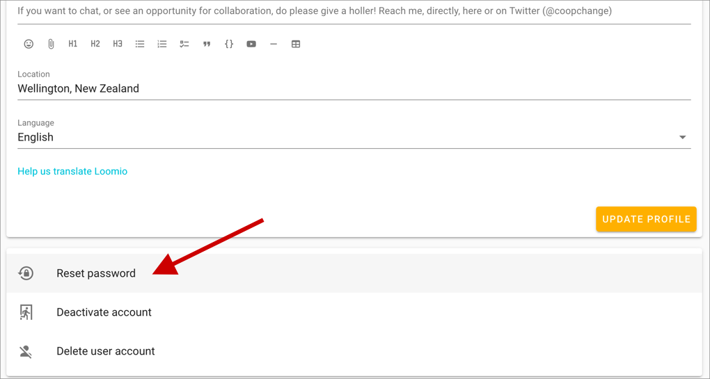

<iframe width="100%" height="380px" src="https://www.youtube-nocookie.com/embed/0Mb2_D74ktM" frameborder="0" allowfullscreen></iframe>

Your profile page lets you customize your Loomio identity. To visit your profile page select the **Edit profile** option in the user menu, which is found by clicking on your name in the top-left of the screen; _if it is closed, click on the menu icon (top-left) to open it._

## Uploading a profile photo
When you first create a Loomio account, your initials will be the default image associated with your profile. You can upload a profile photo by clicking on your picture on the profile page. If you have a [Gravatar](https://en.gravatar.com/) you can set that as your profile picture by selecting **Use Gravatar**. You can also choose for Loomio to use the photo you use for other common platforms/tools.

## Update your personal info

You can update:

* **your name**
* **your email address** - this email receives your Loomio notifications (on, by default)
* **your username** - your username is a name people can use to alert you with an @mention in threads
* **your introduction** - a few lines to let others in your group know more about you
* **your location** - useful for distributed or remote groups so people can get an idea of where others are

## Language settings
Loomio is developed in English, but [is translated by volunteers into many languages](https://www.loomio.org/g/cpaM3Hsv/loomio-community-translation).

Loomio will detect your browser’s language settings, but you can manually set your preferred language from the profile page.

<iframe width="100%" height="380px" src="https://www.youtube-nocookie.com/embed/0llDGzowrXU" frameborder="0" allowfullscreen></iframe>

## Resetting your password
You can change your password by visiting your profile page and clicking **Reset Password**.

## Deactivating your account
If you no longer want to receive notifications from Loomio, but think that you may want to access your account again some time in the future, you can deactivate your account.

To deactivate your account

1. Login to loomio with the email address of the account you wish to deactivate
2. Visit the "Edit profile" page from the user menu (top right corner of the screen).
3. Scroll to the bottom of the page and click "Deactivate account"
4. Confirm you wish to deactivate.

Once your account has been deactivated:

* you will no longer be listed as a member of any groups
* comments, proposals and discussions you’ve made will remain but your name will be removed from them
* you will no longer receive Loomio-related emails

## Reactivating your account
If you login to your account with your email address you'll reactivate your account and regain access to your groups.

## Permanently deleting your account

Go to the section on [Deleting Your Loomio Account](../deleting_your_account)
