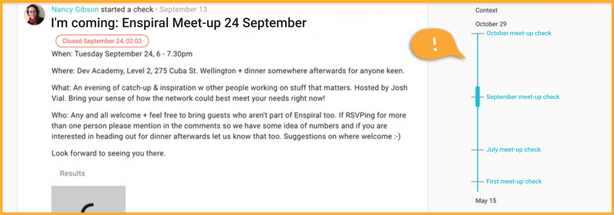
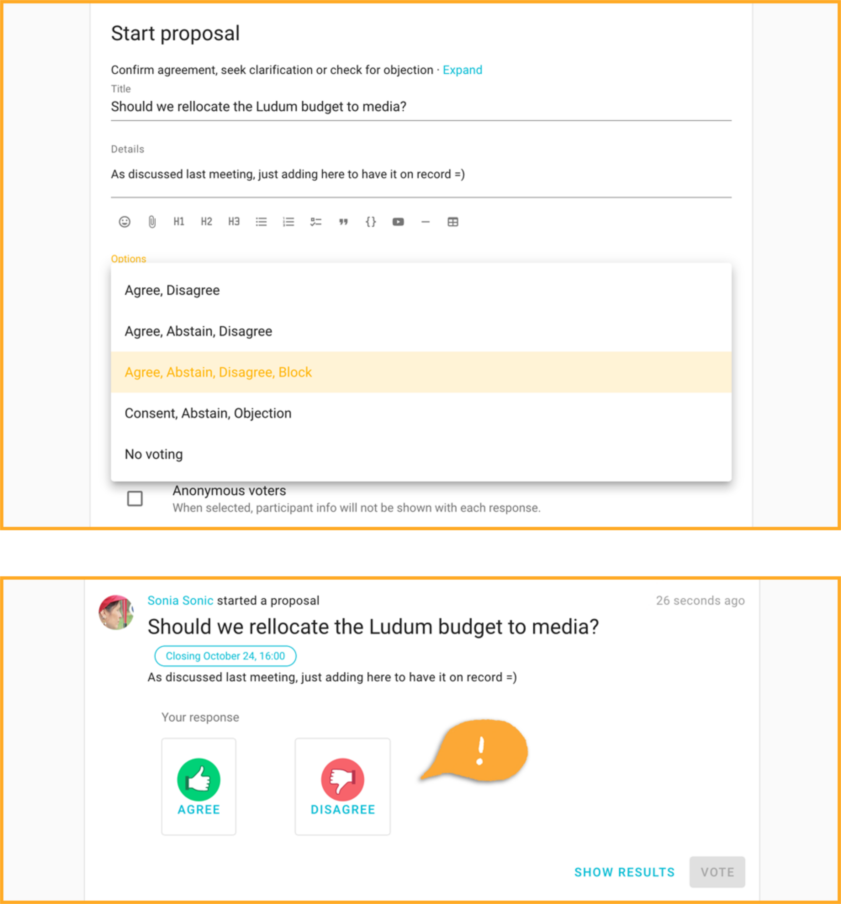
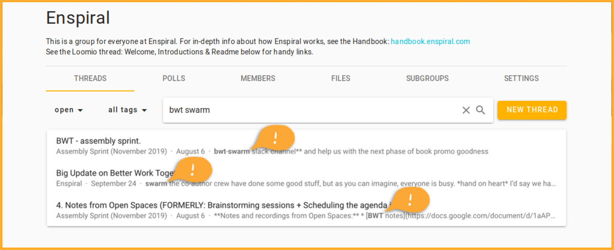

Everything is new!

It’s an exciting time for us at Loomio and also for our customers; we’ve listened to your feedback and here's the result — Loomio 2.0 (beta). The software is not changing at its core, but every aspect of the platform has been revamped and improved.

## New text editor

With our new rich text editor, you’ll have all the editing options one click away, a host of emoticons, cool checklists and a simple drag and drop file upload system.

## Timeline

Every part of Loomio's layout has been carefully reworked. One new feature we want to highlight is our new timeline inside the threads: an easy way to find the information you need and understand how a conversation evolved over time.

## Pinning items in the timeline

A crucial feature in the new timeline is the power to pin specific comments or decisions, showing all the thread members where the most vital information is.

## Polls

What we used to call _Decision Tools_ are now called _Polls_. Nearly all of them have been improved.

## Flexible proposals

Now you can choose which of the four decision types you’ll use for your proposal. People shouldn’t be able to veto a specific decision? Not helpful if people abstain on your call for questions and comments? Now it’s your call.

## Dot vote

Our dot vote evolved so much that we decided to give it a new and better name: allocate! The design makes it simpler and easier to fiddle around before you cast your vote.

## Score

If you haven't score-voted before (assigning a number to each option) it's never been a better experience! Now you can define the minimum and maximum score, even using negative numbers.

## Time poll

Our new time poll has a simpler visual both when you’re choosing your options and also when you’re checking everyone’s replies.

## Time zones are easy to manage

Our Time Poll now let's you compare time zones, displaying your team’s most used time zones, so you can quickly propose times that suit most members.

## Ranked choice

Which option got the most votes? With our new visual aid, it’s impossible to get it wrong.

## Reaching a new threshold

With 2.0, we feel that we’re crossing a line. Our software was never that potent, that easy and that tailored to what our customers ask us.

The Loomio team couldn’t be happier with the thoughtful work that gets done with our help, so please consider this update our way to say thank you.

## Thread "seen by" feature

In one click, you can now find out who read your threads and when.

## Notification history

Like the new seen by feature, when you notify or invite specific people to threads or decisions you can now see if they've read it.

## "Newest first" thread order

Long threads? Endless scrolling to find the latest comment? No more! Now you can choose to see the newest information at the top of the comment section.

## Invitations to groups and subgroups, all in one place

If your organization is heavy on subgroups, this is for you: now you can invite new members to your organization and directly place them in the proper subgroups they’ll be working with. All in the same window.

## Search revamp

Our search function now has its own dedicated page. It highlights word matches and partial matches on the text below the searched threads’ title.

## What's coming next

More good news: we're moving quick to meet other big needs we've heard…

- mobile app
- email your group to start a thread
- real-time collaborative editing
